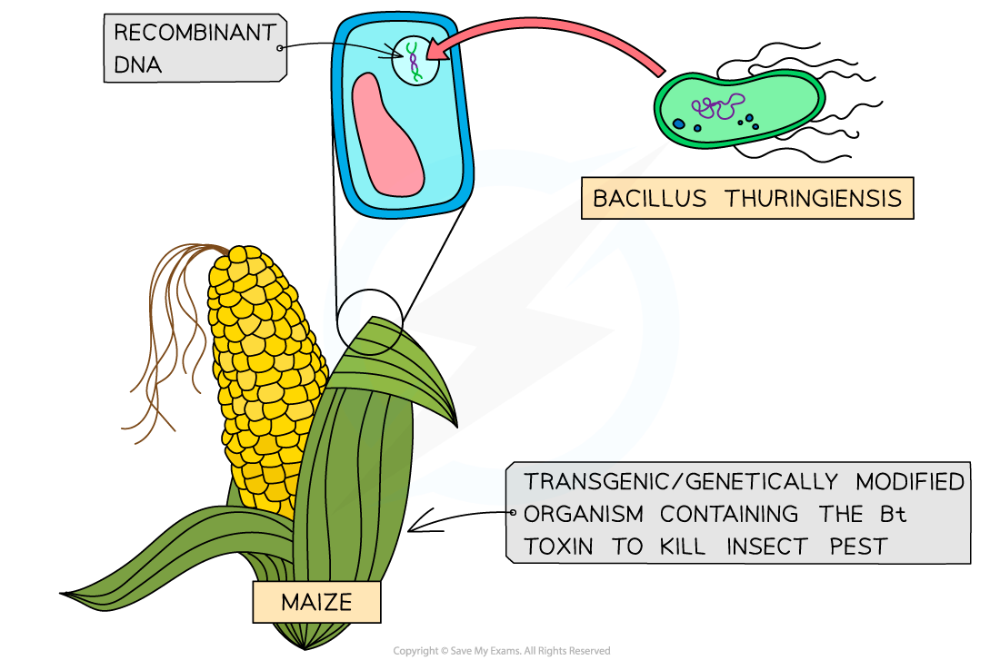
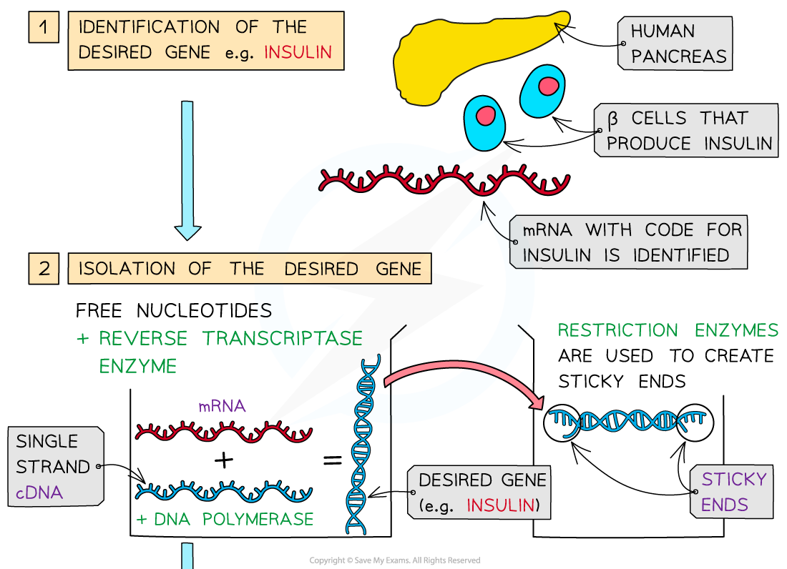
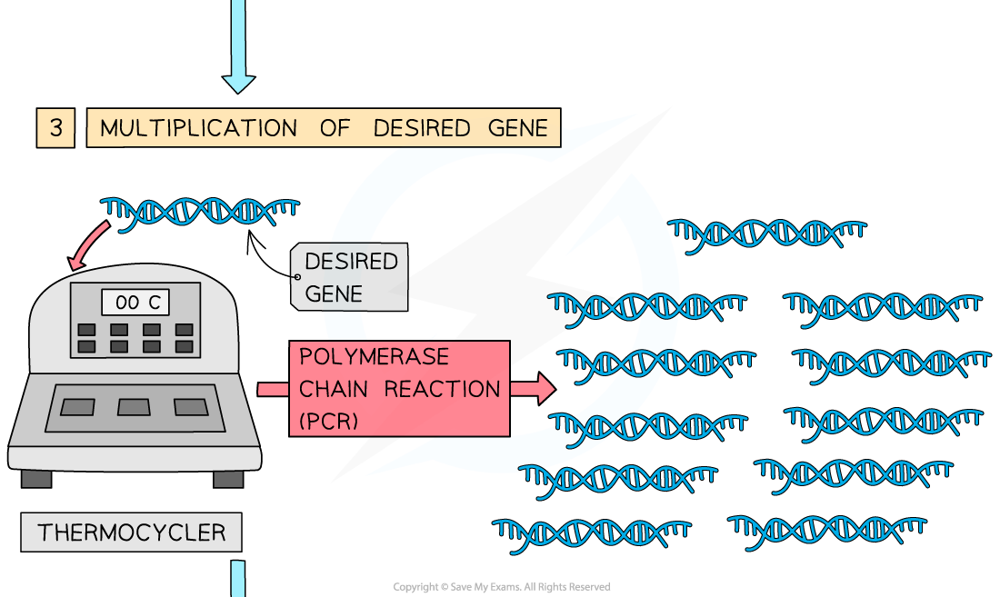
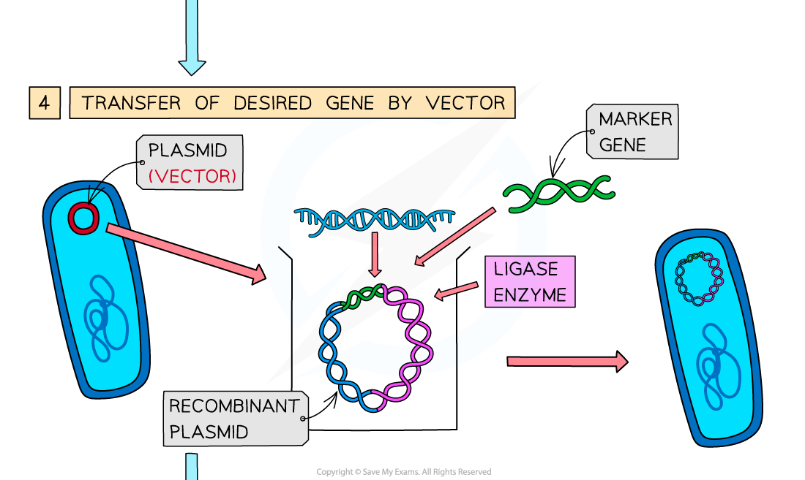
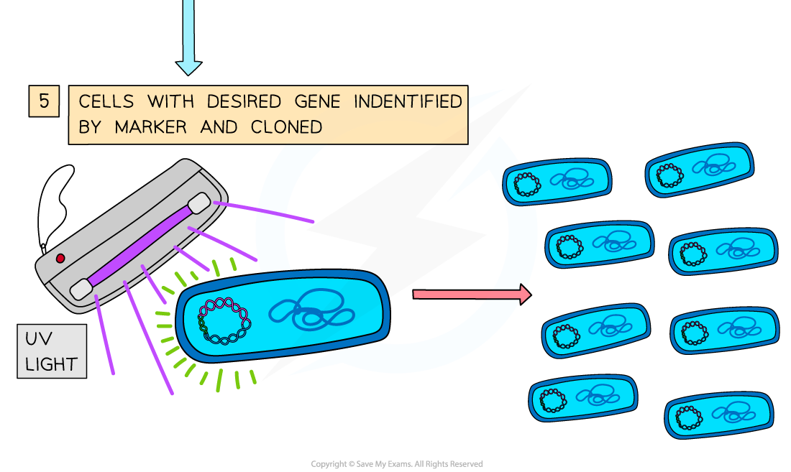
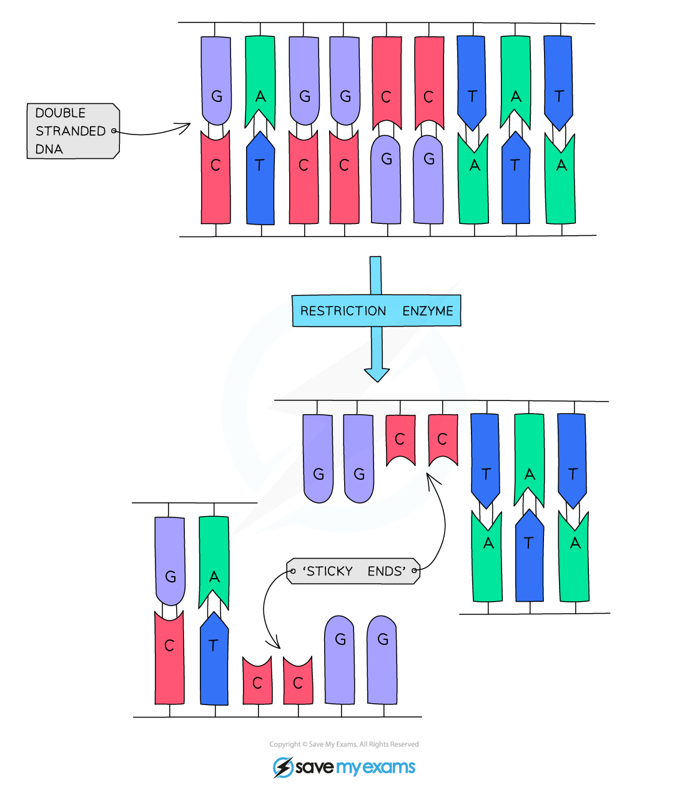

# Recombinant DNA

## Recombinant DNA

> **Spec point** — `spcpt_T3GWRxgPwCCFQQQy`

## Recombinant DNA

- The genetic code is the basis for storing instructions that, alongside environmental influences, **dictate the characteristics of organisms**
- The genetic code is **universal**, meaning that almost every organism uses the same four nitrogenous bases A, T, C, and G

  - The universal nature of the genetic code means that the **same** *codons* **code for the same amino acids in all living things; **genetic information is therefore transferable between species
  - The mechanisms of *transcription* and *translation* are also **universal **which means that the transferred DNA can be translated within cells of another species
- Scientists can artificially change an organism's DNA by combining lengths of *nucleotides* from** different sources; **typically the nucleotides are from different species
- The altered DNA, with the introduced nucleotides, is called **recombinant DNA **
- If an organism contains nucleotide sequences from a different species it is known as a **transgenic **organism or a **genetically modified organism** (GMO)

***Transferring genes from bacteria into the DNA of maize plants creates recombinant DNA***

- Producing a transgenic organism involves the following process

  - **Identification** of the **desired gene**
  
    - This gene will code for a desired characteristic, e.g.
    
      - Pest resistance genes in crops
      - The human insulin gene
  - **Isolation** of the desired gene by, e.g.
  
    - Using an enzyme called **reverse transcriptase** to convert a desired length of mRNA back into DNA; DNA produced in this way is known as complementary DNA, or **cDNA**
    - Cutting the gene from its location on a chromosome using enzymes called **restriction endonucleases**
    - Designing and building synthetic DNA sequences in a lab
  - **Multiplication** of the gene, i.e. producing many copies, or clones; this can be carried out using the polymerase chain reaction (PCR)
  
    - PCR machines known as thermocyclers use free nucleotides, *DNA polymerase*, and DNA *primers* to produce many identical copies of a desired gene
  - **Transfer** of the desired gene into another organism's DNA using a **vector,** e.g. DNA *plasmids*, viruses, or fatty envelopes known as liposomes
  
    - Once another organism has taken up the vector it is said to be **transformed**
  - **Identification** of the cells that contain the new gene by using a **marker gene** alongside the desired gene; this means that any cells that take up the desired gene will take up the marker gene as well e.g.
  
    - Antibiotic resistance; transformed cells will survive if treated with a specific antibiotic
    - Fluorescence; transformed bacterial cells will fluoresce under UV light
- Once the transformed cells have been identified they can be **cloned**, ensuring that all new cells contain copies of the desired gene

  - In the case of bacteria this can be carried out in a large container known as a fermenter

***DNA can be transferred from one organism to another to produce recombinant DNA; this process involves identification, isolation, multiplication, and transfer of the desired gene, followed by identification and cloning of the transformed organisms***

#### Isolating the desired gene using restriction endonucleases

- **Restriction endonucleases** are enzymes that cut DNA

  - They are sometimes referred to as **restriction enzymes **
- There are many different restriction endonucleases, each of which binds to a **specific** sequence of bases known as a **restriction site** on DNA, e.g. the restriction endonuclease HindIII will always bind to the base sequence AAGCTT
- Restriction endonucleases separate DNA at restriction sites by cutting the** sugar-phosphate backbone** in an uneven way; this leaves exposed single-stranded sequences of bases known as '**sticky ends**'

  - Sticky ends result in one strand of the DNA fragment being longer than the other strand
- The sticky ends make it easier to insert the desired gene into another organism's DNA or into **vector DNA** as they can easily form hydrogen bonds with complementary base sequences that have been cut with the **same** **restriction endonucleases**

***Restriction enzymes produce a jagged cut at a restriction site, leaving 'sticky ends'***

#### Inserting the desired gene into a vector using DNA ligase

- Once the desired gene has been cut from DNA using the relevant restriction endonuclease, it can then be transferred into the DNA of a **vector**, e.g.

  - A DNA plasmid
  - A vector organism such as a virus or bacterium
- The DNA of the vector will be cut using the **same restriction endonuclease** as the desired gene, leaving **complementary sticky ends**
- The enzyme **DNA ligase** is used to catalyse the formation of **phosphodiester bonds** between the sugar-phosphate backbone of the desired gene and that of the vector DNA

  - If this is carried out using a plasmid, the plasmid will be known as a **recombinant plasmid**

***DNA ligase is used to join the isolated gene to the vector DNA***
