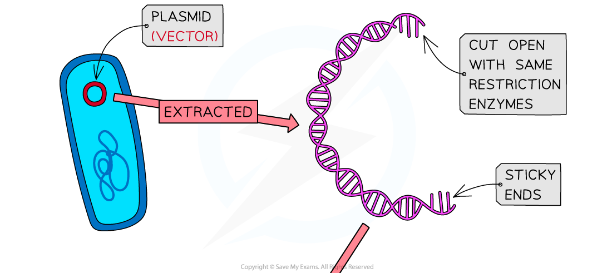
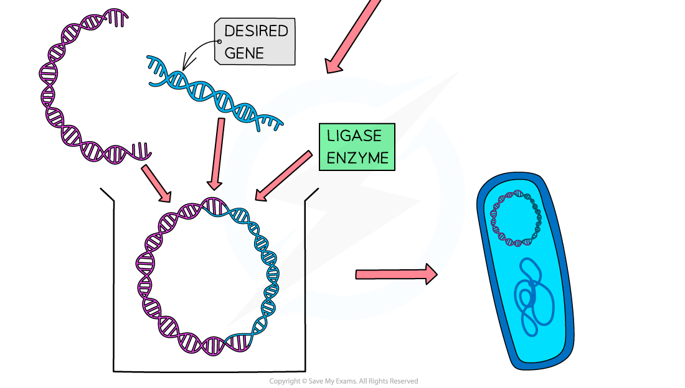
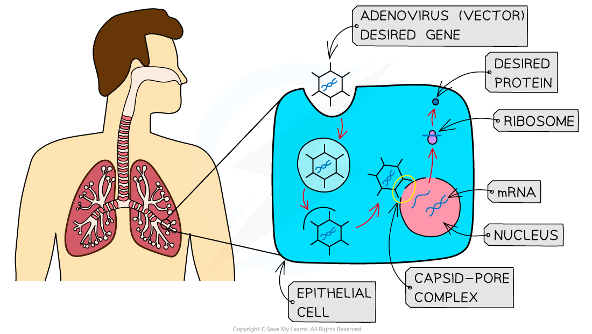
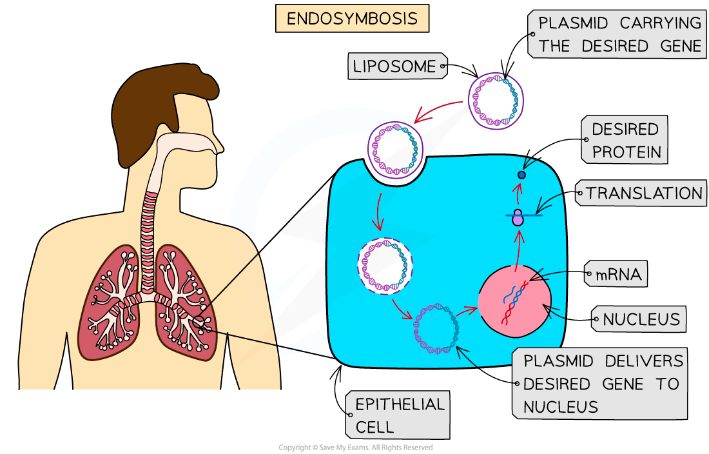

# Transfer of Recombinant DNA into Other Cells

## Transfer of Recombinant DNA into Other Cells

> **Spec point** — `spcpt_dwSMrRzs9sptX8sR`

## Transfer of Recombinant DNA into Other Cells

- Sections of DNA can be transferred from one organism's DNA to that of another, creating **recombinant DNA**
- In order to create recombinant DNA, desired genes, such as the gene for human insulin, need to be **transferred into new types of cell**; there are several different ways of doing this, e.g.

  - Vectors, e.g.
  
    - DNA plasmids
    - Viruses
    - Liposomes
  - Gene guns
  - Microinjection
- Once a section of DNA has been transferred into a new cell it needs to be **incorporated into the cell's genetic material** in order to be transcribed and translated; the success rate for transferred genes entering the nucleus of a eukaryotic cell is currently **very low**

  - The problem of transferred genes not reaching the nucleus is a barrier to the success of **gene therapy**
  
    - Gene therapy is a medical technique that involves inserting non-mutated genes into the cells of individuals with genetic disorders

#### Plasmid vectors

- Plasmids are small, circular rings of double-stranded DNA that can be found in some bacterial cells, as well as some other cell types
- To insert the desired gene into the circular DNA of a plasmid, it is cut open using a **restriction endonuclease**
- **DNA ligase** is then used to join the desired gene to the plasmid DNA; this creates a **recombinant plasmid**
- The **recombinant plasmid DNA** can then be **transferred into other cells**, usually bacteria, by a process called **transformation**

  - Only a small proportion of bacteria will become transformed and therefore marker genes such as antibiotic resistance are used to identify them
  
    - Scientists can **modify** or **design** bacterial plasmids so that they contain one or more **marker genes,** e.g. genes for antibiotic resistance
- Transformation can occur by

  - Bathing the plasmids and bacteria in an ice-cold calcium chloride solution and then briefly incubating at 40°C; this makes the bacterial outer membrane permeable
  - Electroporation; the bacteria are given a small electrical shock, making the membrane porous

***Plasmid vectors can be used to transform bacterial cells***

#### Viral vectors

- Viruses reproduce by** inserting their DNA into the cells of other organisms**, making them ideal vectors for the process of creating transformed cells
- Viruses exist that infect animal cells, plant cells, and bacterial cells, so viral vectors can be used to transform **many cell types**
- Viruses used as vectors need to be **non-harmful** to the cells being transformed
- Viruses are useful for ensuring that transferred DNA **reaches the nucleus** of cells, but despite being harmless they can sometimes **initiate an immune response**
- Viruses can be used as vectors in the process of **gene therapy**, which can be used to treat genetic diseases such as cystic fibrosis in humans

***Viral vectors can be used to insert genes into human cells***

#### Liposome vectors

- Liposomes are small, spherical *vesicles*, surrounded by a **phospholipid bilayer **
- Liposomes can be used as vectors because they can **fuse with the cell surface membranes** of host cells
- These vesicles can also be used in gene therapy to carry non-mutated genes into host cells

***Liposomes can enter cells by fusing with the cell surface membrane. Note that you do not need to know the term endosymbiosis here***

#### Gene guns

- The fragments of DNA containing the desired gene can be used to **coat tiny pellets** of gold or tungsten which are then **fired at high speed** into the cells that are to be transformed
- Cells that avoid damage are able to incorporate the new DNA into their genome

#### Microinjection

- A fine glass **micropipette** is used to transfer DNA into a cell
- This is a common laboratory technique for transferring genetic material into animal cells for the creation of transgenic animals
