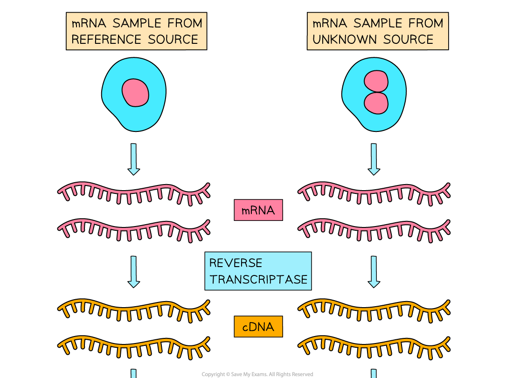
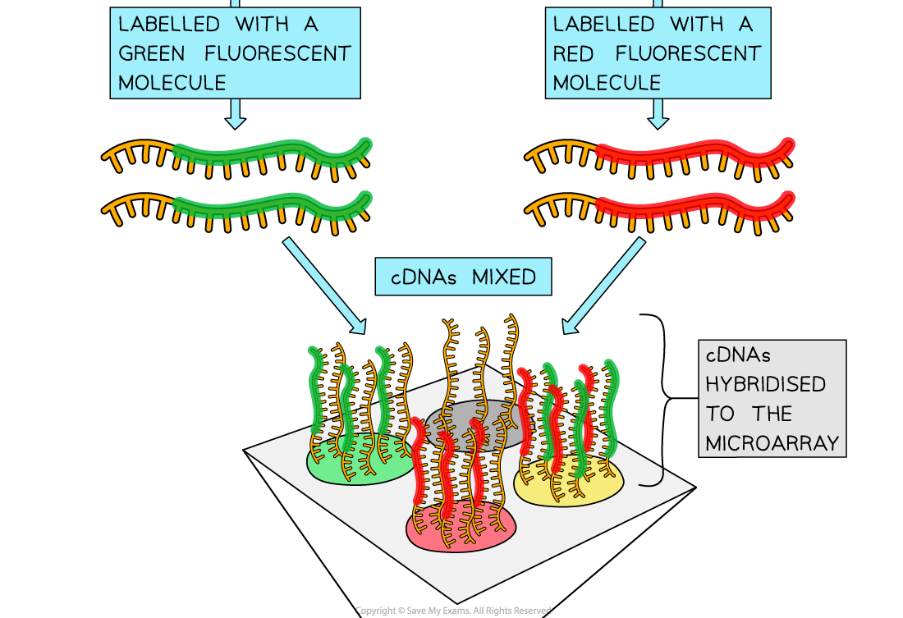
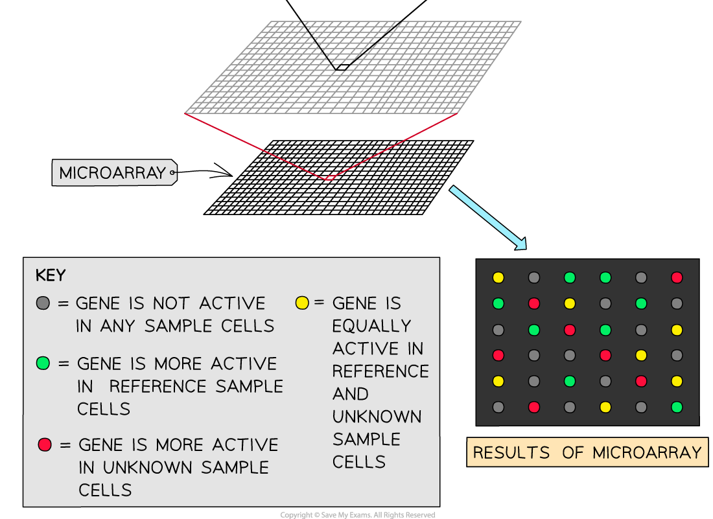

# Identification of Active Genes

## Identification of Active Genes

> **Spec point** — `spcpt_ZSP3h8mjYK4gQzg3`

## Identification of Active Genes

- Microarrays are laboratory tools used to **identify** **active genes**

  - Active genes are genes that are **expressed**; **mRNA is transcribed **from them and the resulting mRNA strand is **translated into a polypeptide**
- Microarrays can be used to identify active genes in **thousands of gene samples** at a time
- Microarrays are used for

  - Medical diagnosis and treatment, e.g. identification of harmful mutations
  - Biotechnology, e.g. identifying genes for the process of producing recombinant DNA
  - Forensic analysis, e.g. in criminal investigations
- A microarray consists of a small piece of glass, plastic or silicon that has **DNA probes** attached to many spots, called **gene spots**, in a grid pattern

  - DNA probes are short, single stranded lengths of DNA linked to an **easily identifiable label** such as a fluorescence protein or a radioactive tag; these single stranded probes **bind to any complementary sequences** present in a DNA sample, indicating their presence by fluorescing or under an x-ray
  - There can be 10 000 or more spots per cm2
- When producing a microarray, scientists compare experimental samples of genetic material with a **known reference sample**, e.g. a genetic sample taken from an individual known to have a particular disease mutation

- When a microarray is used to **analyse genomes**

  - Samples of genetic material, known as **chips**, are collected from
  
    - A **reference** source, e.g. an individual known to have a particular genetic mutation; this provides a control sample for comparison
    - An **unknown** source, e.g. a patient to be diagnosed
    
      - Note that many unknown samples can be simultaneously compared to a single reference sample
  - Collecting **mRNA** rather than DNA at this stage enables **active genes to be identified**; only active genes will be undergoing the process of **transcription into mRNA**
  - Enzymes called **reverse transcriptase enzymes** are used to convert the mRNA back into DNA; the DNA produced in this way is known as **complementary DNA**, or **cDNA**
  - The cDNA samples are labelled, e.g. using **fluorescence labels**
  
    - The reference samples are labelled with a different label to the unknown experimental samples
    
      - Usually the **reference samples fluoresce green** while the **unknown samples fluoresce red**
  - Once the reference and unknown samples are mixed together, they are then allowed to *hybridise* with the probes on the microarray
  
    - After a set period of time any DNA that did not hybridise with the probes is washed off
  - The microarray is then examined using ultraviolet light which causes the tags to fluoresce, or scanned; **colours are detected** by the computer and the information is analysed
  - The fluorescence colour detected indicates where **hybridisation** has occurred, as the DNA fragment is complementary to the probe
  
    - If reference (green) and unknown (red) samples both hybridise in equal proportions then the overall colour detected will be **yellow**; this shows that the gene in question is being **expressed in equal quantities** in the reference individual and the individual from whom the unknown sample was taken
    - If reference samples hybridise more than the unknown samples then the overall colour detected will be **green**; this shows that the gene is being **expressed more in the reference individual** than in the individual providing the unknown sample
    - If unknown samples hybridise more than the reference samples then the overall colour detected will be **red**; this shows that the gene is being **expressed more in the individual providing the unknown sample** than in the reference individual
    - Note that a lack of fluorescence indicates that the gene in question is **not being expressed** at all

***Microarrays can be used to identify active genes***

- Microarrays can be used to test for **expression of genes** that increase the risk of certain **cancers**

  - E.g. High levels of expression of genes that code for **receptors that bind to the hormone oestrogen **can be a factor in the progression of some cancers; if doctors know that these genes are being expressed at high levels then **drugs that block oestrogen receptors** are likely to be an effective treatment
