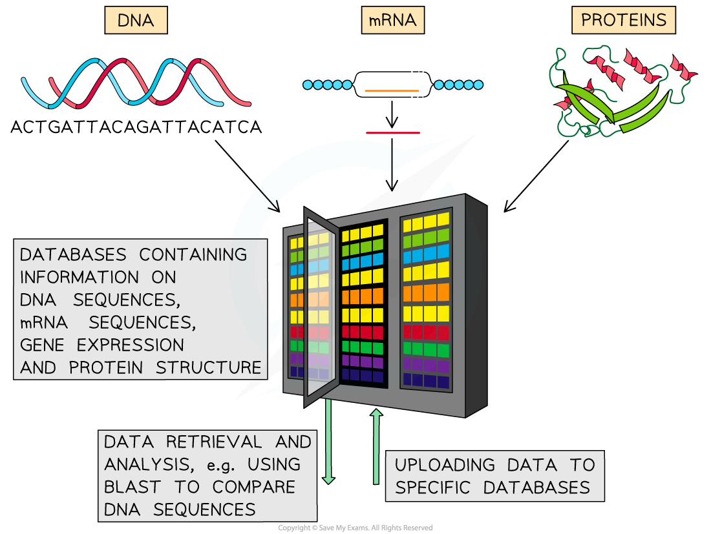

# Bioinformatics

## Bioinformatics

> **Spec point** — `spcpt_NC2KFR5sdZTZD58M`

## Bioinformatics

- New DNA technologies such as microarrays and sequencing generate **enormous quantities of data**, e.g.

  - Genome sequences
  - Information on *gene expression*
  - The amino acid sequence and functions of proteins
- To analyse all of this data scientists use **bioinformatics**
- Bioinformatics is an interdisciplinary science that incorporates** biology** with **computer technology** and **statistics** in order to collect, organise, store, and analyse **biological data**
- **Large databases** are created containing information such as **gene sequences** and **amino acid sequences** of proteins

  - The databases are available online and can perform analysis of the data selected
  - Multiple scientific research groups around the world can contribute to central databases; other groups can then analyse the research and raise queries

- There are a number of different applications of bioinformatics, e.g.

  - **Gene function** can be studied and compared across different species
  - The DNA sequences of different species can be compared and **evolutionary relationships** can be established
  - **New drug candidates **can be** identified quickly** by scanning libraries of molecules
  - Drug candidates can be** tested safely**; the impacts of different molecules on cells can be **simulated** using computer models
  - Data from microarrays and gene sequencing can be analysed to develop **personalised medical treatments** for individuals
  - New types of **genetic testing** can be developed to enable identification of genetic disease
  - Desired genes for the production of recombinant DNA can be identified, as well as determining where it is best to insert new desired genes into the genome of a genetically modified organism
  
    - This is useful for the development of new **gene therapies**

***Bioinformatics enables the effective storage and analysis of biological data. Note that you do not need to know about BLAST analysis***
