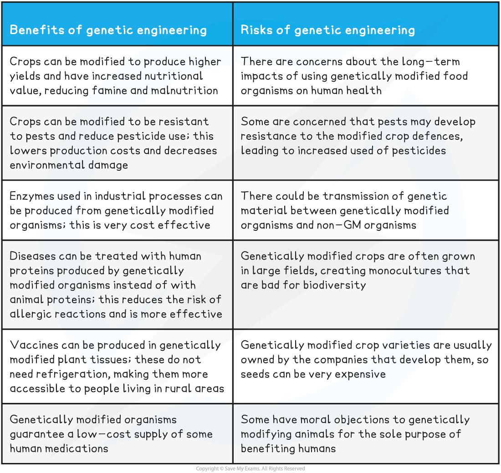

# Risks & Benefits of Using GMOs

## Risks & Benefits of Using GMOs

> **Spec point** — `spcpt_6vyscXny8bGfjZwG`

## Risks & Benefits of Using GMOs

- While GMOs can be used for medical benefit, there is still **much concern about the potential impacts** of changing the genes of organisms, as well as the **ethics of genetically modifying animals**

  - These concerns are often amplified when the GMOs are **crop plants destined for human consumption**

**Risks and Benefits of Genetic Engineering Table**

