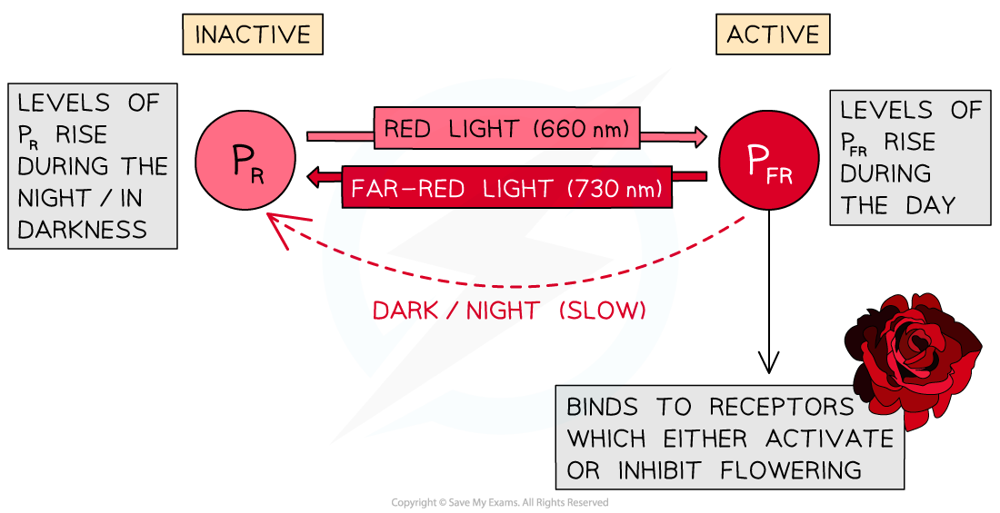
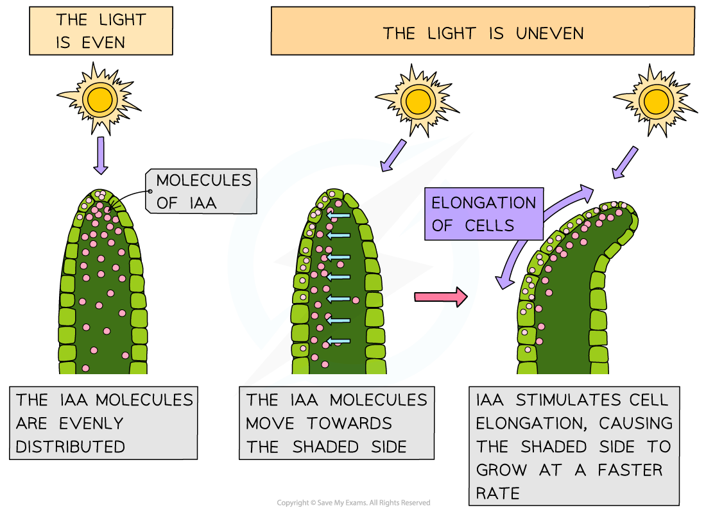
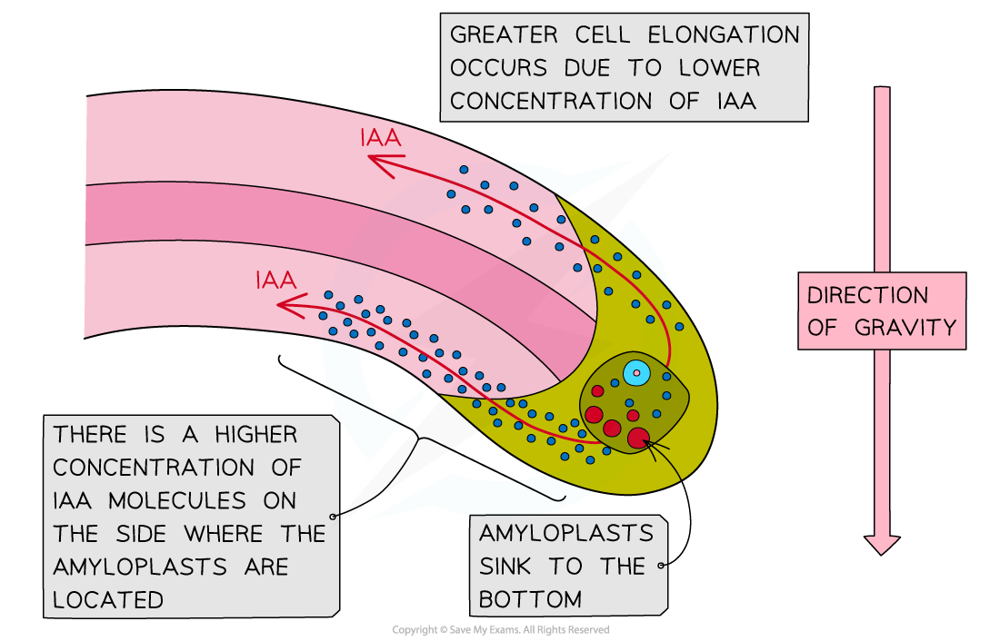
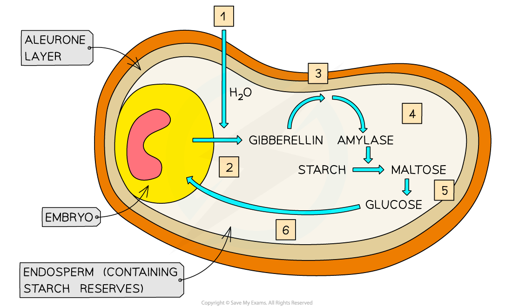
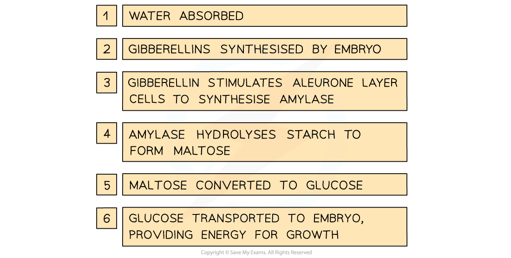

# Effects of Plant Hormones

## Effects of Plant Hormones

> **Spec point** — `spcpt_38yVPB7H2hnkqVW2`

## Effects of Plant Hormones

- Just like animals, the survival of plants is dependent on their ability to **respond to changes** in their environment; this **maximises their survival chances** e.g.

  - Growing towards light **maximises the rate of photosynthesis** and therefore glucose production
  - Producing harmful or foul-tasting chemicals in response to being eaten by a herbivore **reduces the likelihood of being eaten**
  - Producing flowers at the right time of year increases the chances of **reproducing successfully**
- Plants can respond to** several types of stimuli** e.g.

  - Light
  - Gravity
  - Physical objects
  - Herbivory
  - Water
  - Physical touch
- Unlike many animals, plants do not possess a nervous system; the responses of plants rely on **chemical substances** that are released or altered in response to a stimulus

#### Phytochrome

- **Phytochromes** are **plant pigments** that react to different types of light, leading to different plant responses
- Phytochrome pigments exist in two forms

  - **P****R**** **is the **inactive form** of phytochrome, it absorbs light from the **red** part of the spectrum (wavelength 660 nm)
  - **P****FR** is the **active form** of phytochrome, it absorbs light from the **far red** part of the spectrum (wavelength 730 nm)
- Absorption of different wavelengths of light causes a **reversible** **conversion between the P****R**** and P****FR** forms of phytochrome
- When **P****R**** absorbs red light** (660 nm) **it is converted into P****FR**

  - When **P****FR**** absorbs far red light** (730 nm)** it is converted back into P****R**
  - In the **absence of red light, **the unstable **P****FR**** gradually converts back into P****R**

#### Phytochrome and germination

- Early observations of light exposure and seed germination showed that **seeds exposed to red light would germinate**, while **seeds exposed to far-red light would not**.
- It is now thought that phytochrome is responsible for these observations

  - Exposure to even a short burst of red light **converts P****R**** into P****FR**, **triggering germination** in seeds
  - Far-red light causes **P****FR**** to be converted back into P****R**, reversing the effects of any red light exposure and **preventing germination**

#### Phytochrome and Flowering

- Flowering in plants is controlled by the **stimulus** of night length

  - Nights are shorter during the spring and summer and longer in the autumn and winter
  - Some plants flower when nights are short and some flower when nights are long
- When the nights reach a certain length, genes that control flowering may be **switched on or off, **leading to the** activation or inhibition of flowering**

  - Genes that are switched on **are expressed**, leading to **production of the polypeptides** for which they code, while genes that are switched off **are not expressed**, so the polypeptides for which they code **are not produced**
- The length of night can be detected by a plant because it determines the quantities of different forms of a pigment called **phytochrome **in the leaf

- **During the day **levels of **P****FR** rise

  - Sunlight contains more wavelengths at 660 nm than 730 so the conversion from PR to PFR occurs more rapidly in the daytime than the conversion from PFR to PR
- **During the night **levels of **P****R **rise

  - Red light wavelengths are not available in the darkness and PFR converts slowly back to PR

***P******R****** is converted to P******FR****** in a reversible reaction which controls flowering***

- E.g. long day plants

  - Long day plants flower when the nights are **short **e.g. in summer
  
    - When nights are short, the **day length is longer**, hence the term 'long day plants'
  - In **long day plants** high levels of the **active form of phytochrome activate flowering**
  - Flowering occurs due to the following process
  
    - Days are long so **P****R ****is converted to P****FR ****at a greater rate** than PFR is converted to PR
    - The **active form of phytochrome**, PFR, is present at **high levels**
    - High levels of PFR **activate flowering **
    
      - PFR activates expression of genes that stimulate flowering
      
        - It is thought that PFR acts as a *transcription factor*
      - The active gene is transcribed and translated
      - The resulting protein causes flowers to be produced rather than stems and leaves

#### Phytochrome and transcription

- Evidence suggests that in addition to their role in germination and flowering, phytochromes are also involved in plant responses to light and gravity
- Phytochromes are thought to** influence gene expression** in plants by acting as **transcription factors**

  - PR is converted into PFR in the presence of red light
  - PFR can move into the nucleus via the nuclear pores
  - PFR **binds to a protein in the nucleus** known as phytochrome-interacting factor 3 (**PIF3**)
  - Once bound to PFR, PIF3 can **initiate transcription**
- It is thought that PFR and PIF3 together are able to activate various different genes and so control **many different aspects of plant growth and development**

#### Growth factors

- Plants can respond to stimuli in various ways, including by **altering their growth**

  - E.g. a seedling will bend and grow towards the light because there is more growth on the shaded side than on the illuminated side
- This type of **directional** **growth response** is referred to as a **tropism**

  - Phototropism is a growth response to** light**
  - Geotropism is a growth response to **gravity**
  
    - The response to gravity is also known as gravitropism
- Tropisms can be **positive **or** negative**

  - Positive tropisms involve growth **towards** a stimulus
  
    - E.g. positive phototropism is a growth response towards light
  - Negative tropisms involve growth **away from** a stimulus
  
    - E.g. negative geotropism is a growth response** **away from gravity i.e. upwards

- The growth responses of plants rely on chemical substances that are released in response to a stimulus
- These chemical **growth factors** act in a similar way to the hormones that are found in animals

  - Plant growth factors are sometimes referred to as **plant hormones** as they are **chemical messengers**
- Growth factors are produced in the growing parts of a plant before moving **from the growing regions to other tissues** where they **regulate cell growth** in response to a directional stimulus

  - E.g. **auxin** is a growth factor that **stimulates cell elongation in plant shoots** and **inhibits growth in cells in plant roots**
- Other examples of plant hormones along with some of their regulatory roles include

  - **Gibberellins**
  
    - Stem elongation
    - Flowering
    - Seed germination
  - **Cytokinins**
  
    - Cell growth and division
  - **Abscisic** **acid** (ABA)
  
    - Leaf loss
    - Seed dormancy
  - **Ethene**
  
    - Fruit ripening
    - Flowering

#### Indoleacetic acid

- **Indoleacetic acid**, or **IAA,** is a type of **auxin**

  - **Auxins** are a group of plant growth factors that influence many aspects of plant growth, e.g.
  
    - **Apical dominance**; the suppression of the growth of side shoots by auxins in the growing shoot tip
    - Promoting the growth of roots at **low concentrations** and inhibiting the growth of roots at **high concentrations**
    - **Phototropism** in shoots
- It is thought that **IAA brings about plant responses** such as phototropism by **altering the ***transcription* **of genes inside plant cells**

  - Altering the expression of genes that code for proteins involved with cell growth can affect the growth of a plant
- IAA is produced by cells in the growing parts of a plant before it is **redistributed** to other plant tissues

  - IAA can be transported from cell to cell by** diffusion and active transport **
  - Transport of IAA over longer distances occurs in the **phloem**
- The redistribution of IAA is affected by **environmental stimuli **such as light and gravity, leading to an uneven distribution of IAA in different parts of the plant

  - This brings about **uneven plant growth**

#### IAA in plant shoots

- Light affects the growth of plant shoots in a response known as **phototropism**
- The **concentration of IAA** determines the **rate of cell elongation** within the stem

  - A **higher concentration of IAA **causes an **increase **in the rate of cell elongation by increasing the stretching ability of cell walls
  - If the concentration of IAA is **not uniform** across the stem then **uneven cell growth **can occur
- When light shines on a stem from one side, IAA is transported** from the illuminated side of a shoot to the shaded side**
- An **IAA gradient** is established, with **more on the shaded side **and** less on the illuminated side**
- The higher concentration of auxin on the shaded side of the shoot causes a **faster rate of cell elongation**, and the shoot bends towards the source of light

***IAA stimulates cell elongation in shoots***

#### IAA in roots

- Roots respond to gravity in a response known as **geotropism**
- In roots, **IAA concentration also affects cell elongation**, but **high concentrations of IAA** result in a** lower **rate of cell elongation

  - Note that this is the **opposite effect **to that of IAA on **shoot cells**
- IAA is transported** towards the lower side** of plant roots
- The resulting high concentration of auxin at the lower side of the root** inhibits cell elongation**
- As a result, the **lower side grows at a slower rate than the upper side of the root**, causing the **root to bend downwards**

***IAA inhibits cell elongation in shoots. Note that you do not need to know about the role played by amyloplasts in detecting the direction of gravity***

#### Gibberellins

- **Gibberellins** are a type of plant growth regulator involved in controlling **seed germination,** **stem elongation, flowering, **and** fruit development**
- When a barley seed is shed from the parent plant, it is in a state of dormancy, containing very little water and being metabolically inactive

  - This allows the seed to survive harsh conditions until the conditions are right for successful germination, e.g. the seed can survive a cold winter until temperatures rise again in spring
- The barley seed contains

  - An **embryo**
  
    - This will grow into the new plant when the seed germinates
  - An **endosperm**
  
    - This is a starch-containing energy store surrounding the embryo
  - An **aleurone layer**
  
    - This is a protein-rich layer on the outer edge of the endosperm

- When the conditions are right the barley seed starts to **absorb water** to begin the process of **germination**
- This stimulates the **embryo** to produce **gibberellins**
- Gibberellin molecules diffuse to the **aleurone layer** and stimulate the cells there to **synthesise amylase**

  - In barley seeds it has been shown that gibberellin does this by causing an **increase in the transcription of genes coding for amylase**
- The amylase **hydrolyses starch **molecules in the **endosperm**, producing soluble **maltose** molecules
- The maltose is **converted to glucose** and transported to the **embryo**
- This glucose can be **respired** by the embryo, providing the embryo with the **energy** needed for **growth**

***Gibberellins in barley seeds cause the synthesis of amylase enzymes which break down starch stores in the endosperm***
