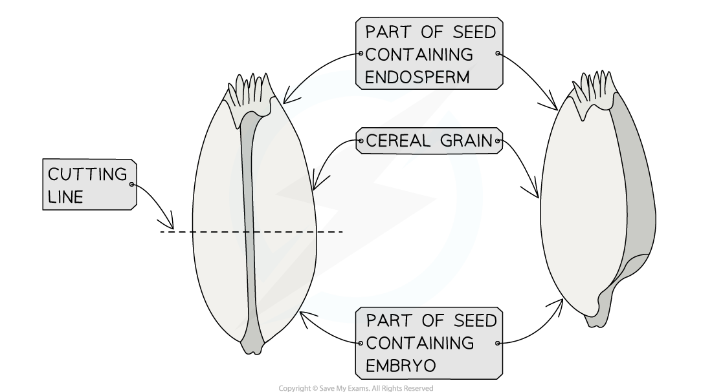
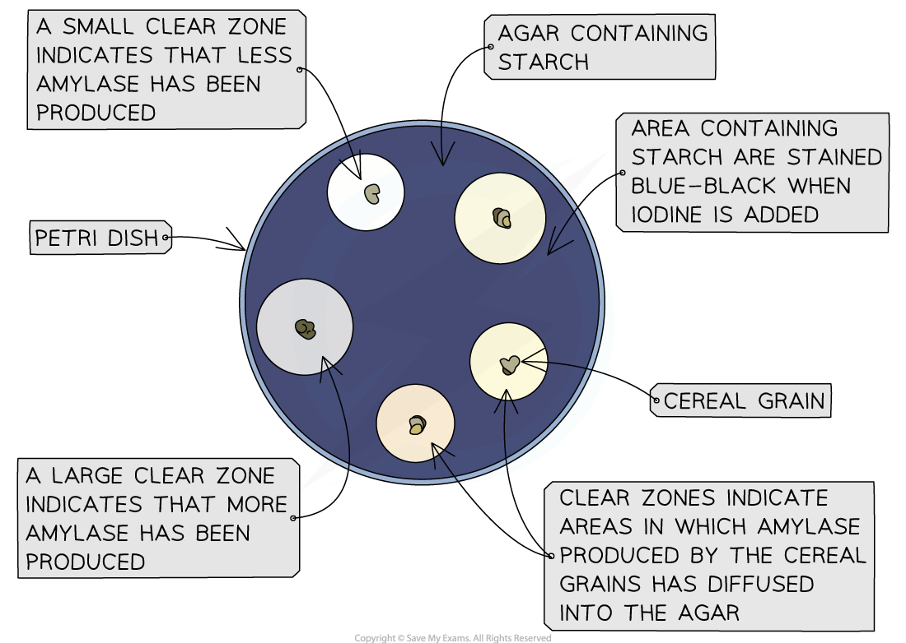

# Core Practical 18: Amylase in Germinating Cereal Grains

## Amylase in Germinating Cereal Grains

> **Spec point** — `spcpt_C3wwwrTCDkFQj699`

## Amylase in Germinating Cereal Grains

- Cereal grains such as barley contain

  - An **embryo**
  
    - This will grow into the new plant when the seed germinates
  - An **endosperm**
  
    - This is a starch-containing energy store surrounding the embryo
  - An **aleurone layer**
  
    - This is a protein-rich layer on the outer edge of the endosperm
- Barley seeds are shed from the parent plant in a state of **dormancy**, but when conditions are right for **germination** the starch in the endosperm is **broken down** into first maltose and then glucose, which provides a source of energy for the developing embryo
- The breakdown of the endosperm is stimulated by production of the plant growth factor **gibberellin** in the seed **embryo**, which **initiates the production of amylase** in the aleurone layer

  - Amylase breaks down amylose in starch into maltose

- The effect of** gibberellin concentration** on the **production of amylase** in germinating barley seeds can be investigated using a technique called a **starch agar assay**

  - As part of this process, cereal grains need to be cut in half to **remove the embryo** part of the seed; the embryo in a germinating seed would normally produce gibberellin, so removing it allows the investigator to **control the amount of gibberellin** the grain is exposed to
  
    - The embryo is found in the more pointed end of the seed, so this section must be discarded during the investigation

***Cutting the grain in half allows the part of the seed containing the embryo to be removed and discarded; this removes the part of the seed that produces gibberellin, allowing the investigator to control the gibberellin exposure of the remaining part of the grain***

#### Apparatus

- Measuring cylinders and pipettes
- Marker pen
- Cereal grains e.g. barley
- 3 % sodium hypochlorite solution
- Filter cloth e.g. muslin
- Distilled water
- Beakers
- Scalpel
- Forceps
- Cutting tile
- 1 g dm-3 gibberellic acid solution
- Petri dishes containing starch agar gel
- Sticky tape
- Iodine
- Large beaker for waste iodine solution
- Ruler

#### Method

1. Use measuring cylinders and pipettes to make up several gibberellic acid solutions at different concentrations; place these in labelled beakers
2. Remove any outer husks from cereal grains

  - This allows the shape of the grain to be seen clearly, helping to identify the half of the grain that **contains the embryo** in step 3
3. Cut seeds horizontally using a scalpel on a cutting tile and discard the seed half containing the embryo

  - This prevents any **gibberellin produced by the embryo** from influencing the results
4. Place grain halves into sodium hypochlorite solution for 5 minutes

  - This **sterilises **the grains
5. Wash the seeds with distilled water, draining the water through a filter cloth; this should be repeated several times to remove all of the sodium hypochlorite solution

  - The sodium hypochlorite solution will smell of chlorine, so washing should be repeated **until this** **smell is no longer present**
6. Use forceps to place the grain halves into gibberellin solutions at different concentrations, cover lightly and leave for 12-48 hours

  - Covering **prevents contamination**, but doing so lightly ensures that the covers are not air tight so that **oxygen can enter**
7. Place several grain halves from one gibberellin concentration onto a sterile starch agar petri dish and label dish with relevant gibberellin concentration; place seeds with cut half facing downwards
8. Lightly tape the lid onto the petri dish with 2-4 small pieces of sticky tape and leave for 24-48 hours

  - Any **amylase** being produced inside the seed will **diffuse** out of the cut seed and **into the starch agar**, digesting the starch and leaving **areas of agar around the seed in which no starch is present**
9. Repeat steps 7-8 for seeds at all gibberellin concentrations
10. Pour iodine solution onto the surface of each petri dish, ensuring that it covers the entire surface of the agar and that the lid of each dish is only raised enough to allow iodine to be poured

  - Only lifting the lid slightly will **prevent contamination** of the agar with any **other potential sources of starch**
11. Leave for a few minutes until the starch in the agar becomes stained with the iodine, and then pour excess iodine into a waste container

  - Areas of the agar containing starch will stain **blue-black**
12. Measure the diameter of the clear zone around each cereal grain, recording the results for each gibberellin concentration in a table

  - The** larger the clear area**, the **more amylase was produced **by the cereal grain
  - If several grains were used at each concentration then an **average** can be calculated
13. Plot a graph of gibberellin concentration against diameter of clear agar area

***The diameter of the clear zone around each cereal grain indicates the amount of amylase released; the larger the clear zone, the more amylase has been produced by the grain***
