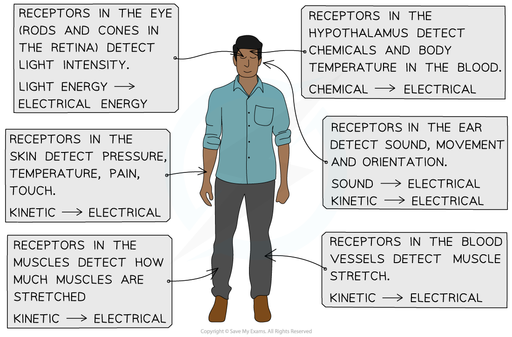
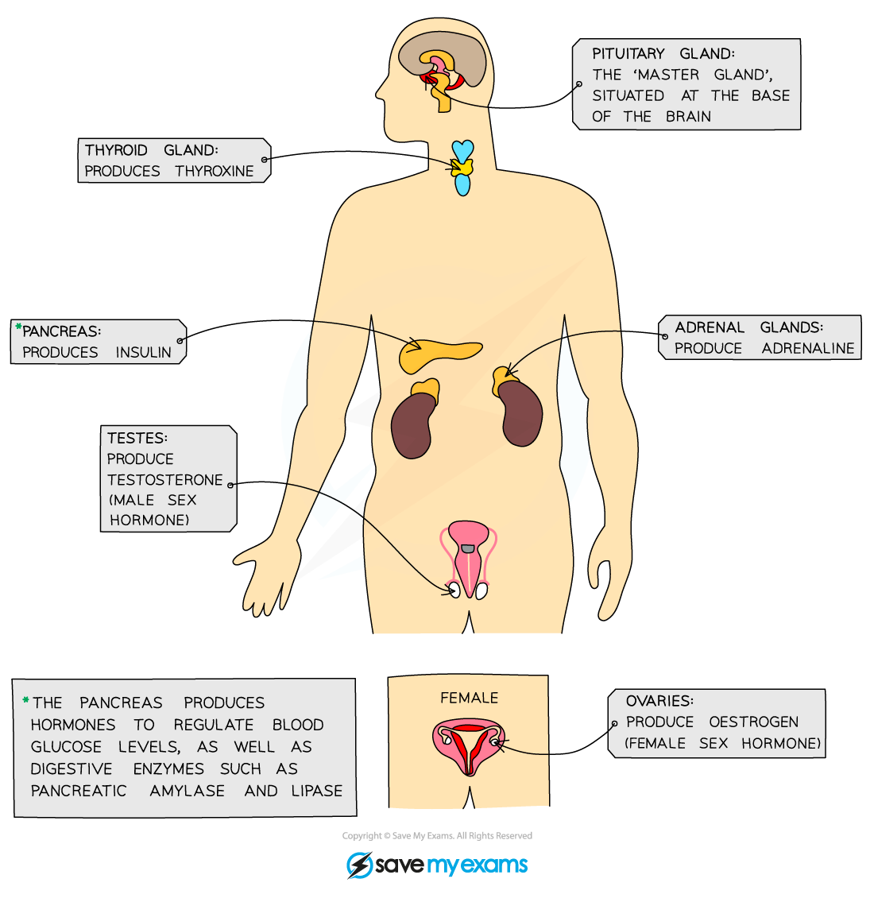
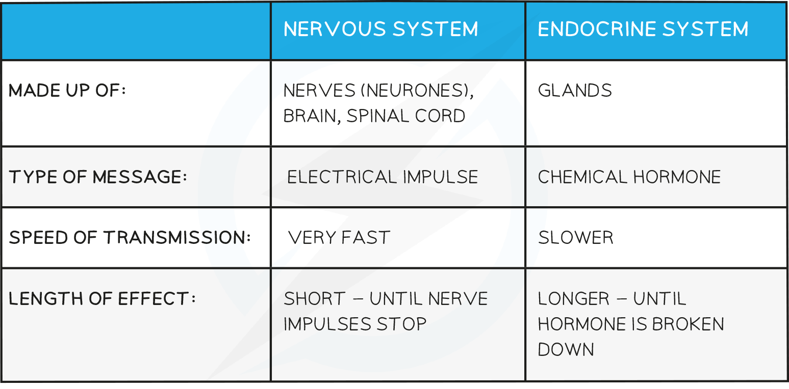

# Nervous & Hormonal Coordination

## Nervous & Hormonal Coordination

> **Spec point** — `spcpt_9WyYCK6wVsN323p6`

## Nervous & Hormonal Coordination

- Both plants and animals must **respond to changes** in their **external** and **internal** environments in order to survive

  - They need to
  
    - Find favourable external conditions e.g. avoiding locations that are too hot or cold
    - Find food
    - Avoid harm e.g. from predators or high blood glucose
- While plants use chemical signals to co-ordinate responses to stimuli, **animals** bring about coordination by **both nervous and hormonal control**
- Changes in the environment, or **stimuli **(singular** stimulus**) are detected by specialised **receptor cells**

  - Receptor cells are located in the **sense organs** e.g. the nose and eyes
  - Receptor cells can also be found inside the body e.g. pressure receptors in the blood vessels
- Receptor cells send **signals** via either the** nervous system **or the **hormonal system** to the body's co-ordination centres in the** brain** or **spinal cord**
- Signals are then sent on to the parts of the body which respond, known as the **effectors**

  - Effectors can be either **muscles** or **glands** e.g.
  
    - An arm muscle would respond to a hot surface by contracting to move the hand away
    - The pancreas responds to high blood sugar by secreting insulin

***Receptors are cells that detect stimuli in the internal and external environment***

#### The nervous system

- The human nervous system consists of

  - **Central nervous system** (CNS) – the **brain** and **spinal cord**
  - **Peripheral nervous system** (PNS) – all of the **nerves** in the body
- The nervous system allows detection of stimuli in our surroundings and the **coordination **of the body's **responses** to the stimuli
- Information is sent through the nervous system in the form of **electrical impulses** that pass along **nerve cells** known as **neurones**

  - A **bundle of neurones** is known as a **nerve**
  - There are different types of neurones** **including **sensory neurones, relay neurones, **and **motor neurones**
- The nerves connect the receptors in the sense organs with the CNS, and connect the CNS with effectors

  - The **CNS **acts as a **central coordinating centre** for the impulses that come in from, and are sent out to, any part of the body
- Nerve impulses pass through the nervous system along the following pathway

**stimulus **$\rightarrow$** receptor **$\rightarrow$** sensory neurone **$\rightarrow$** CNS **$\rightarrow$**motor neurone **$\rightarrow$**effector**

- An example of this nerve pathway in action might be

**hot surface **$\rightarrow$** pain receptor in skin of hand **$\rightarrow$** sensory neurone **$\rightarrow$**CNS **$\rightarrow$** motor neurone **$\rightarrow$** arm muscle**

- The muscle in the arm responds by contracting to move the hand away from the hot surface

***The nervous system allows the detection of stimuli and the co-ordination of appropriate responses***

#### The hormonal system

- Hormones are **chemical substances** produced by **endocrine glands** and carried by the **blood**

  - Endocrine glands are **ductless** and secrete hormones directly into the **blood**
  - Hormones are sometimes known as **chemical messengers**
- Hormones **transmit information from one part of an organism to another** and bring about **change **by altering the **activity** of one or more **specific target organs**

  - Hormones can leave the blood and bind to **specific receptors** on the cell surface membranes of target organs
- Hormones are slower in action than nerve impulses and are therefore used to control functions that **do not need instant responses**
- Endocrine glands that produces hormones in animals are known collectively as the **endocrine system**

  - Endocrine glands can be stimulated to secrete hormones by the action of **another hormone **or by the arrival of a **nerve impulse**
- The pathway of hormone action is as follows

**stimulus **$\rightarrow$** receptor **$\rightarrow$** hormone **$\rightarrow$**effector**

- An example of this pathway in action might be

**high blood sugar **$\rightarrow$** cells in the pancreas **$\rightarrow$** insulin **$\rightarrow$** liver cells **

- The liver cells respond to insulin by converting glucose into glycogen

***Hormones are secreted into the blood by the endocrine glands ***

**Comparison of Nervous and Hormonal control Table**

