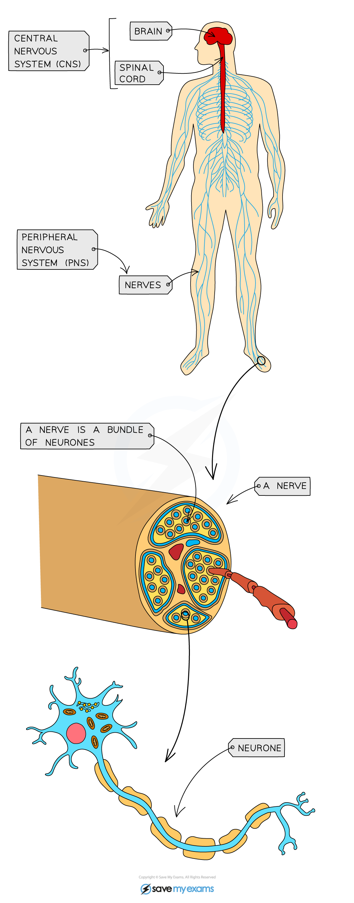

# Central & Peripheral Nervous System

## Central & Peripheral Nervous System

> **Spec point** — `spcpt_jgWtFTdqXCtgZHMf`

## Central & Peripheral Nervous System

- The human nervous system consists of

  - **Central nervous system** (CNS) – the **brain** and **spinal cord**
  - **Peripheral nervous system** (PNS) – the parts of the nervous system that are not within the central nervous system and that extend to the rest of the body
- The nervous system allows detection of stimuli in the surroundings and the **coordination **of the body's **responses** to the stimuli

  - Stimuli are detected by cells called **receptor cells**
  
    - Receptor cells are gathered together in the **sense organs**, e.g.
    
      - Photoreceptors that are stimulated by light are found in the eye
      - Chemoreceptors that are stimulated by chemicals are found on the tongue
      - Pressure receptors that are stimulated by pressure are found on the skin and inside the blood vessels
  - The parts of the body that respond to stimuli are known as the **effectors**
  
    - Effectors can be muscles or glands
- Information is sent through the nervous system in the form of **electrical impulses** that pass along **nerve cells** known as **neurones**

  - A **bundle of neurones** is known as a **nerve**
  - There are different types of neurones** **including **sensory neurones, relay neurones, **and **motor neurones**
- The PNS connects the receptor cells in the sense organs with the CNS, and connects the CNS with effectors

  - The **CNS **acts as a **central coordinating centre** for the impulses that come in from, and are sent out to, any part of the body
- Nerve impulses pass through the nervous system along the following pathway

**stimulus **$\rightarrow$** receptor **$\rightarrow$** sensory neurone **$\rightarrow$** CNS **$\rightarrow$**motor neurone **$\rightarrow$**effector**

***The nervous system consists of the central nervous system and the peripheral nervous system***
