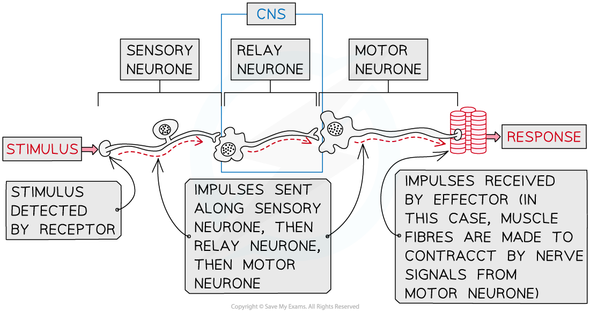

# How a Response is Generated by Effectors

## How a Response is Generated by Effectors

> **Spec point** — `spcpt_VJzGkv3c6TwBqDfF`

## How a Response is Generated by Effectors

- The nervous system enables the body to **detect changes in the environment **and brings about **appropriate responses** to ensure its safety

  - **Receptor cells** detect changes in the environment, or **stimuli**
  - Nerve impulses travel from the receptor cells along **sensory neurones **to the **central nervous system,** or CNS
  - The **CNS **acts as a **coordinating centre** for the impulses that arrive from the receptors, determining which part of the body needs to respond and sending out a new set of impulses along **motor neurones**
  - **Motor neurones send impulses** to the** effectors **to bring about a **response**
  
    - Effectors may be muscles or glands
- Nerve impulses pass through the nervous system along the following pathway

**stimulus **$\rightarrow$** receptor **$\rightarrow$** sensory neurone **$\rightarrow$** CNS **$\rightarrow$**motor neurone **$\rightarrow$**effector**

***Receptors detect stimuli and impulses are sent through to the nervous system to bring about a response in the effector***
