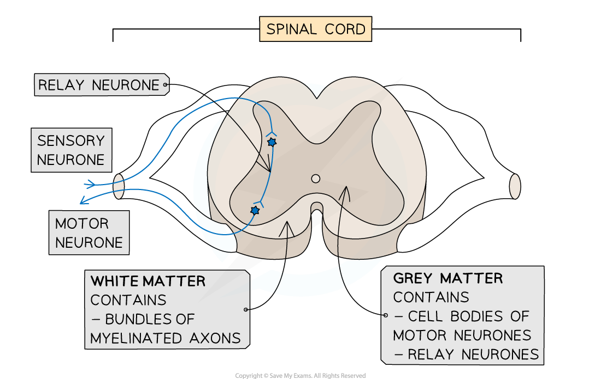

# The Reflex Arc

## The Reflex Arc

> **Spec point** — `spcpt_DrTMpGZNb3tXPXP9`

## The Reflex Arc

- The **central nervous system** (**CNS**) consists of the **brain** and **spinal cord**

  - The brain **processes information** about external and internal stimuli and **co-ordinates the body's responses**
  - The spinal cord **connects the brain** to the rest of the nervous system as well as **coordinating some reflex responses**
- **Reflex responses** are actions of the body that occur **without conscious thought**

  - Reflexes are **automatic** and **rapid,** **minimising damage** to the body and therefore** aiding survival**
  - Awareness of a reflex response occurs **after it has been carried out**; this is because the information takes longer to reach the conscious parts of the brain
- Examples of reflexes include blinking, coughing, and the pupil and knee reflexes

  - Blinking prevents the outer surface of the eye from drying out as well as protecting it from foreign objects
  - Coughing prevents food from entering the airways and removes mucus from the airways during infection or an allergic reaction
  - The pupil reflex prevents damage to the eye from bright light
  - The knee reflex aids balance when standing upright
- A **reflex arc** is a **pathway** along which impulses are transmitted from a receptor to an effector **without involving conscious regions of the brain**

  - A reflex arc therefore brings about a reflex response
  - **Sensory neurones, relay neurones and motor neurones **work together in a reflex arc

#### Spinal reflexes

- The pathway of a spinal reflex involves **relay neurones** located in the **spinal cord**

  - The spinal cord is made up of types of tissue known as **grey matter** and **white matter**
  
    - Grey matter contains the **cell bodies** of motor neurones along with **relay neurones**
    - White matter contains **long myelinated axons** that carry information through the spinal cord

***The spinal cord contains both grey matter and white matter***

- Pulling a foot away from a sharp object is an example of a spinal reflex

  - The stimulus of a sharp pin is detected by a **receptor** **cell** in the skin of the foot
  
    - The skin has receptors for pressure, touch, and pain
  - A **sensory neurone** sends electrical impulses to the CNS
  - An electrical impulse is passed to a **relay** **neurone** in the **spinal cord**
  - A relay neurone **synapses** with a motor neurone
  
    - A synapse is the junction between neurones; nerve impulses cross synapses by diffusion of a chemical called a neurotransmitter
  - A **motor** neurone carries an impulse to an **effector **muscle in the leg
  - When stimulated by the motor neurone the muscle will contract and pull the foot up and away from the sharp object; this is the **reflex response**
- The reflex arc for a spinal reflex is as follows

**stimulus **$\rightarrow$** receptor **$\rightarrow$** sensory neurone **$\rightarrow$** relay neurone in spinal cord **$\rightarrow$** motor neurone **$\rightarrow$** effector **$\rightarrow$** response**

***Spinal reflexes involve relay neurones in the spinal cord***

#### Cranial reflexes

- The pathway of a cranial reflex involves relay neurones located in the **brain**
- The pupil reflex is an example of a cranial reflex

  - Changing pupil diameter enables the eye to **control the amount of light** hitting the retina
  - The diameter of the pupil in the eye is determined by two sets of muscles
  
    - The **circular muscles** contract to **constrict** the pupil
    - The **radial muscles** contract to **dilate** the pupil
  - The two sets of muscles work **antagonistically**, meaning that when one set of muscles contracts the other relaxes, and vice versa
- When bright light falls on the eye, the following events occur

  - The light level is detected by photoreceptors in the retina
  - A **sensory** neurone sends electrical impulses to the CNS
  - An electrical impulse is passed to a **relay** **neuron**e in the **brain**
  - A relay neurone **synapses** with a motor neurone
  - A **motor** neurone carries an impulse to the **effector** muscle; in this case the **circular muscle in the iris **
  - When stimulated by the motor neurone the muscle will contract and **constrict** the pupil; this is the **reflex response**
- When in dim light the same process occurs, but the motor neurone stimulates the **radial muscles in the iris**, causing them to contract and **dilate** the pupil
- The reflex arc for a cranial reflex is as follows

**stimulus **$\rightarrow$** receptor **$\rightarrow$** sensory neurone **$\rightarrow$** relay neurone in brain **$\rightarrow$** motor neurone **$\rightarrow$** effector **$\rightarrow$** response**
