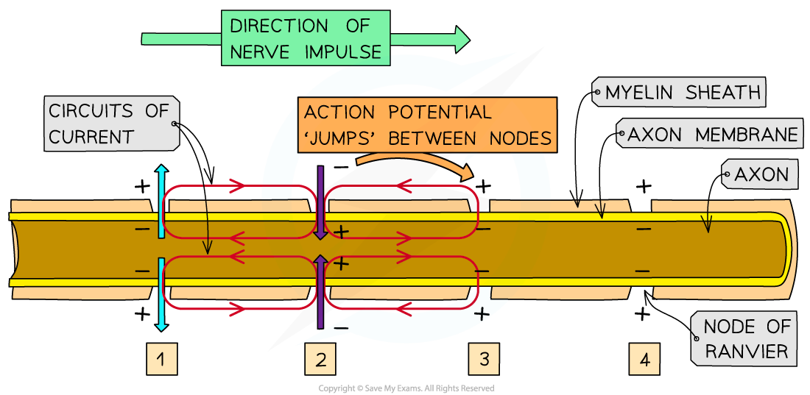
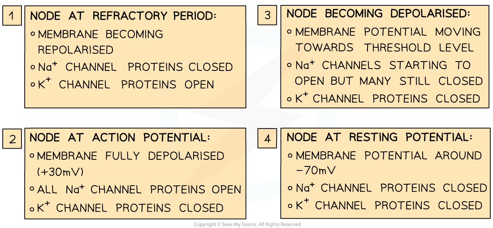

# Myelination & Saltatory Conduction

## Myelination & Saltatory Conduction

> **Spec point** — `spcpt_pqgvGM58Z98HcJZz`

## Myelination & Saltatory Conduction

- In **unmyelinated** neurones the speed of conduction is relatively **slow** because depolarisation must occur along the whole membrane of the axon
- By insulating the axon membrane myelin **increases the speed at which action potentials can travel** along the neurone

  - In sections of the axon that are surrounded by a myelin sheath **depolarisation** **cannot occur** as the myelin sheath **stops** the diffusion of sodium and potassium ions
  - Action potentials can only occur at the **nodes of Ranvier**
  
    - Nodes of Ranvier are the gaps between the Schwann cells that make up the myelin sheath
  - Sodium ions diffuse along the axon within the Schwann cells and the membrane at the nodes of Ranvier depolarises when the sodium ions arrive
  
    - The diffusion of sodium ions in this way is known as **local currents**, or **local circuits**
  - The action potential therefore appears to** ‘jump’ from one node to the next; **this is known as **saltatory conduction**
- Saltatory conduction allows the impulse to travel **much faster** than in an unmyelinated axon of the same diameter

***Action potentials are transmitted along myelinated axons by saltatory conduction***
