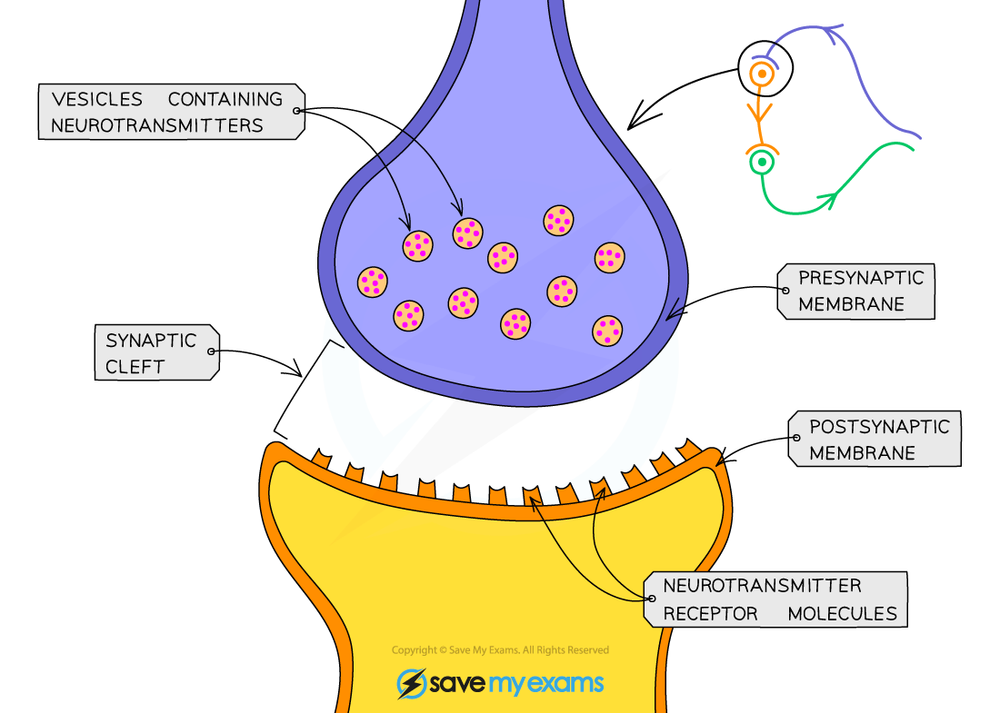

# The Effects of Drugs on Nervous Transmission

## The Effects of Drugs on Nervous Transmission

> **Spec point** — `spcpt_5qMYkrYNSQV6sW4n`

## The Effects of Drugs on Nervous Transmission

- The chemicals in **drugs** can have a major impact on the **functioning of the brain and nervous system**
- Many drugs impact the nervous system by altering the events that occur at **synapses**
- Drugs can **increase transmission** of impulses at a synapse by

  - Causing more neurotransmitter to be** produced **in the synaptic knob
  - Causing more neurotransmitter to be **released** at the presynaptic membrane
  - Imitating the effect of a neurotransmitter by **binding to and activating receptors** on the postsynaptic membrane
  - **Preventing the breakdown** of neurotransmitters by enzymes
  - **Preventing the reuptake** of neurotransmitters by the presynaptic cell
- Drugs can **decrease transmission **of impulses at a synapse by

  - **Preventing production** of neurotransmitter in the presynaptic knob
  - **Preventing the release** of neurotransmitter at the presynaptic membrane
  - Enabling neurotransmitter to gradually leak out of the presynaptic knob so there is little left when an action potential arrives
  
    - The neurotransmitter that leaks out of the cell is **destroyed by enzymes**
  - Binding to receptors on the postsynaptic membrane and so **preventing neurotransmitters from binding**

***Drugs can influence the transmission of nerve impulses at synapses***

#### Nicotine

- Nicotine is the addictive chemical found in **tobacco**
- Nicotine affects synapses in more than one way

  - It **mimics acetylcholine**
  
    - Nicotine binds to a type of acetylcholine receptor on the postsynaptic neurone known as a **nicotinic receptor**
    - The binding of nicotine to nicotinic receptors **initiates an action potential** in the postsynaptic neurone
    - After stimulation by nicotine these receptors** become unresponsive** to other stimulation
    
      - While it is normal for receptors to be briefly unresponsive to further stimulation after being activated, nicotine causes a **prolonged period of unresponsiveness**
  - It **stimulates release of dopamine**
  
    - Dopamine is released from the **pleasure centres** in the brain in response to nicotine
    - The release of dopamine is thought to **reinforce rewarding behaviours,** in this case smoking, increasing the likelihood that we will carry out that behaviour again
- Nicotine **increases heart rate and blood pressure**, as well as **increasing the likelihood that an individual will continue smoking**; this further impacts the circulatory system as well as increasing the risk of other health problems such as lung cancer

#### Lidocaine

- Lidocaine is often used as a **local anaesthetic** for **numbing small areas** of the body

  - E.g. it is used by dentists before dental procedures such as tooth extraction
- It can also be used to **regulate the heart beat** in people suffering from irregular heart rhythms
- Lidocaine works by **blocking voltage gated sodium channels**

  - This **prevents a large influx of sodium ions** in the postsynaptic neurone, therefore **preventing an action potential** from being generated

#### Cobra venom

- Cobra venom, also known as $α$-cobratoxin, is a type of **venom **produced by some species of cobra

  - Receiving a snake bite from a cobra can be fatal
  - $α$ = alpha
- $α$-cobratoxin **binds to acetylcholine receptors** on the postsynaptic membrane, preventing an influx of sodium ions and therefore the generation of an action potential
- When this occurs at the synapses between motor neurones and muscle fibres, known as **neuromuscular junctions**, this can lead to **muscle paralysis**

  - Eventual paralysis of the **muscles that control breathing **leads to death
- Small quantities of $α$-cobratoxin can be used as a **muscle relaxant** during asthma attacks

#### L-dopa

- L-dopa is a drug used to treat the symptoms of **Parkinson's disease**
- It has a very **similar structure to dopamine;** a neurotransmitter present at lower levels than usual in the brains of those who suffer from Parkinson's disease
- L-dopa is transported from the blood into the brain, where it is **converted into dopamine** in a reaction catalysed by the **enzyme** dopa-decarboxylase
- The effect is to **increase levels of dopamine in the brain**

  - Note, dopamine cannot be given directly to those who have Parkinson's disease as it cannot cross the barrier between the blood and the brain
- Increased levels of dopamine mean that **more nerve impulses are transmitted **in parts of the brain that control movement, giving sufferers better control over their movement and lessening the symptoms of Parkinson's disease

#### MDMA

- MDMA is a **recreational drug** that is also known as ecstasy

  - Its use and sale are criminal offences in most parts of the world
- MDMA effects multiple neurotransmitters, most notably **serotonin**

  - MDMA **inhibits the reuptake **of serotonin into the presynaptic neurone by **binding to the specific proteins that enable serotonin reuptake**, located on the presynaptic membrane; this increases the amount of serotonin present in the brain
  
    - Serotonin is usually reabsorbed into the **presynaptic neurone to be recycled** for future action potentials
  - MDMA also triggers the** release of further serotonin** from presynaptic neurones, further adding to the increase
- Serotonin can affect people in many ways including their **mood**, anxiety and sleep
- When an individual takes MDMA they may feel **extreme euphoria** and enhanced touch and bodily sensations
