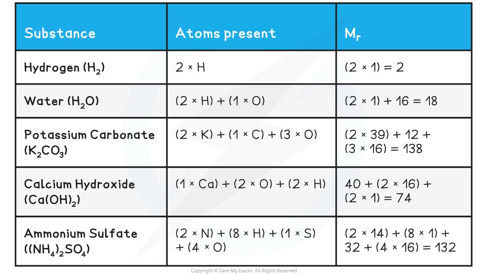

# Formulae & Mass

## Formulae - Definitions

> **Spec point** — `spcpt_BrN7h44sQm5RDZpc`

## Formulae - Definitions

#### Basic terms

- There are basic terms that you are expected to know from your previous studies

  - Atom
  
    - A single particle
    - The smallest part of an element that can participate in a chemical reaction
  - Element
  
    - An atom or group of atoms of only one type, which can be chemically joined or not
    - A substance that cannot be broken down into simpler substances
  - Ion
  
    - An atom that has become electrically charged
    - An atom (or group of atoms) that has gained or lost electrons to become a charged species
  - Molecule
  
    - Two or more atoms chemically joined together
  - Compound
  
    - A substance with two or more elements chemically joined together
  - Empirical formula
  
    - The smallest whole-number ratio of atoms (of each element) in a compound/molecule
  - Molecular formula
  
    - The actual number of atoms (of each element) in a compound/molecule

## Mass - Definitions

> **Spec point** — `spcpt_Jn5CfT4jZSgSyFVH`

## Mass - Definitions

- The relative mass of an atom uses the carbon-12 isotope as the international standard
- One atom of carbon-12 has an accepted mass of 1.992646538 x 10-26 kg
- It is not realistic to work with this value so the mass of a carbon-12 atom is fixed as exactly 12 atomic mass units / 12υ
- The standard mass for atomic mass is 1υ

  - Therefore, the standard mass for comparison is the mass of $\frac{1}{12}$ of a carbon-12 atom

#### Relative isotopic mass

- Relative isotopic mass is defined as the mass of an isotope relative to $\frac{1}{12}$ of a carbon-12 atom
- For A Level Chemistry it is common to work with mass values rounded to one decimal place, for example:
- The accurate relative isotopic mass of nitrogen is 14.00307401 but this is rounded to 14.0
- The accurate relative isotopic mass of oxygen is 15.99491464 but this is rounded to 16.0

#### Relative atomic mass

- Most elements on the Periodic Table represent a mixture of different isotopes, which is shown as their relative atomic mass (*A*r)
- The relative atomic mass is the weighted mean / average mass of an atom relative to $\frac{1}{12}$ of the mass of a carbon-12 atom

- We have seen previously that the symbol for the relative atomic mass is *A**r*
- This is calculated from the **mass number** and **relative abundances** of all the **isotopes** of a particular element
- The symbol for the **relative formula mass** is ***M******r***** **and it refers to the** total mass** of the substance

  - The term relative formula mass should be used for compounds with giant structures e.g. ionic compounds such as sodium chloride
  - If the substance is molecular you can use the term **relative molecular mass**
- To calculate the *M**r* of a substance, you have to add up the **relative atomic masses** of all the atoms present in the formula

#### Relative Formula Mass Calculations Table

> **Exam Hint**
> It is expected that you will use relative atomic mass values from the Periodic Table
> 
> - This means that your values will be more accurate
> - e.g. potassium carbonate = (2 x 39.1) + 12.0 + (3 x 16.0) = 138.2
> 
> If you are in any doubt whether to use relative molecular mass or relative formula mass, use the latter because it applies to all compounds whether they are ionic or covalent.
