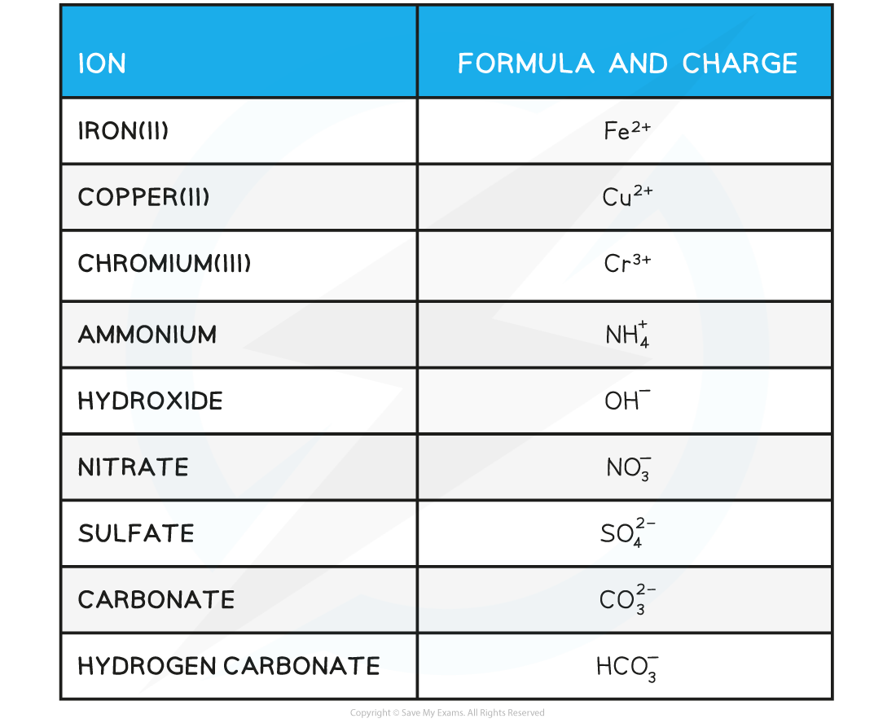

# Full & Ionic Equations

## Writing & Balancing Equations

> **Spec point** — `spcpt_TprbNpGbbyg6JSbj`

## Writing & Balancing Equations

- A **symbol **equation is a shorthand way of describing a chemical reaction using **chemical symbols **to show the number and type of each atom in the reactants and products
- A **word **equation is a longer way of describing a chemical reaction using only **words** to show the reactants and products

#### Balancing equations

- During chemical reactions, atoms cannot be **created **or **destroyed**
- The number of each atom on each side of the reaction must therefore be the **same**

  - E.g. the reaction needs to be **balanced**
- When balancing equations remember:

  - Not to change any of the formulae
  - To put the numbers used to balance the equation **in front **of the formulae
  - To balance firstly the carbon, then the hydrogen and finally the oxygen in **combustion reactions **of organic compounds
- When balancing equations follow the following the steps:

  - Write the formulae of the reactants and products
  - Count the numbers of atoms in each reactant and product
  - Balance the atoms one at a time until all the atoms are balanced
  - Use appropriate state symbols in the equation
- The **physical state **of reactants and products in a chemical reaction is specified by using **state symbols**

  - **(s)** solid
  - **(l)** liquid
  - **(g)** gas
  - **(aq)** aqueous

#### Formulae for Ionic Compounds

- The formulae of simple ionic compounds can be calculated if you know the charge on the ions
- Below are some common ions and their charges:

**Common Ions & Their Charges Table**

- For ionic compounds you have to balance the charge of each part by multiplying each ion until the sum of the charges = 0
- Example: what is the formula of aluminium sulfate?

  - Write out the formulae of each ion, including their charges
  - Al3+ SO42-
- Balance the charges by multiplying them out: Al3+ x** 2** = +6 and SO42- x **3** = -6; so +6 – 6 = 0
- So the formula is Al2(SO4)3

> **Exam Hint**
> Another method that also works is to 'swap the numbers'.
> 
> In the example above the numbers in front of the charges of the ions (3 and 2) are swapped over and become the multipliers in the formula (2 and 3).
> 
> Easy when you know how!

> **Worked Example**
> Balance the following equation:
> 
> magnesium + oxygen **→** magnesium oxide
> 
> **Answer:**
> 
> **Step 1:** Write out the symbol equation showing reactants and products
> 
> **Mg + O****2**** → MgO**
> 
> **Step 2:** Count the numbers of atoms in each reactant and product
> 
> 
> 
> **Step 3:** Balance the atoms one at a time until all the atoms are balanced
> 
> **2Mg + O****2**** → 2MgO**
> 
> This is now showing that 2 moles of magnesium react with 1 mole of oxygen to form 2 moles of magnesium oxide
> 
> **Step 4:** Use appropriate **state symbols **in the fully balanced equation
> 
> **2Mg (s) + O****2 ****(g) → 2MgO (s)**

#### Ionic equations

- In aqueous solutions ionic compounds **dissociate** into their ions
- Many chemical reactions in aqueous solutions involve ionic compounds, however only some of the ions in solution take part in the reactions
- The ions that do **not **take part in the reaction are called **spectator ions**
- An **ionic equation **shows **only **the ions or other particles taking part in a reaction, and not the spectator ions

> **Worked Example**
> 1. Balance the following equation
> 
> zinc + copper(II) sulfate → zinc sulfate + copper
> 
> 2. Write down the ionic equation for the above reaction
> 
> **Answer 1:**
> 
> **Step 1:** To balance the equation, write out the symbol equation showing reactants and products
> 
> **Zn  + CuSO****4****  → ZnSO****4**** + Cu**
> 
> **Step 2:** Count the numbers of atoms in each reactant and product. The equation is already balanced
> 
> 
> 
> **Step 3:** Use appropriate **state symbols **in the equation
> 
> **Zn (s)  + CuSO****4 ****(aq)  → ZnSO****4 ****(aq) + Cu (s)**
> 
> **Answer 2:**
> 
> **Step 1:**  The full chemical equation for the reaction is
> 
> **Zn (s)  + CuSO****4**** (aq)  → ZnSO****4**** (aq) + Cu (s)**
> 
> **Step 2:**  Break down reactants into their respective ions
> 
> **Zn (s)  + Cu****2+ ****+  SO****4****2-**** (aq)  → Zn****2+****+ SO****4****2-**** (aq) + Cu (s) **
> 
> **Step 3:**  Cancel the spectator ions on both sides to give the ionic equation
> 
> **Zn (s)  + Cu****2+ ****+ ****SO****4****2-**** (aq)  → Zn****2+****+ ****SO****4****2-**** (aq) + Cu (s)**
> 
> **Zn (s)  + Cu****2+****(aq)  → Zn****2+**** (aq) + Cu (s)**

## Experimental Observations & Equations

> **Spec point** — `spcpt_mnpKP3jzZSQmnP5R`

## Experimental Observations & Equations

- Chemical equations give information about the reaction that is taking place

  - Balanced equations show the number of particles participating in the reaction and the number of products being formed
  - Balanced equations can be used to calculate the number of moles involved in reactions
  - Balanced equations can, also, be used to calculate masses and volumes involved in reactions
  - Ionic equations only show the reacting particles
  - Ionic equations allow you to identify spectator ion

### Types of reaction

- Chemical equations can be used to determine the type of reaction taking place

#### Displacement reactions

Br2 (aq) + 2KI (aq) → I2 (aq) + 2KBr (aq)

- In this reaction, the more reactive bromine **displaces **the less reactive iodide in potassium iodide
- This can also be seen in the ionic equation for the reaction

Br2 (aq) + 2I- (aq) → I2 (aq) + 2Br- (aq)

> **Exam Hint**
> The use of chemical equations can help identify risks and hazards in the reaction and suggest appropriate precautions where necessary
> 
> For example, the use of aqueous bromine in the above example should suggest the potential use of a fume cupboard and nitrile gloves because:
> 
> - Bromine liquid is **toxic**, **corrosive **and **harmful to the environment**
> - Bromine water with a concentration of 0.2 mol dm3 is corrosive
> - With a concentration of between 0.06 mol dm3 and 0.2 mol dm3, bromine water is an **irritant**
> - Only below concentrations of 0.06 mol dm3 is bromine water considered a **low hazard**

#### Neutralisation reactions

- These can be identified by the presence of reactant acids and bases as well as the formation of a **neutral solution **salt and water (and sometimes other compounds such as carbon dioxide)

HCl (aq) + NaOH (aq) → NaCl (aq) + H2O (l)

Na2CO3 (aq) + 2HNO3 (aq) → 2NaNO3 (aq) + H2O (l) + CO2 (g)

- The ionic equations can more clearly demonstrate the neutralisation of an acid and a base:

H+ (aq) + OH- (aq) → H2O (l)

2H+ (aq) + CO32- (aq) → H2O (l) + CO2 (g)

> **Exam Hint**
> For neutralisation reactions, the main hazards are linked to:
> 
> - The concentration of the acid
> - The type of acid
> 
>   - This could mean **strong**,  e.g. HCl, or **weak**, e.g. CH3COOH
>   - This could also mean **monoprotic**, e.g. HNO3, **diprotic**, e.g. H2SO4, or **triprotic**, e.g. H3PO4
> - The concentration of the base
> - The strength of the base
> - The physical state of the base, e.g. NaOH (s) is arguably considered more corrosive than a high concentration solution of NaOH (aq)

#### Precipitation reactions

- These are shown by the reaction of two aqueous solutions to form products which include one solid

BaCl2 (aq) + Na2SO4 (aq) → BaSO4 (s) + 2NaCl (aq)

- The ionic equation shows the precipitation reactions more clearly as there are no other products considered

Ba2+ (aq) + SO42- (aq) → BaSO4 (s)

> **Exam Hint**
> A precipitation reaction is a clear example of where consideration for further practical procedures is most obvious
> 
> The formation of a solid product should tell you that any purification of the product should include filtering or decanting as a minimum
