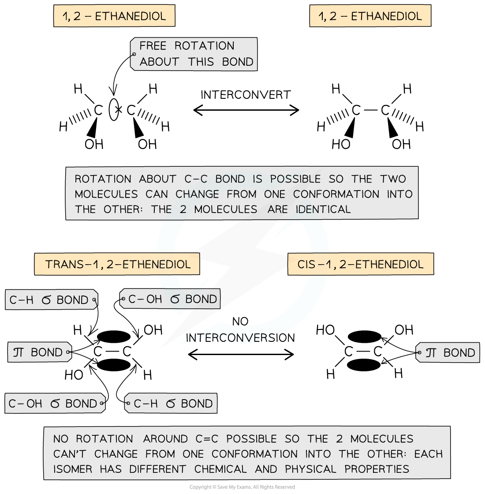
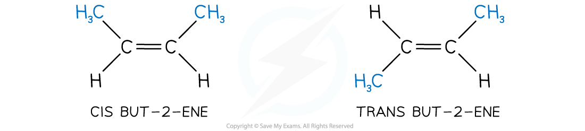
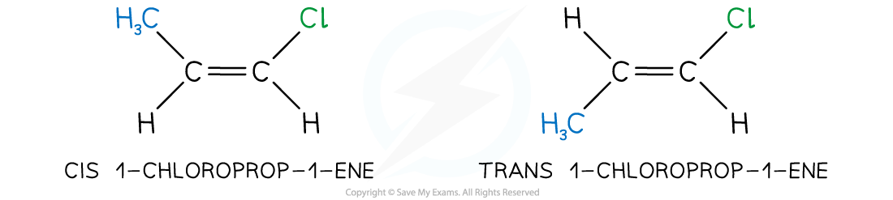
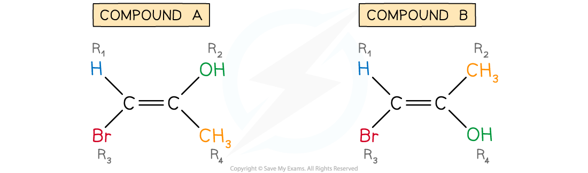

# Isomers - Geometric

## Isomers - Geometric

> **Spec point** — `spcpt_hjz3DmyJVDP4qW3P`

## Isomers - Geometric

- One of the features of alkenes is their stereoisomerism or geometric isomerism, which can be classed as ***E / Z*** or **cis / trans**

  - *E / Z *isomerism is an example of stereoisomerism where different atoms or groups of atoms are attached to each carbon atom of the C=C bond
  - Cis / trans isomerism is a special case of *E / Z* isomerism where two of the atoms or groups of atoms attached to each carbon atom of the C=C bond are the same

#### Cis / trans isomers

- In *saturated compounds*, the atoms / functional groups attached to the single, σ-bonded carbons are not fixed in their position due to the free rotation about the C-C **σ-bond**
- In unsaturated compounds, the groups attached to the C=C carbons remain fixed in their position

  - This is because free rotation of the bonds about the C=C bond is not possible due to the presence of a **π bond**
- Cis / trans nomenclature can be used to distinguish between the isomers

  - Cis isomers have two functional groups on the same side of the double bond / carbon ring, i.e. both above the C=C bond or both below the C=C bond
  - Trans isomers have two functional groups on opposite sides of the double bond / carbon ring, i.e. one above and one below the C=C bond

***The presence of a ***π ***bond in unsaturated compounds restricts rotation about the C=C bond forcing the groups to remain fixed in their position and giving rise to the formation of certain configurational isomers***

## Deducing E / Z Isomers

> **Spec point** — `spcpt_P99vprMjtBVMsBRC`

## Deducing E / Z Isomers

#### Naming cis / trans isomers

- For cis / trans isomers to exist, we need two different atoms or groups of atoms on either side of the C=C bond

  - This means that 2-methylpropene cannot have cis / trans isomers as the methyl groups are both on the same side of the C=C bond:

***2-methylpropene molecules do not have cis / trans isomers***

- However, moving one of the methyl groups to the other side of the C=C bond causes cis / trans isomerism:

***But-2-ene does have cis / trans isomers***

- The atoms or groups of atoms on either side of the C=C bond do not have to be the same for cis / trans isomers:

***1-chloroprop-1-ene also shows cis / trans isomerism***

- However, the cis / trans naming system starts to fail once we have more than one atom or group of atoms on either side of the C=C bond

  - The cis / trans naming system can still be used with three atoms / groups of atoms but only if: 
  
    - Two of the three atoms or groups of atoms are the same
    - These two atoms or groups of atoms are on opposite sides of the double bond

***1,2-dichloropropene can be named using cis / trans ***

- The cis / trans naming system cannot be used with three atoms / groups of atoms when they are all different

  - This requires the use of the *E* / *Z* naming system

***1-bromo-2-chloropropene cannot be named using cis / trans ***

#### E / Z isomers

- To discuss *E* / *Z* isomers, we will use an alkene of the general formula C2R4:

***The general alkene, C******2******R******4***

- When the groups R1, R2, R3 and R4 are all different (i.e. R1 ≠ R2 ≠ R3 ≠ R4), we have to use the *E* / *Z* naming system

  - This is based on Cahn-Ingold-Prelog (CIP) priority rules
- To do this, we look at the **atomic number** of the first atom attached to the carbon in question

  - The higher the atomic number; the higher the priority
- For example, 1-bromo-1-propen-2-ol has four different atoms or groups of atoms attached to the C=C bond

  - This means that it can have two different displayed formulae:

***1-bromo-1-propen-2-ol (compounds A and B)***

**Compound A**

- **Step 1: Apply the CIP priority rules**

  - Look at R1 and R3:
  
    - Bromine has a higher atomic number than hydrogen so bromine has priority
  - Look at R2 and R4:
  
    - Oxygen has a higher atomic number than carbon so oxygen has priority

- **Step 2: Deduce *****E***** or *****Z***

  - *E* isomers have the highest priority groups on opposite sides of the C=C bond, i.e. one above and one below
  
    - The *E* comes from the German word "entgegen" meaning opposite
  - *Z* isomers have the highest priority groups on the same side of the C=C bond, i.e. both above or both below
  
    - The *Z* comes from the German word "zusammen" meaning together
  - In compound A, the two highest priority groups are on opposite sides (above and below) the C=C bond
  
    - Therefore, compound A is *E*-1-bromo-1-propen-2-ol

**Compound B**

- **Step 1: Apply the CIP priority rules**

  - Look at R1 and R3:
  
    - Bromine has a higher atomic number than hydrogen so bromine has priority
  - Look at R2 and R4:
  
    - Oxygen has a higher atomic number than carbon so oxygen has priority

- **Step 2: Deduce *****E***** or *****Z***

  - In compound B, the two highest priority groups are on the same side (both below) the C=C bond
  
    - Therefore, compound B is *Z*-1-bromo-1-propen-2-ol

#### More complicated E / Z isomers

- Compound X exhibits *E* / *Z* isomerism:

***Compound X***

- **Step 1: Apply the CIP priority rules**

  - Look at R1 and R3:
  
    - Carbon is the first atom attached to the C=C bond, on the left hand side
  - Look at R2 and R4:
  
    - Carbon is the first atom attached to the C=C bond, on the right hand side
  - This means that we cannot deduce if compound X is an *E* or *Z* isomer by applying the CIP priority rules to the first atom attached to the C=C bond
  
    - Therefore, we now have to look at the second atoms attached
  - Look again at R1 and R3:
  
    - The second atoms attached to R1 are hydrogens and another carbon
    - The second atoms attached to R3 are hydrogens and bromine
    - We can ignore the hydrogens as both R groups have hydrogens
    - Bromine has a higher atomic number than carbon, so bromine is the higher priority
    
      - Therefore, the CH2Br group has priority over the CH3CH2 group
  - Look again at R2 and R4:
  
    - The second atoms attached to R2 are hydrogens
    - The second atoms attached to R3 are hydrogens and an oxygen
    - Oxygen has a higher atomic number than hydrogen, so oxygen is the higher priority
    
      - Therefore, the CH2OH group has priority over the CH3 group

- **Step 2: Deduce *****E***** or *****Z***

  - In compound X, the two highest priority groups are on the same side (both below) the C=C bond
  
    - Therefore, compound X is the *Z* isomer
