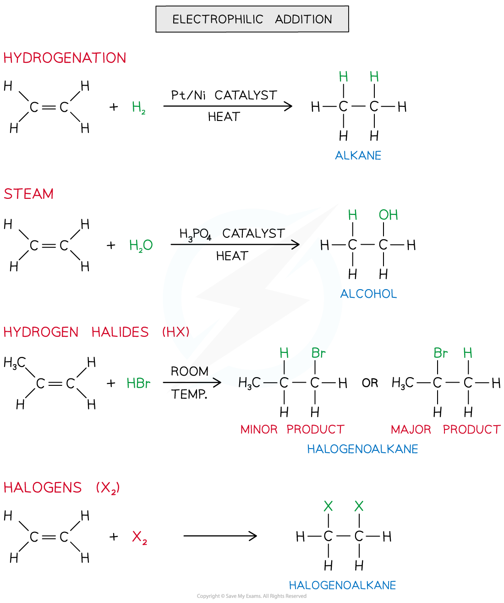
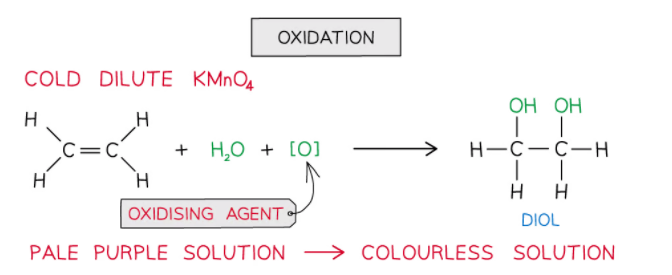

# Reactions of Alkenes

## Alkenes - Reactions 

> **Spec point** — `spcpt_mNT5kqZrfY3hgG2t`

## Alkenes - Reactions

- The double bond in alkenes is an area of high electron density (there are four electrons found in this double bond)
- This makes the double bond susceptible to attack by electrophiles (electron-loving species)
- An **electrophilic addition **is the addition of an **electrophile** to a double bond
- The C-C double bond is broken, and a new single bond is formed from each of the two carbon atoms
- Electrophilic addition reactions include the addition of:

  - Hydrogen (also known as **hydrogenation** **reaction**)
  - Steam (H2O (g))
  - Hydrogen halide (HX)
  - Halogen

***The diagram shows an overview of the different electrophilic addition reactions alkenes can undergo***

#### Oxidation

- Alkenes can also be **oxidised **by **acidified potassium manganate(VII) **(KMnO4) which is a very powerful **oxidising agent**
- When shaken with cold dilute** KMnO****4** the **pale purple **solution turns **colourless **and the product is a **diol**

  - This colour change means this reaction can be used, like bromine, to distinguish alkanes from alkenes (alkanes do not have double bonds and so are not oxidised in this way)

- Although you do not need to know the full details of the working of this reaction you can think of it as an oxidation followed by an addition

  - The potassium manganate provides an oxygen atom (oxidation)
  - Then water in the solution provides another oxygen atom and two hydrogen atoms, so there is addition of two OH groups across the double bond
