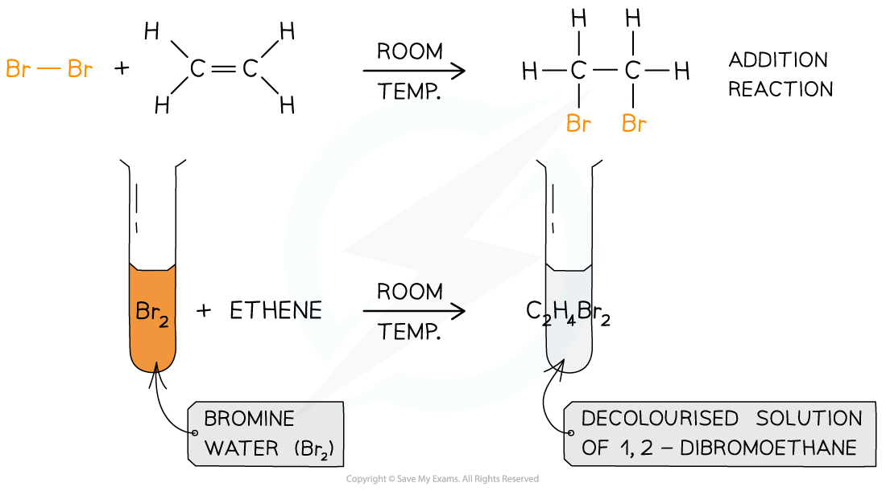

# Saturation Test

## Saturation Test

> **Spec point** — `spcpt_MM9CXWrrqPvjhp6f`

## Saturation Test

- Halogens can be used to test if a molecule is **unsaturated **(i.e. contains a double bond)
- Br2(aq) is an orange or yellow solution, called **bromine water **and this is the halogen most commonly used
- The unknown compound is **shaken **with the bromine water
- If the compound is unsaturated, an addition reaction will take place and the coloured solution will decolourise

***The decolourisation of bromine water by an unsaturated compound as a result of an addition reaction***
