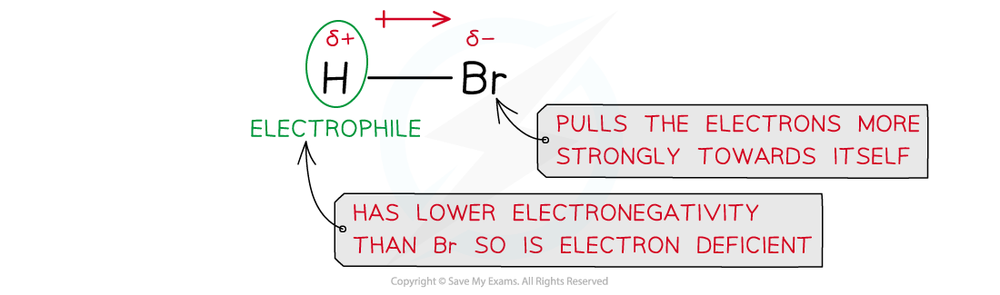
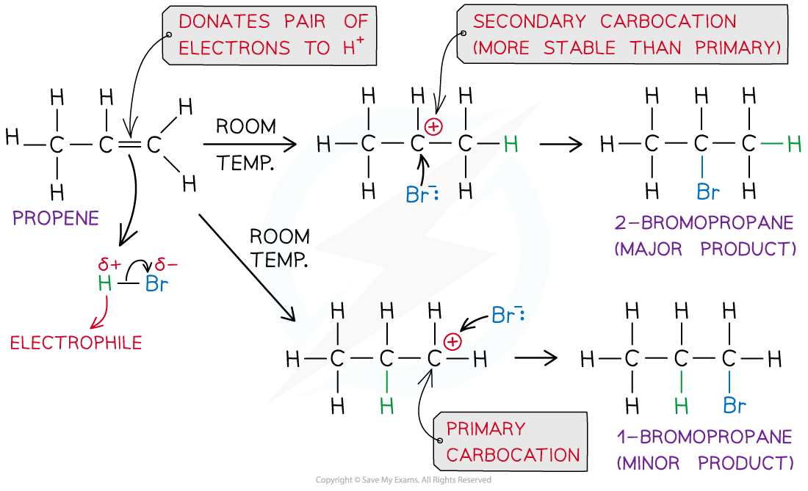
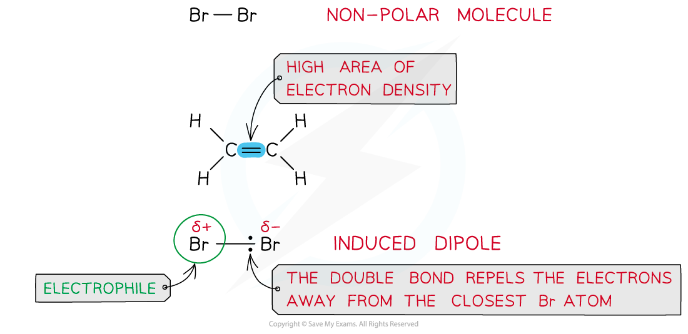
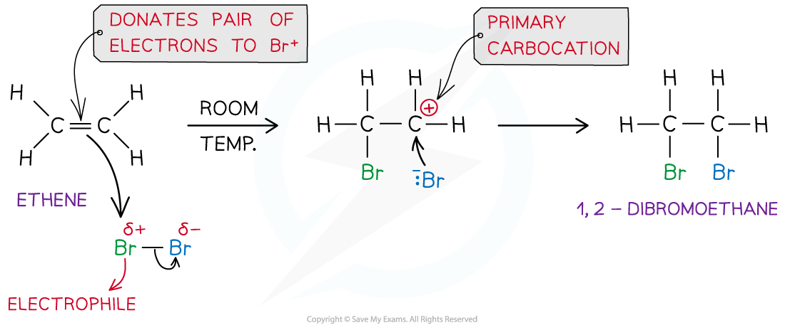

# Electrophilic Addition - Mechanism

## Electrophilic Addition - Mechanism

> **Spec point** — `spcpt_84DbW97DcVzVvrz4`

## Electrophilic Addition - Mechanism

#### Electrophilic addition of hydrogen halides

- Hydrogen halides such as hydrogen bromide (HBr) are polar as the hydrogen and halogen atoms have different electronegativities
- The bromine atom has a stronger pull on the electrons in the H-Br bond
- As a result of this, the Br atom has a partial negative and the H atom a partial positive charge

***Due to differences in electronegativities of the hydrogen and bromine atom, HBr is a polar molecule***

- In an addition reaction, the H atom acts as an electrophile and accepts a pair of electrons from the C-C bond in the alkene

  - The H-Br bond breaks heterolytically, forming a Br- ion
- This result in the formation of a highly reactive carbocation intermediate which reacts with the Br- (nucleophile)

***Example of an electrophilic addition reaction of HBr and propene to form 1-bromopropane and 2-bromopropane***

#### Electrophilic addition of Halogens

- Halogens such as bromine (Br2) are a non-polar molecules as both atoms have similar electronegativities and therefore equally share the electrons in the covalent bond
- However, when a bromine molecule gets closer to the double bond of an alkene, the high electron density in the double bond repels the electron pair in Br-Br away from the closest Br atom
- As a result of this, the closest Br atom to the double bond is slightly positive and the further Br atom is slightly negatively charged

***Br******2****** is a non-polar molecule however when placed close to an area of high electron density it can get polarised***

- In an addition reaction, the closest Br atom acts as an electrophile and accepts a pair of electrons from the C-C bond in the alkene

  - The Br-Br bond breaks heterolytically, forming a Br- ion
- This results in the formation of a highly reactive carbocation intermediate which reacts with the :Br- (nucleophile)

***Example of an electrophilic addition reaction of Br******2****** and ethene to form dibromoethane***

> **Exam Hint**
> The stability of the carbocation intermediate is as follows:
> 
> tertiary > secondary > primary
> 
> When more than one carbocations can be formed, the major product of the reaction will be the one that results from the nucleophilic attack of the most stable carbocation.
