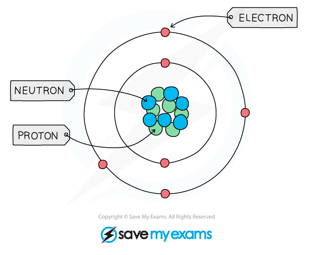
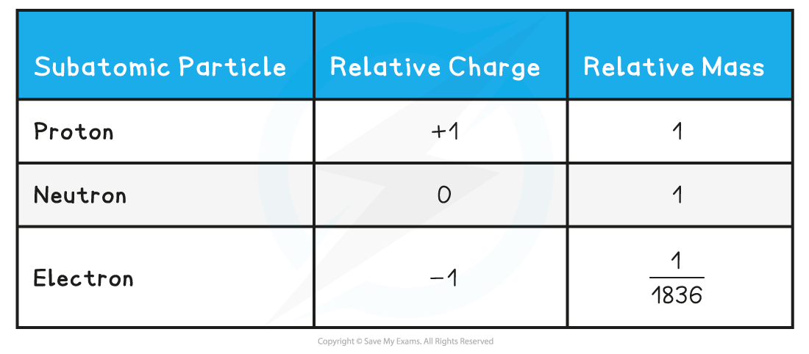
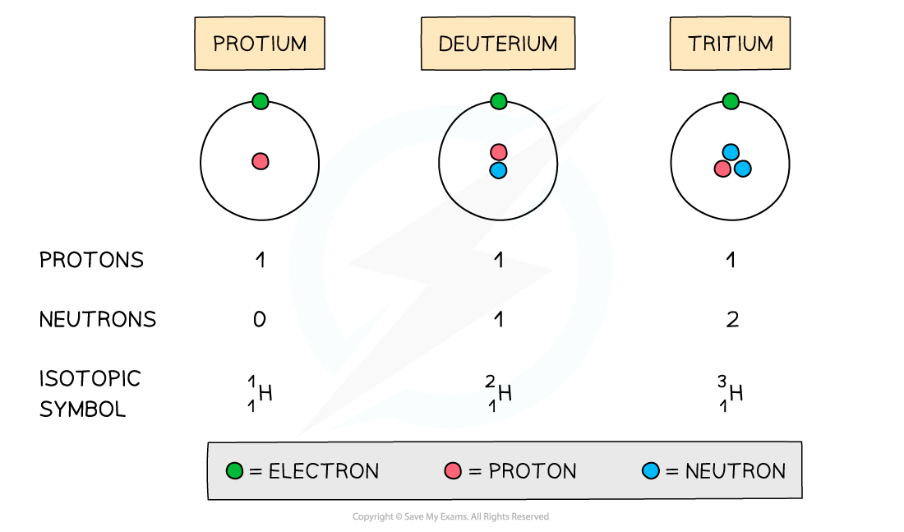

# Sub-Atomic Particles

## Sub-Atomic Particles

> **Spec point** — `spcpt_SgqBMnYrRZ88B4XF`

## Sub-Atomic Particles

- All matter is composed of **atoms**, which are the smallest parts of an element that can take place in **chemical reactions**
- Atoms are mostly made up of **empty** **space** around a very small, dense **nucleus** that contains **protons** and **neutrons**
- The nucleus has an overall **positive** **charge**

  - The protons have a positive charge and the neutrons have a neutral charge
- **Negatively** **charged** electrons are found in orbitals in the empty space around the nucleus

***The basic structure of an atom (not to scale)***

- **Subatomic** **particles** are the particles an element is made up of and include **protons**, **neutrons** and **electrons**
- These subatomic particles are so small that it is not possible to measure their masses and charges using **conventional** **units** (such as grams and coulombs)
- Instead, their masses and charges are compared to each other using **‘relative** **atomic** **masses’** and ‘**relative atomic charges**’
- These are not actual charges and masses but they are charges and masses of particles relative to each other

  - Protons and neutrons have a very similar mass so each is assigned a relative mass of 1 whereas electrons are 1836 times smaller than a proton and neutron
  - Protons are **positively** charged, electrons **negatively** charged and neutrons are **neutral**
- The relative mass and charge of the subatomic particles are:

#### Relative Mass & Charge of Subatomic Particles Table

> **Exam Hint**
> The **relative** **mass** of an electron is **almost negligible.**
> 
> The **charge** of a single **electron** is -1.602 x 10-19  coulombs whereas the charge of a **proton** is +1.602 x 10-19  coulombs, however, relative to each other, their charges are -1 and +1 respectively.

## Chemical Elements

> **Spec point** — `spcpt_NXmsbZPknqSwKrSb`

## Chemical Elements

- The **atomic number **(or **proton number**) is the number of protons in the nucleus of an atom and has **symbol** ***Z***

  - The atomic number is equal to the number of electrons present in a **neutral **atom of an element
  - E.g. the atomic number of lithium is 3 which indicates that the neutral lithium atom has 3 protons and 3 electrons
- The** mass** **number **(or **nucleon** **number**) is the total number of **protons** and **neutrons** in the nucleus of an atom and has **symbol *****A***
- The number of **neutrons **can be calculated by:

**Number of neutrons = mass number - atomic number**

- Protons and neutrons are also called **nucleons**

> **Exam Hint**
> 
> 
> ***The mass (nucleon) and atomic (proton) number are given for each element in the Periodic Table***

- An atom is **neutral **and has no overall charge
- Ions on the other hand are formed when atoms either **gain **or **lose **electrons, causing them to become **charged**
- The number of **subatomic particles **in atoms and ions can be determined given their atomic (proton) number, mass (nucleon) number and charge

#### Protons

- The atomic number of an atom and ion determines which element it is
- Therefore, all atoms and ions of the **same element** have the same number of protons (atomic number) in the nucleus

  - E.g. lithium has an atomic number of 3 (three protons) whereas beryllium has atomic number of 4 (4 protons)
- The number of protons equals the **atomic (proton) number**
- The number of protons of an **unknown **element can be calculated by using its mass number and number of neutrons:

***Mass number = number of protons + number of neutrons***

***Number of protons = mass number - number of neutrons***

#### Electrons

- An atom is **neutral **and therefore has the **same **number of **protons **and **electrons**
- Ions have a different number of electrons to their atomic number depending on their charge

  - A positively charged ion has **lost **electrons and therefore has** fewer** electrons than protons
  - A negatively charged ion has **gained **electrons and therefore has **more** electrons than protons

#### Neutrons

- The **mass **and **atomic** **numbers **can be used to find the number of **neutrons** in **ions **and **atoms:**

***Number of neutrons = mass number (A) - number of protons (Z)***

> **Worked Example**
> Determine the number of protons, electrons and neutrons for the following ions and atoms:
> 
> 1. Mg2+ ion
> 2. Carbon atom
> 3. An unknown atom of element X with mass number 63 and 34 neutrons
> 
> ** Answer 1:**
> 
> The atomic number of a magnesium atom is 12
> 
> - Therefore, the number of protons in a Mg2+ ion is also 12
> 
>   - However, the 2+ charge in Mg2+ ion suggests it has lost two electrons
>   
>     - Therefore, the Mg2+ ion only has 10 electrons left now
> 
> The atomic number of a magnesium atom is 12 and its mass number is 24
> 
> - Number of neutrons = mass number (A) - number of protons (Z)
> 
>   - Number of neutrons = 24 - 12 = 12
>   - The Mg2+ ion has 12 neutrons in its nucleus
> 
> **   Answer 2:**
> 
> The atomic number of a carbon atom is 6
> 
> - Therefore, the number of protons in a carbon atom is also 6
> 
> The atom has no overall charge so the number of protons = the number of electrons
> 
> - Therefore, the carbon atom has 6 electrons
> 
> The atomic number of a carbon atom is 6 and its mass number is 12
> 
> - Number of neutrons = mass number (A) - number of protons (Z)
> 
>   - Number of neutrons = 12 - 6 = 6
>   - The carbon atom has 6 neutrons in its nucleus
> 
> **   Answer 3:**
> 
> Use the formula to calculate the number of protons
> 
> - Number of protons = mass number - number of neutrons
> 
>   - Number of protons = 63 - 34
>   - Number of protons = 29
>   - (Element X is therefore copper)
> 
> The atom is not charged so the number of protons = the number of electrons
> 
> - Therefore, the atom of element X has 29 electrons
> 
> The number of neutrons is 34 (given in the question)

#### Isotopes

- The symbol for an isotope is the **chemical** **symbol** (or **word**) followed by a **dash** and then the **mass** **number**

  - E.g. carbon-12 and carbon-14 are isotopes of carbon containing 6 and 8 neutrons respectively
- Isotopes are atoms of the **same** **element** that contain the same number of **protons** and electrons but a different number of **neutrons**

***The atomic structure and symbols of the three isotopes of hydrogen***

#### Properties of Isotopes

- Isotopes have **similar chemical properties **but **different physical properties**

#### Chemical properties

- Isotopes of the same element display the** same chemical characteristics**
- This is because they have the same number of electrons in their **outer** **shells**
- Electrons take part in **chemical reactions **and therefore determine the **chemistry **of an atom

#### Physical properties

- The only difference between isotopes is the number of **neutrons**
- Since these are neutral subatomic particles, they only add **mass** to the atom
- As a result of this, isotopes have different **physical properties **such as small differences in their **mass**, **density**, **melting point** and** boiling point **
