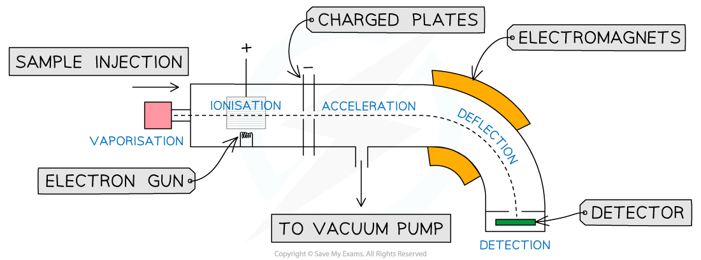
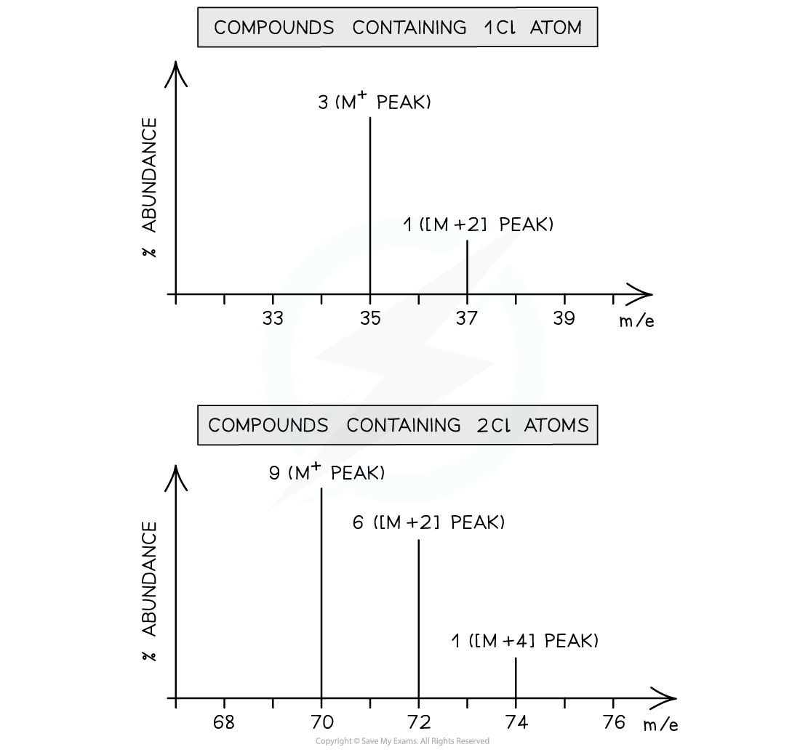
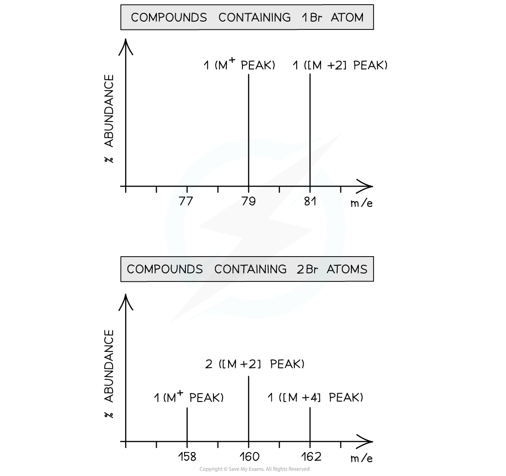

# Isotopes & Mass Spectra

## The Mass Spectrometer

> **Spec point** — `spcpt_d9qSjDst2trMxrrQ`

## The Mass Spectrometer

- The mass spectrometer is an instrument used to determine the relative isotopic mass and the relative abundance of each isotope
- Relative isotopic mass is the mass of an individual isotope relative to the mass of carbon-12
- Apart from finding the masses of isotopes, mass spectrometry is a vey useful tool for detecting illegal drugs, forensic science, space exploration and carbon-14 dating

***The components of a mass spectrometer***

#### How the mass spectrometer works

- A sample is injected into the spectrometer where it is heated and vaporised
- The atoms or molecules are then bombarded by high energy electrons created by an electron gun
- The high energy electrons collide with the sample material and remove electrons creating positive ions
- The ions are then accelerated by attraction towards negatively charged plates
- Many ions strike the plate and are discharged, but a few will pass through a gap in the plates into a curved section of the spectrometer known as the flight tube
- The flight tube is encased in electromagnets which create a strong electromagnetic field that deflects the path of the ions in a curve
- The ions pass onto a charged detector plate where every strike is recorded as a small current which is then amplified
- By varying the electric and magnetic fields all the charged particles can be deflected to the detector which gives information about the mass/charge ratio and abundance of each ion

## Isotopes & Mass Spectra

> **Spec point** — `spcpt_pCrfcpfPSsrG9Q8M`

## Isotopes & Mass Spectra

- Isotopes are different atoms of the same element that contain the same number of protons and electrons but a different number of neutrons

  - These are atoms of the same elements but with different mass numbers
- Therefore, the mass of an element is given as relative atomic mass (*A*r) by using the average mass of the isotopes

  - The relative atomic mass of an element can be calculated by using the relative abundance values

*A*r = `fraction numerator open parentheses r e l a t i v e space a b u n d a n c e subscript i s o t o p e space 1 end subscript cross times m a s s subscript i s o t o p e space 1 end subscript close parentheses plus open parentheses r e l a t i v e space a b u n d a n c e subscript i s o t o p e space 2 end subscript cross times m a s s subscript i s o t o p e space 2 end subscript close parentheses space e t c over denominator 100 end fraction`

- The relative abundance of an isotope is either given or can be read off the mass spectrum

> **Worked Example**
> **Calculating the relative atomic mass of oxygen**
> 
> A sample of oxygen contains the following isotopes:
> 
> 
> 
> What is the relative atomic mass, *A*r, of oxygen in this sample, to 2dp?
> 
> **  Answer**
> 
> - *A*r = `fraction numerator open parentheses 99.76 space cross times space 16 close parentheses space plus open parentheses 0.04 space cross times space 17 close parentheses space plus open parentheses 0.20 space cross times 18 close parentheses over denominator 100 end fraction`
> 
>   - *A*r = 16.0044
>   - *A*r = 16.00

> **Worked Example**
> **Calculating the relative atomic mass of boron**
> 
> Calculate the relative atomic mass of boron using its mass spectrum, to 1dp:
> 
> 
> 
> **   Answer**
> 
> - *A*r = $\frac{(19.9\times10)+(80.1\times11)}{100}=10.801=10.8$

> **Exam Hint**
> You can be expected to work with tables or graphs of data to calculate relative atomic mass
> 
> You can also be expected to do these calculations backwards to determine the abundance of one isotope given sufficient information

#### Mass spectra of molecules

- When a compound is analysed in a mass spectrometer, vaporised molecules are bombarded with a beam of high-speed electrons
- These knock off an electron from some of the molecules, creating **molecular ions:**

- The relative abundances of the detected ions form a **mass spectrum**: a kind of molecular fingerprint that can be identified by computer using a spectral database
- The peak with the highest ***m/z***** **value is the molecular ion (**M****+**) peak which gives information about the **molecular** **mass** of the compound
- This value of m/z is equal to the **relative molecular mass** of the compound

#### The M+1 peak

- The [**M+1] **peak is a smaller peak which is due to the natural abundance of the isotope **carbon-13**
- The height of the **[M+1]** peak for a particular ion depends on how many carbon atoms are present in that molecule; The more carbon atoms, the larger the **[M+1]** peak is

  - For example, the height of the **[M+1]** peak for an hexane (containing six carbon atoms) ion will be greater than the height of the** [M+1]** peak of an ethane (containing two carbon atoms) ion

> **Worked Example**
> Determine whether the following mass spectrum belongs to propanal or butanal
> 
> 
> 
> **  Answer:**
> 
> - The mass spectrum corresponds to **propanal** as the molecular ion peak is at *m/z* = 58
> 
>   - Propanal arises from the CH3CH2CHO+ ion which has a molecular mass of 58
>   - Butanal arises from the CH3CH2CH2CHO+ ion which has a molecular mass of 72

> **Exam Hint**
> A mass spectrum can give lots of information about fragments of the overall compound being analysed

## Mass Spectra - Predictions

> **Spec point** — `spcpt_VZrcYDFMJ3VWxhPm`

## Mass Spectra - Predictions

- You can also predict how a mass spectrum might appear for a given compound, e.g. ethanol, CH3CH2OH

  - The methyl, CH3+, fragment has a mass of 15.0
  - The ethyl, CH3CH2+, fragment has a mass of 29.0
  - The base ion, CH2OH+, fragment has a mass of 31.0
  - The whole molecule has a mass of 46.0
- Predicting mass spectra becomes more complex with the inclusion of halogen isotopes such as chlorine and bromine

#### Chlorine

Chlorine exists as two isotopes, 35Cl and 37Cl

- A compound containing **one **chlorine atom will therefore have two molecular ion peaks due to the two different isotopes it can contain

  - 35Cl = **M****+**** **peak
  - 37Cl = [**M+2] **peak
  - The ratio of the peak heights is 3:1 (as the relative abundance of 35Cl is 3x greater than that of 37Cl)
- A diatomic chlorine molecule or a compound containing **two **chlorine atoms will have three molecular ion peaks due to the different combinations of chlorine isotopes they can contain

  - 35Cl + 35Cl = **M****+**** **peak
  - 35Cl + 37Cl = [**M+2] **peak
  
    - There is an alternative of 37Cl + 35Cl doubling the [**M+2] **peak
  - 37Cl + 37Cl = [**M+4]** peak
  - The ratio of the peak heights is **9:6:1**
  
    - This ratio can be deduced by using the probability of each chlorine atom being 35Cl or 37Cl
    - 35Cl + 35Cl = $\frac{3}{4}\times\frac{3}{4}=\frac{9}{16}$
    - 35Cl + 37Cl = $\frac{3}{4}\times\frac{1}{4}=\frac{3}{16}$ but this doubles for the 37Cl + 35Cl option, therefore, $\frac{6}{16}$
    - 37Cl + 37Cl = $\frac{1}{4}\times\frac{1}{4}=\frac{1}{16}$

- The presence of bromine or chlorine atoms in a compound gives rise to a [**M+2] **and possibly** [M+4] **peak*** ***

***Mass spectrum of compounds containing one chlorine atom (1) and two chlorine atoms (2)***

#### Bromine

- Bromine too exists as two isotopes, 79Br and 81Br
- A compound containing **one **bromine atom will have two molecular ion peaks

  - 79Br = **M****+**** ** peak
  - 81Br = [**M+2] **peak
  - The ratio of the peak heights is 1:1 (they are of **similar **heights as their relative abundance is the same!)
- A diatomic molecule of bromine or a compound containing **two **bromine atoms will have three molecular ion peaks

  - 79Br + 79Br= **M****+**** **peak
  - 79Br+ 81Br = [**M+2] **peak
  - 81Br + 81Br= [**M+4]** peak
  - The ratio of the peak heights is **1:2:1**

***Mass spectrum of compounds containing one bromine atom***
