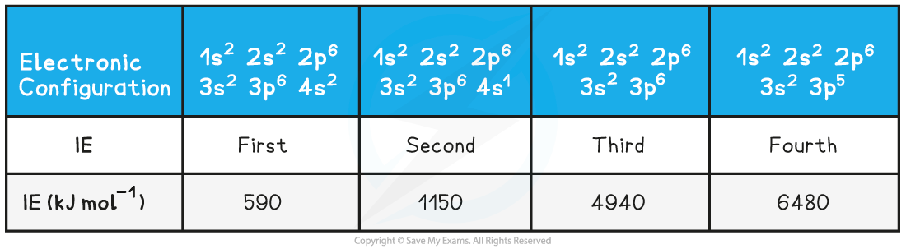
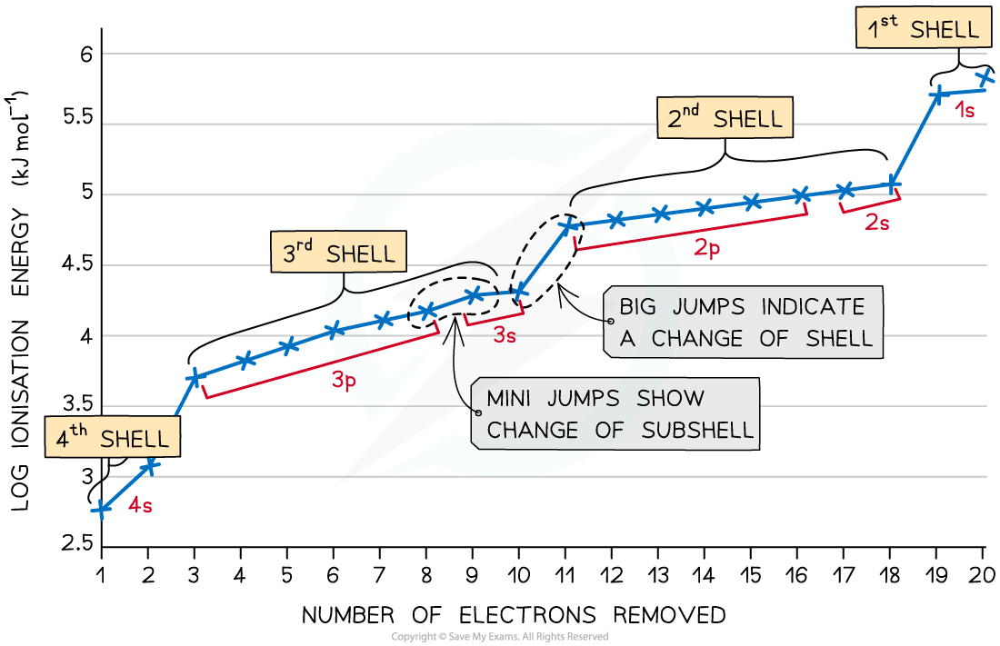
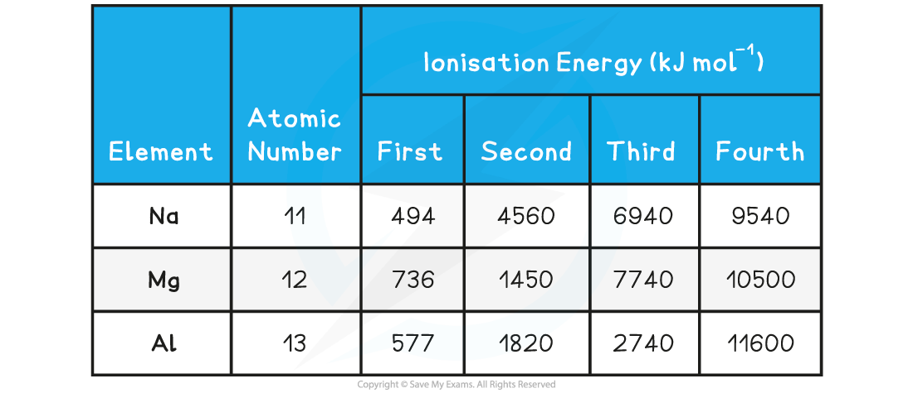

# Electronic Structures

## Ionisation Energy & Sub-shells

> **Spec point** — `spcpt_WBjRkP52tDSg2C8N`

## Ionisation Energy & Sub-shells

- **Successive** **ionisation** **data** can be used to:
- Predict or confirm the simple electronic configuration of elements

  - Confirm the number of electrons in the outer shell of an element
  - Deduce the group an element belongs to in the Periodic Table
  - We can look at** calcium** as an example

- The **first** electron removed in calcium has a low *IE*1 as it is easily removed from the atom due to the spin-pair repulsion of the electrons in the 4s orbital
- The **second** electron is more difficult to remove than the first electron as there is no **spin-pair repulsion**
- The **third **electron is much more difficult to remove than the second one corresponding to the fact that the third electron is in a **principal quantum** shell that is closer to the nucleus (3p)
- Removal of the **fourth **electron is more difficult as the orbital is no longer full, and there is less **spin-pair repulsion**
- The graph shows there is a large increase in successive ionisation energy as the electrons are being removed from an increasingly positive ion
- The big jumps on the graph show the change of **shell** and the small jumps are the change of **subshell**

#### Ionisation Energies of Calcium Table

***Successive ionisation energies for the element calcium***

By analysing where the large jumps appear and the number of electrons removed when these large jumps occur, the **electron configuration **of an atom can be determined Na, Mg and Al will be used as examples to deduce the electronic configuration and positions of elements in the Periodic Table using their successive ionisation energies

#### Successive Ionisation Energies Table

#### Sodium

- For sodium, there is a huge **jump** from the **first** to the **second** ionisation energy, indicating that it is much easier to remove the first electron than the second
- Therefore, the first electron to be removed must be the last electron in the **valence** **shell** thus Na belongs to group I
- The large jump corresponds to moving from the 3s to the full 2p subshell Na       1s2 2s2 2p6 **3s****1**

#### Magnesium

- There is a huge increase from the **second** to the **third** ionisation energy, indicating that it is far easier to remove the first two electrons than the third
- Therefore the **valence** **shell** must contain only two electrons indicating that magnesium belongs to group II
- The large jump corresponds to moving from the 3s to the full 2p subshell Mg       1s2 2s2 2p6 **3s****2**

#### Aluminium

- There is a huge increase from the **third** to the **fourth** ionisation energy, indicating that it is far easier to remove the first three electrons than the fourth
- The 3p electron and 3s electrons are relatively easy to remove compared with the 2p electrons which are located closer to the nucleus and experience greater **nuclear** **charge **
- The large jump corresponds to moving from the **third shell **to the **second shell** Al         1s2 2s2 2p6 **3s****2 ****3p****1**

> **Worked Example**
> Values for the successive *IE*s of an unknown element are:
> 
> *IE*1 = **899** kJ mol-1, *IE*2 = **1757** kJ mol-1, *IE*3 = **14850** kJ mol-1,* IE*4 = **21005** kJ mol-1
> 
> Deduce which group of the periodic table of elements you would expect to find the unknown element.
> 
> **Answer:**
> 
> - The largest jump is between** *****IE*****2 **and** *****IE*****3** which will correspond to a change in energy level.
> 
>   - Therefore the unknown element must be in **group 2**

> **Worked Example**
> The table shows successive ionisation energies for element **X** in period 2.
> 
> 
> 
> Identify element **X**.
> 
> **Answer:**
> 
> - The largest jump in ionisation energy is between ***IE*****6 **and ***IE*****7 **meaning that the 7th electron is being removed from an energy level closer to the nucleus
> 
>   - Therefore element** X** must be group 6
>   - If element **X** is in group 6 and in period 2 it must be **oxygen**
