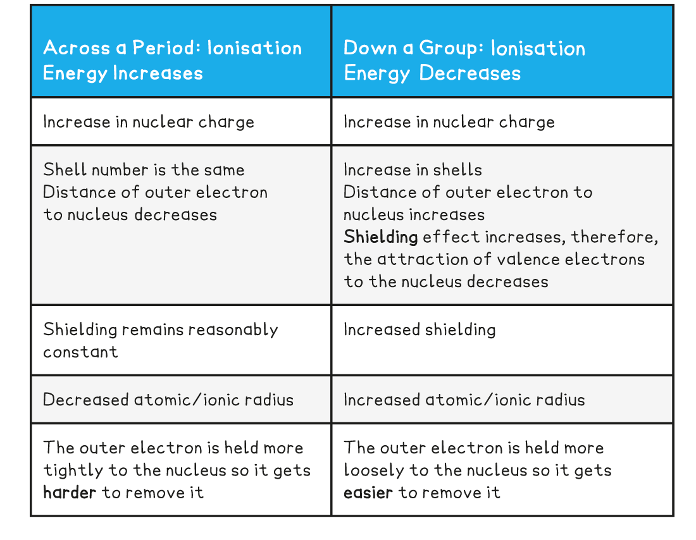

# Periodicity - Ionisation Energy

## Ionisation Energy Across a Period

> **Spec point** — `spcpt_HkVnvSt4xqdNWvD3`

## Ionisation Energy Across a Period

- Elements in the periodic table are arranged in order of increasing atomic number and placed in vertical columns (**groups**) and horizontal rows (**periods)**
- The elements across the periods show **repeating patterns** in chemical and physical properties
- This is called **periodicity**

***All elements are arranged in the order of increasing atomic number from left to right***

- Ionisation energies show** **a trend across a period of the Periodic Table
- As could be expected from their electron configuration, the group 1 metals have a relatively low ionisation energy, whereas the noble gases have very high ionisation energies

***Graph showing first ionisation energies of elements 1 to 11**** *

#### Ionisation energy across period 2 and 3

- The ionisation energy across a period generally **increases** due to the following factors:

  - Across a period the **nuclear charge increases**
  - This causes the **atomic radius** of the atoms to **decrease**, as the outer shell is pulled closer to the nucleus, so the distance between the nucleus and the outer electrons **decreases**
  - The **shielding **by inner shell electrons remain reasonably constant as electrons are being added to the same shell
  - It becomes **harder to remove an electron** as you move across a period; **more energy** is needed
  - So, the ionisation energy increases

#### Dips in the trend for period 2

- There is a slight **decrease **in *IE*1 between **beryllium **and **boron** as the fifth electron in boron is in the 2p subshell, which is further away from the nucleus than the 2s subshell of beryllium

  - Beryllium has a first ionisation energy of 900 kJ mol-1 as its electron configuration is 1s2 2s2
  - Boron has a first ionisation energy of 800 kJ mol-1 as its electron configuration is 1s2 2s2 2px1
- There is a slight **decrease **in *IE*1 between **nitrogen **and** oxygen **due to **spin-pair repulsion** in the 3px orbital of oxygen

  - Nitrogen has a first ionisation energy of 1400 kJ mol-1 as its electron configuration is 1s2 2s2 2px1 2py1 2pz1
  - Oxygen has a first ionisation energy of 1310 kJ mol-1 as its electron configuration is 1s2 2s2 2px2 2py1 2pz1
- In oxygen, there are 2 electrons in the 2px orbital, so the repulsion between those electrons makes it slightly easier for one of those electrons to be removed

#### Dips in the trend for period 3

- There is again a slight decrease between **magnesium **and **aluminium** as the thirteenth electron in aluminium is in the 3p subshell, which is further away from the nucleus than the 3s subshell of magnesium

  - Magnesium has a first ionisation energy of 738 kJ mol-1 as its electron configuration is 1s2 2s2 2p6 3s2
  - Aluminium has a first ionisation energy of 578 kJ mol-1 as its electron configuration is 1s2 2s2 2p6 3s2 3px1
- There is a slight decrease in *IE*1 between **phosphorus **and** sulfur **due to **spin-pair repulsion**in the 3px orbital of sulfur

  - Phosphorus has a first ionisation energy of 1012 kJ mol-1 as its electron configuration is 1s2 2s2 2p6 3s2 3px1 3py1 3pz1
  - Sulfur has a first ionisation energy of 1000 kJ mol-1 as its electron configuration is 1s22s2 2p6 3s2 3px2 3py1 3pz1
- In sulfur, there are 2 electrons in the 3px orbital, so the repulsion between those electrons makes it slightly easier for one of those electrons to be removed

## Ionisation Energy Down a Group

> **Spec point** — `spcpt_wVXpTB8htjzjVTRg`

## Ionisation Energy Down a Group

#### Ionisation energy down a group

- The ionisation energy down a group **decreases** due to the following factors:

  - The number of protons in the atom is increased, so the **nuclear charge **increases
  - But, the atomic radius of the atoms increases as you are adding more shells of electrons, making the atoms bigger
  - So, the **distance **between the nucleus and outer electron **increases **as you descend the group
  - The **shielding **by inner shell electrons **increases **as there are more shells of electrons
  - These factors outweigh the increased nuclear charge, meaning it becomes **easier to remove the outer electron** as you descend a group
  - So, the ionisation energy decreases

#### Summary Explanation for Trend in Ionisation Energy Across a Period and Down a Group

