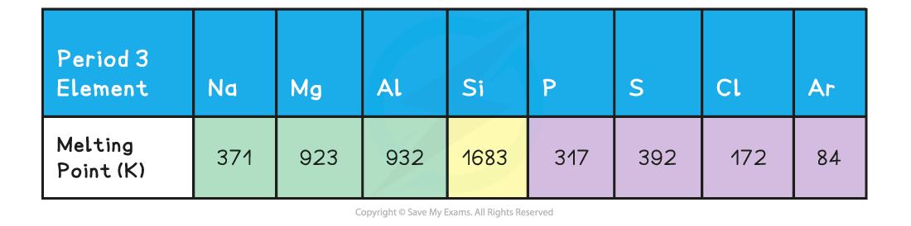
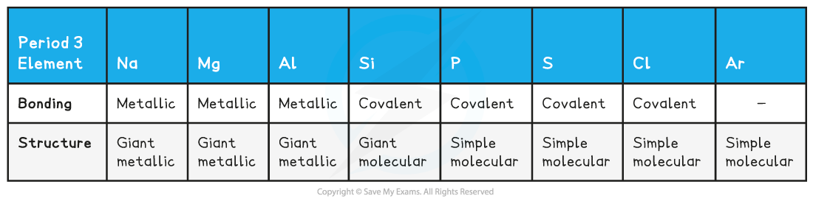
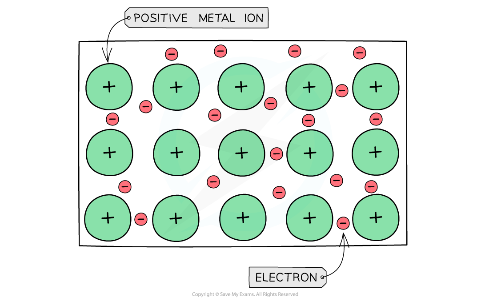

# Periodicity - Thermal Trends

## Trends in Melting & Boiling Point

> **Spec point** — `spcpt_nBVKSWh4hSY3tK55`

## Trends in Melting & Boiling Point

#### Melting point

- Period 2 and 3 elements follow the **same pattern** in relation to their melting points

#### Melting Points of the Elements Across Period 3 Table

*Melting points of the period 3 elements*

- A general increase in **melting point **for the Period 3 elements up to silicon is observed
- **Silicon **has the highest **melting point**
- After the Si element the melting points of the elements **decreases **significantly

- The above trends can be explained by looking at the bonding and structure of the elements

#### Bonding & Structure of the Elements Table

- The table shows that **Na**, **Mg** and **Al** are metallic elements which form positive ions arranged in a **giant** **lattice** in which the ions are held together by a 'sea' of delocalised electrons

***Metal cations form a giant lattice held together by electrons that can freely move around***

> **Exam Hint**
> - **Remember:** At room temperature and pressure, metals (except for mercury) are **solid**
> - This means that the lattice structure should:
> 
>   - Have a regular arrangement of positive ions (rows and columns)
>   - Have the ions tightly packed / close together
> - The lattice structure should **not**:
> 
>   - Have large gaps between the positive ions
>   
>     - This could lose marks in an exam as examiners may not be satisfied that a solid is being shown
>   - Have a random arrangement of particles
>   
>     - Examiners would consider a randomly arranged, close packed structure to be a liquid and penalise answers accordingly
> - The delocalised electrons do not have to be specifically shown

- The electrons in the ‘sea’ of delocalised electrons are those from the **valence shell** of the atoms
- **Na** will donate one electron into the ‘sea’ of delocalised electrons, **Mg** will donate two and **Al **three electrons
- As a result of this, the metallic bonding in **Al **is stronger than in **Na**
- This is because the electrostatic forces between a **3+ ion** and the larger number of negatively charged delocalised electrons is much larger compared to a **1+ ion** and the smaller number of delocalised electrons in Na
- Because of this, the **melting points increase **going from **Na **to **Al**
- **Si **has the highest melting point due to its giant molecular structure in which each Si atom is held to its neighbouring Si atoms by **strong covalent bonds**
- **P, S**, **Cl **and **Ar** are non-metallic elements and exist as **simple molecules** (P4, S8, Cl2 and Ar as a single atom)
- The **covalent bonds within** the molecules are strong, however, **between **the molecules, there are only weak **instantaneous dipole-induced dipole forces**
- It doesn’t take much energy to break these **intermolecular** forces
- Therefore, the melting points decrease going from **P **to **Ar **(note that the melting point of S is higher than that of P as sulphur exists as larger S8 molecules compared to the smaller P4 molecule)
