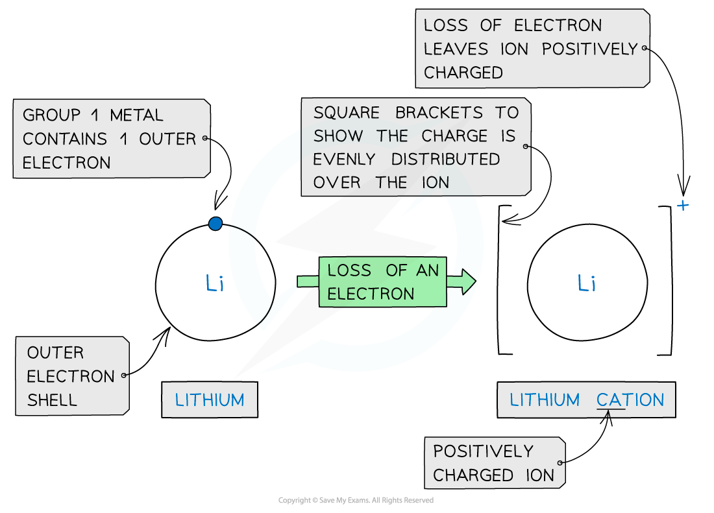
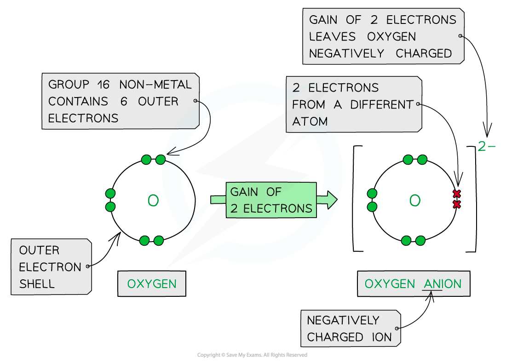
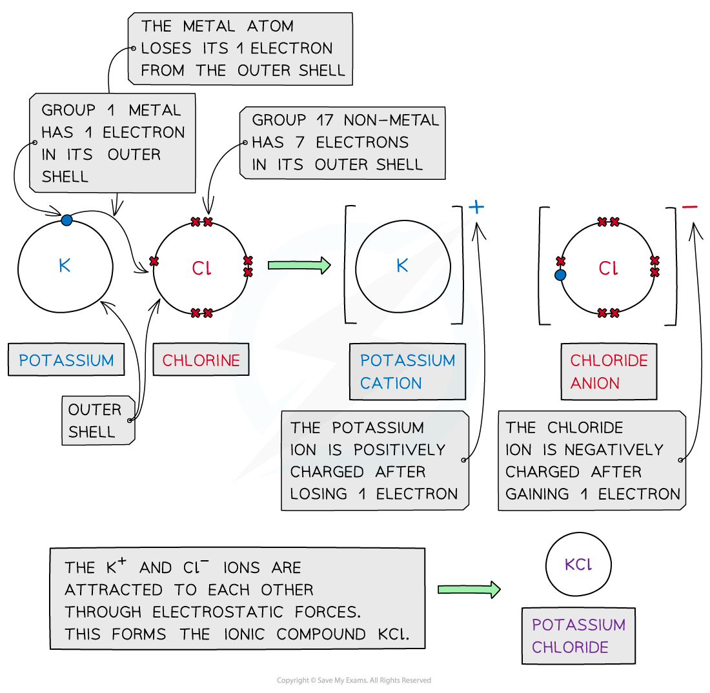

# Ionic Bonding & Structures

## Ionic Dot & Cross Diagrams

> **Spec point** — `spcpt_h23wGTh5VbQjxx5M`

## Ionic Dot-and-Cross Diagrams

- As a general rule, **metals** are on the **left** of the periodic table and **nonmetals** are on the **right-hand** side
- **Ionic** **bonding** involves the **transfer** of electrons from a **metallic** element to a **non-metallic** element
- Transferring electrons usually leaves the metal and the non-metal with a **full** **outer** **shell**
- Metals **lose** electrons from their valence shell forming **positively charged cations**
- Non-metal atoms **gain** electrons forming **negatively charged anions**
- Once the atoms become ions, their electronic configurations are the same as a noble gas

  - A potassium ion (K+) has the same electronic configuration as argon: [2,8,8]+
  - A chloride ion (Cl-) also has the same electronic configuration as argon: [2,8,8]-

***Forming cations by the removal of electrons from metals***

***Forming anions by the addition of electrons to nonmetals***

- **Cations** and **anions** are oppositely charged and therefore attracted to each other
- **Electrostatic** **attractions** are formed between the oppositely charged ions to form **ionic** **compounds**
- The **ionic bond** is the **electrostatic attraction** formed **between the oppositely charged ions**, which occurs in all directions ( this called **non-directional bonding**)
- This form of attraction is **very strong** and requires a **lot of energy** to overcome

  - This causes high melting points in ionic compounds

***Cations and anions bond together using strong electrostatic forces, which require a lot of energy to overcome***

- The ions form a **lattice** **structure** which is an evenly distributed **crystalline** structure
- Ions in a lattice are arranged in a **regular** **repeating** **pattern** so that positive charges cancel out negative charges
- The attraction between the cations and anions is occurring in all directions

  - Each ion is attracted to all of the oppositely charged ions around it
- Therefore the final lattice is overall electrically **neutral ** 

***Ionic solids are arranged in lattice structures***

#### Dot and cross diagrams

- These are diagrams that show the arrangement of the outer-shell electrons in an **ionic **or **covalent **compound or element
- The electrons are shown as dots and crosses
- In a dot and cross diagram:

  - Only the outer electrons are shown
  - The charge of the ion is spread evenly which is shown by using brackets
  - The charge on each ion is written at the top right-hand corner

#### Ionic compounds

- Ionic bonds are formed when **metal atoms **transfer electrons to a **non-metal** to form a positively charged and negatively charged ion
- The atoms achieve a **noble gas **configuration 

***Dot-and-cross diagrams of ionic compounds in which one of the atoms transfers their valence electrons to the other***

#### Calcium fluoride

- Calcium is a Group 2 **metal**

  - It **loses** its 2 outer electrons to form a calcium ion with a +2 charge (Ca2+)
- Fluorine is a Group 7 **non-metal**

  - It **gains** 1 electron to form a fluoride ion with a -1 charge (F-)
- As before, the positive and negative ions are attracted to each other via an ionic bond
- However, to cancel out the 2+ charge of the calcium ion, 2 fluorine atoms are needed

  - Each fluorine atom can only accept 1 electron from the calcium atom
  - 2 fluoride ions will be formed
- Calcium fluoride is made when 1 calcium ion and 2 fluoride ions form ionic bonds, CaF2
- The final ionic solid of CaF2 is **neutral** in charge

> **Worked Example**
> Draw a dot cross diagram for lithium nitride
> 
> **Answer**
> 
> - Lithium is a Group 1 **metal**
> 
>   - It **loses** its outer electron to form a lithium ion with a +1 charge (Li+)
>   - Nitrogen is a Group 5 **non-metal**
>   - It **gains** 3 electrons to form a nitride ion with a -3 charge (N3-)
>   - To cancel out the -3 charge of the nitride ion, 3 lithium atoms are needed and 3 lithium ions will be formed
>   - Lithium nitride is made when 1 nitride ion and 3 lithium ions form ionic bonds
>   - The final ionic solid of Li3N is **neutral** in charge
> 
> 
> 
> ***Dot and cross diagram to show the ionic bonding in lithium nitride***

> **Worked Example**
> Draw a dot cross diagram for aluminium oxide
> 
> **Answer**
> 
> - Aluminium is a Group 3 **metal**
> 
>   - It **loses** its outer electrons to form an aluminium ion with a +3 charge (Al3+)
>   - Oxygen is a Group 6 **non-metal**
>   - It **gains** 2 electrons to form an oxide ion with a -2 charge (O2-)
>   - To cancel out the negative and positive charges, 2 aluminium and 3 oxygen atoms are needed
>   - Aluminium oxide is made when 2 aluminium ions and 3 oxygen ions form ionic bonds
>   - The final ionic solid of Al2O3 is **neutral** in charge
> 
> 
> 
> ***Dot and cross diagram to show the ionic bonding in aluminium oxide***
