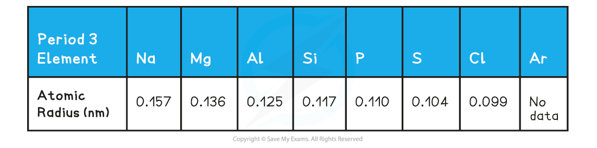
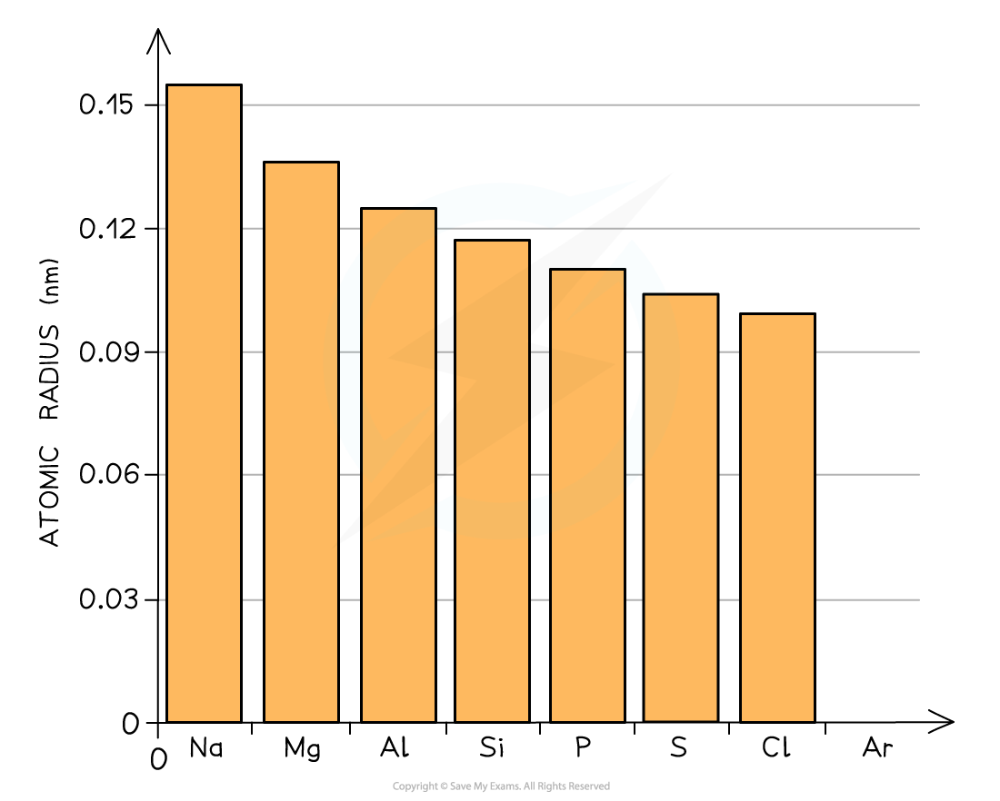
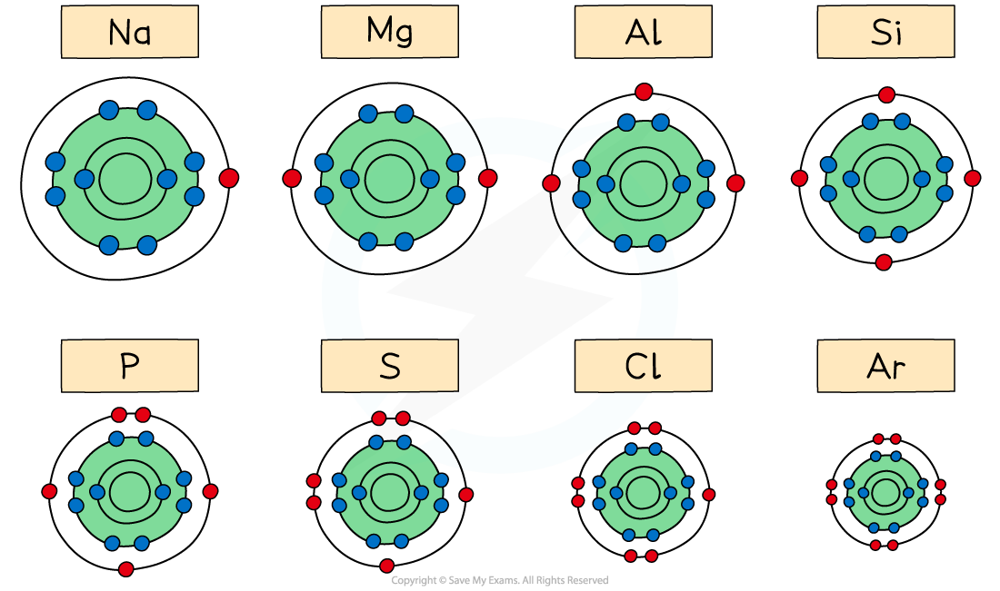
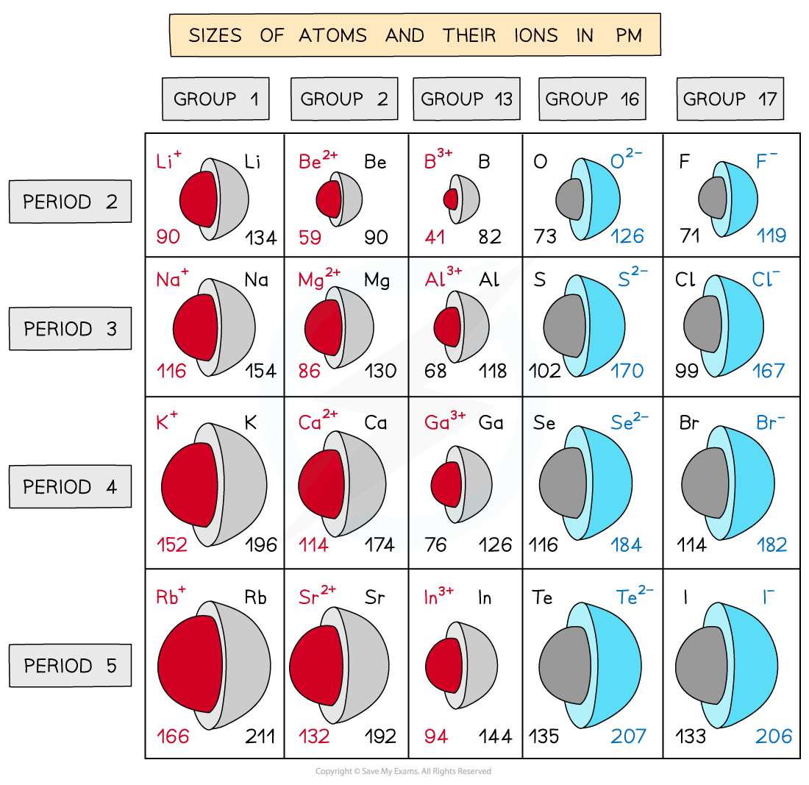

# Ionic Bond Strength

## Trend: Atomic Radius

> **Spec point** — `spcpt_MZfS5v9Cm3wHHwyg`

## Trend: Atomic Radius

- Elements in the periodic table are arranged in order of increasing atomic number and placed in vertical columns (**groups**) and horizontal rows (**periods)**
- The elements across the periods show **repeating patterns** in chemical and physical properties
- This is called **periodicity**

***All elements are arranged in the order of increasing atomic number from left to right***

#### Atomic radius

- The **atomic radius **is the distance between the nucleus and the outermost electron of an atom
- The atomic radius is measured by taking two atoms of the same element, measuring the distance between their nuclei and then halving this distance
- In **metals **this is also called the **metallic radius **and in **non-metals**, the **covalent radius**

#### Atomic radii of Period 3 elements

- You can see a clear trend across the period:

***The graph shows a decrease in atomic radii of Period 3 elements across the period***

- Across the period, the atomic radii decrease
- This is because the number of protons (**the nuclear charge**) and the number of **electrons** increases by one every time you go an element to the right
- The elements in a period all have the same number of shells (so the **shielding effect **is the same)
- This means that as you go across the period the nucleus attracts the electrons more **strongly pulling them closer** to the nucleus
- Because of this, the atomic radius (and thus the size of the atoms) **decreases** across the period

***The diagram shows that across Period 3, the elements gain extra electrons in the same principal quantum shell***

## Ionic Radius & Charge

> **Spec point** — `spcpt_dkSgxtzTKXrqWDp5`

## Ionic Radius & Charge

#### Ionic radius

- The **ionic** **radius** of an element is a measure of the size of an ion
- Ionic radii show predictable patterns

  - Ionic radii **increase** with increasing** negative charge**
  - Ionic radii **decrease **with increasing **positive charge**
- For negative ions

  - They are formed by atoms **gaining** electrons
  - The outermost electrons are further away from the positively charged nucleus and are therefore held only weakly to the nucleus which **increases the ionic radius**
  - The greater the negative charge, the larger the ionic radius
- For positive ions

  - Positively charged ions are formed by atoms **losing** electrons
  - The nuclear charge remains the same but there are now fewer electrons that undergo a greater electrostatic force of attraction to the nucleus which **decreases the ionic radius**
  - The greater the positive charger, the smaller the ionic radius

***Trends in the ionic radii across a period and down a group***

- The strength of ionic bonding, therefore, depends on both the charges and the sizes of the two ions
- **Higher charges** and **smaller sizes** produce stronger bonds
- This is because:

  - As the ionic charge increases, or the ionic radius decreases, the charge density increases

## Trends in Ionic Radius

> **Spec point** — `spcpt_jXp3RkTNW6cGTBWB`

## Trends in Ionic Radius

#### Isoelectronic Ions

- These are ions that have the **same electronic configuration**
- For example the following ions all have the electronic configuration of **1s****2**** 2s****2**** 2p****6**
- However, they all have different numbers of protons, therefore will have a different ionic radius

  - N3- (7 protons)
  - O2- (8 protons)
  - F- (9 protons)
  - Na+ (11 protons)
  - Mg2+ (12 protons)
  - Al3+ (13 protons)
- As the number of protons in the nucleus of the ion increases, the electrons get pulled in more closely to the nucleus
- The radii of the isoelectronic ions therefore fall across this series of ions

  - N3- has an ionic radius of 0.171 nm and Al3+ has an ionic radius of 0.054 nm
