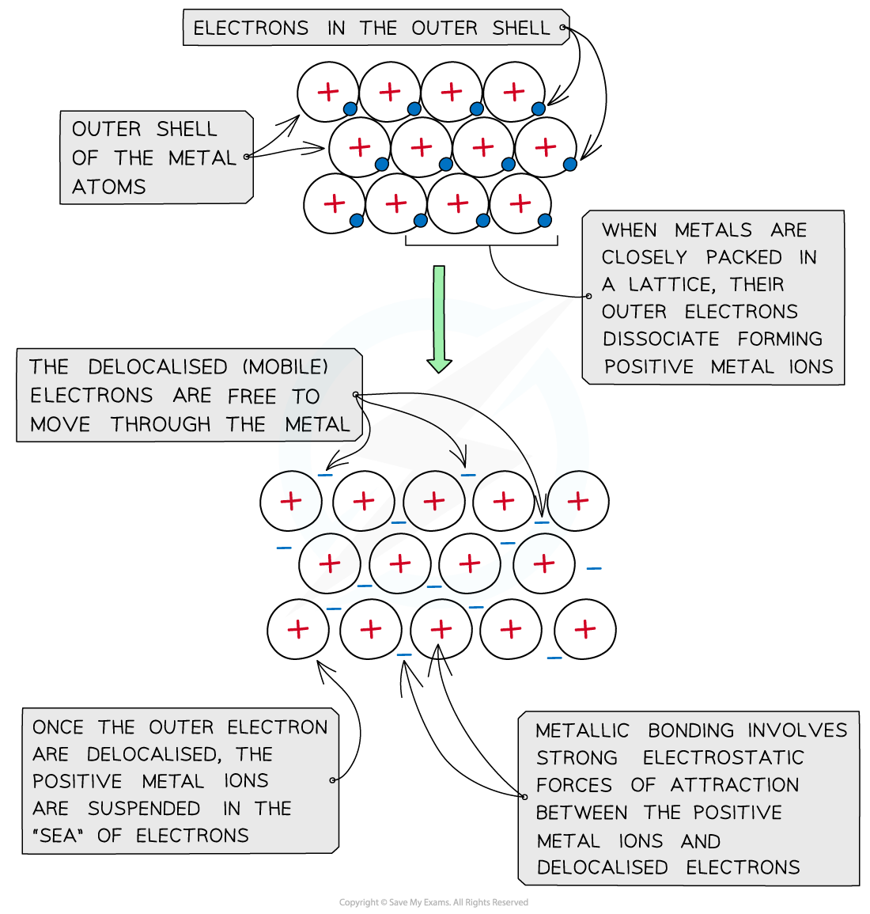
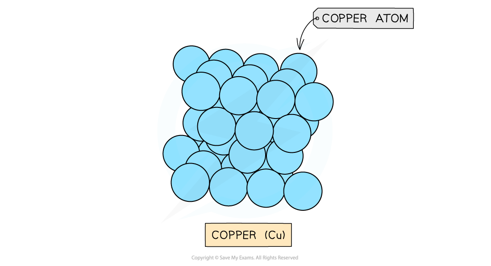

# Metallic Bonding & Lattices

## Metallic Bonding & Lattices

> **Spec point** — `spcpt_kbMJ8Z6V4RQnVzp5`

## Metallic Bonding & Lattices

- **Metal** atoms are tightly packed together in **lattice** structures
- When the metal atoms are in lattice structures, the electrons in their outer shells are free to move throughout the structure
- The free-moving** electrons** are called **‘delocalised electrons’** and they are not bound to their atom
- When the electrons are delocalised, the metal atoms become **positively** charged ions
- The positive ions **repel** each other
- The strong **forces** between the positive metal centres and the ‘sea’ of delocalised electrons holds the lattice together and keeps it stable

***The positive metal ions are suspended in a ‘sea’ of delocalised electrons***

## Simple Properties of Metals

> **Spec point** — `spcpt_HKkVRJ54QQ48DtjS`

## Simple Properties of Metals

- Metals form **giant metallic lattices **in which the metal ions are surrounded by a ‘sea’ of **delocalised **electrons
- The metal ions are often packed in **hexagonal layers **or in a **cubic arrangement**
- This layered structure with the delocalised electrons gives a metal its key properties

***Layers of copper ions (the delocalised electrons are not shown in the diagram)***

- If other atoms are added to the metal structure, such as carbon atoms, this creates an **alloy**
- Alloys are much stronger than pure metals, because the other atoms stop the layers of metal ions sliding over each other easily

- The **strength** of the metallic attraction can be increased by:

  - **Increasing** the number of **delocalised** **electrons** per metal atom
  - **Increasing** the **positive** **charges** on the metal centres in the lattice
  - **Decreasing** the **size** of the metal ions
- Due to the delocalised ‘sea’ of electrons, metallic structures have some **characteristic properties** shown below:

#### Metallic Bonding Properties Table

| **Property** | **Reason** |
|---|---|
| **High melting and boiling point** | There are strong electrostatic forces of attraction between the delocalised electrons and positive metal ions which results in strong metallic bonds within giant metallic structures.  These require large amounts of energy to overcome the forces and break the bonds |
| **Good conductors of electricity** | The delocalised electrons are able to move and carry charge.  For example, in a circuit, electrons entering one end of the metal cause a delocalised electron to be displaced from the other need.  Hence, electrons can flow and conduct electricity |
| **Good conductors of heat** | The delocalised electrons are free to move within the metal structure.  The conversion of the kinetic energy of the electron to heat energy when it collides with the metal atoms/nuclei results in the transfer of energy.  This is alongside the increased vibrations and movement of the particles (positive ions and delocalised electrons) |
| **Malleable and ductile** | Layers of positive ions can easily slide over one another to take up different positions.  This does not disrupt the metallic bonding as the delocalised electrons do not belong to any particular metal atom and so they can move with the layers of positive ions, maintaining the electrostatic forces.  Therefore, the metallic bonds are not broken and, as a result, metallic bonds are strong but flexible/ |

> **Exam Hint**
> You should be able to draw the structure of a metal with positive ions in layers and the delocalised electrons surrounding the ions
> 
> If drawing the structure of a metal in the exam, make sure to include labels for metal ions and delocalised electrons
