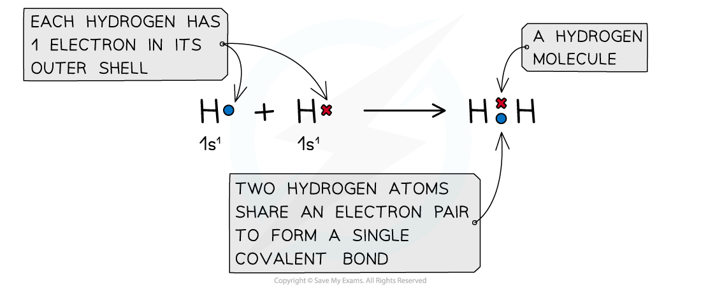

# Evidence of Covalent Bonding

## Evidence of Covalent Bonding 

> **Spec point** — `spcpt_c9MY4qNh84tSxNkM`

## Evidence of Covalent Bonding

- **Covalent** bonding occurs between two **non-metals**
- A covalent bond involves the **electrostatic** **attraction** between nuclei of two atoms and the electrons of their outer shells
- **No** **electrons** are **transferred** but only **shared **in this type of bonding
- When a covalent bond is formed, two **atomic orbitals** overlap and a** molecular orbital** is formed
- Covalent bonding happens because the electrons are more stable when attracted to two nuclei than when attracted to only one

***The positive nucleus of each atom has an attraction for the bonding electrons shared in the covalent bond***

- In a normal covalent bond, each atom provide one of the electrons in the bond. A covalent bond is represented by a short straight line between the two atoms, H-H
- Covalent bonds should not be regarded as shared electron pairs in a fixed position; the electrons are in a state of constant motion and are best regarded as **charge clouds**

***A representation of electron charge clouds. The electrons can be found anywhere in the charge clouds***

#### Bond Polarity

**Non-metals** are able to **share** pairs of electrons to form different types of covalent bonds Sharing electrons in the covalent bond allows each of the 2 atoms to achieve an electron configuration similar to a noble gas This makes each atom more stable

- When two atoms in a covalent bond have the **same electronegativity **the covalent bond is **nonpolar**

***The two chlorine atoms have identical electronegativities so the bonding electrons are shared equally between the two atoms***

When two atoms in a covalent bond have **different electronegativities **the covalent bond is **polar **and the electrons will be drawn towards the **more electronegative **atom As a result of this: The negative charge centre and positive charge centre do not **coincide **with each other This means that the **electron distribution **is **asymmetric** The **less** **electronegative** atom gets a partial charge of** δ+** (**delta** **positive**) The **more** **electronegative** atom gets a partial charge of** δ-** (**delta** **negative**)

- The greater the difference in **electronegativity** the more polar the bond becomes until the bond becomes ionic

***Cl has a greater electronegativity than H causing the electrons to be more attracted towards the Cl atom which becomes delta negative and the H delta positive***

#### The octet rule

- In some instances, the central atom of a covalently bonded molecule can accommodate **more** or **less** than 8 electrons in its outer shell

  - Being able to accommodate **more** than 8 electrons in the outer shell is known as **‘expanding the octet rule’**
  
    - Atoms from Period 3 onwards can accommodate more than 8 electrons as the d-orbitals are accessible
    - Common examples of elements that can have an 'expanded octet' are phosphorous and sulfur
    - For example, PCl5, which has 10 electrons around the central phosphorus atom
    - In SF6, there are 12 electrons around the central sulfur atom
  - Accommodating **less** than 8 electrons in the outer shell means that the central atom is **‘electron deficient’**
  
    - Boron has 3 electrons in its outer shell, 2s22p1
    - When it forms a covalent compound, these three electrons are paired
    - For example, BF3 which has 6 electrons around the central boron atom

#### Covalent bonding & simple covalent lattice structures

- Covalent bonding can be responsible for substances that have many different structures and therefore different physical properties
- Small molecules such as H2O and N2 are simple units made from covalently bonded atoms
- These simple molecules contain** fixed** **numbers** of atoms

- **Simple covalent lattices **have low **melting **and **boiling points**

  - These compounds have weak intermolecular forces between the molecules
  - Only little energy is required to break the lattice
- Most compounds are insoluble with water

  - Unless they are polar and can form hydrogen bonds (such as sucrose)
- They do not **conduct electricity **in the **solid** or **liquid **state as there are no charged particles

  - Some simple covalent compounds do conduct electricity in solution, but this is because their interaction with water produces ions, for example, HCl which forms H+ and Cl- ions when in aqueous solution

- Buckminsterfullere, C60, is an exception to some of these general points about simple molecules

  - Buckminsterfullerene and other fullerenes are spherical networks of carbon atoms
  - They are made up of large molecules but they are **not classed as giant covalent structures**
  - Compared to other simple covalent molecules, buckminsterfullerene has a higher melting and boiling point
  
    - Fullerenes are generally larger molecules so will have larger intermolecular forces because of the number of electrons within the molecule which require more energy to overcome
  - Fullerenes are good insulators as, despite having delocalised electrons within their structure, these cannot pass between molecules and therefore cannot conduct electricity

#### Covalent bonding & giant covalent lattice structures

- Giant covalent structures have a **huge number** of non-metal atoms bonded to other non-metal atoms via strong covalent bonds
- These structures can also be called **giant lattices** and have a** fixed ratio** of atoms in the overall structure
- Some of the common macromolecules you should know about include diamond and graphite

- **Giant covalent lattices **have **very high** **melting **and **boiling points**

  - These compounds have a large number of **covalent bonds **linking the whole structure
  - A lot of energy is required to break the lattice
- The compounds can be **hard **or **soft**

  - Graphite is **soft** as the forces between the carbon layers are weak
  - Diamond and silicon(IV) oxide are **hard** as it is difficult to break their 3D network of strong covalent bonds
- Most compounds are insoluble with water
- Most compounds do not **conduct electricity **however some do

  - In graphite, each carbon atom has three outer electrons that are involved in bonding to other carbon atoms, leaving one electron which becomes **delocalised **between the carbon layers and can move along the layers when a voltage is applied
  - Diamond and silicon(IV) oxide do not conduct electricity as all four outer electrons on every carbon atom are involved in a **covalent bond** so there are no freely moving electrons available
