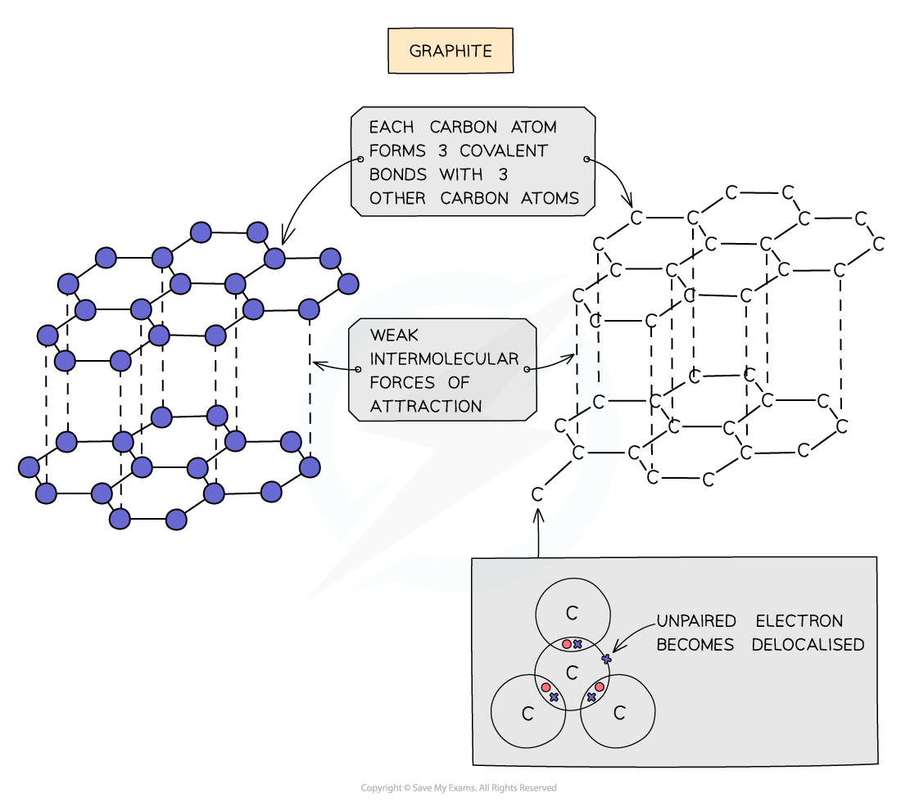
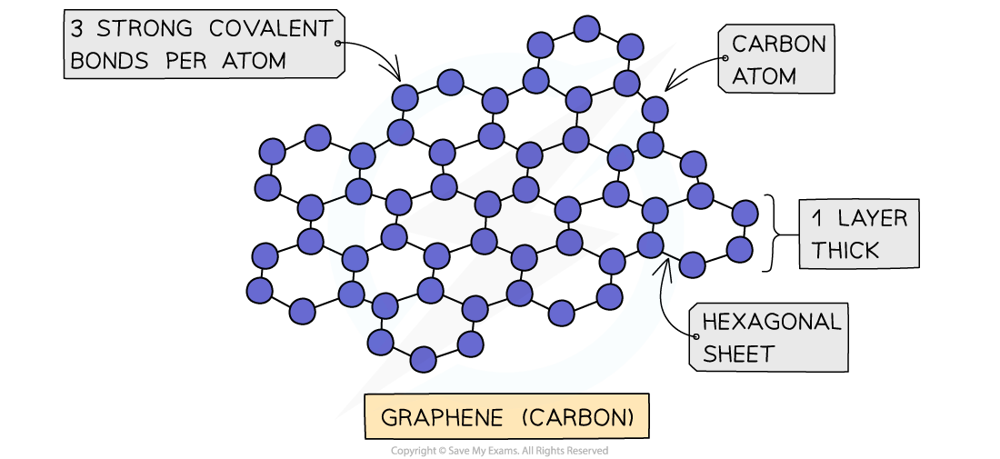

# Carbon Allotropes

## Carbon Allotropes

> **Spec point** — `spcpt_W9WhJc4kdbrgjMQ8`

## Carbon Allotropes

#### Covalent bonding & giant covalent lattice structures

- **Allotropes **of carbon are substances that only contain carbon atoms but due to the differences in bonding arrangements they are physically completely different
- **Giant covalent lattices **have **very high** **melting **and **boiling points**

  - These compounds have a large number of **covalent bonds **linking the whole structure
  - A lot of energy is required to break the lattice
- The compounds can be **hard **or **soft**

  - Graphite is **soft** as the forces between the carbon layers are weak
  - Diamond and silicon(IV) oxide are **hard** as it is difficult to break their 3D network of strong covalent bonds
- Most compounds are insoluble with water
- Most compounds do not **conduct electricity **however some do

  - Graphite has **delocalised **electrons between the carbon layers which can move along the layers when a voltage is applied
  - Diamond and silicon(IV) oxide do not conduct electricity as all four outer electrons on every carbon atom are involved in a **covalent bond** so there are no freely moving electrons available

#### Graphite

- Each carbon atom in graphite is bonded to **three** others forming **layers** of **hexagons**, leaving one free electron per carbon atom
- These free electrons migrate along the layers and are free to move and carry charge, hence graphite can **conduct electricity**
- The covalent bonds within the layers are very strong

  - But, the layers are held together by weak van der Waals' forces of attraction, which are easily overcome
  - This allows the layers to **slide** over each other, making graphite **soft** and** slippery**

***Diagram showing the structure and bonding arrangement in graphite***

#### Diamond

- In diamond, each carbon atom bonds with four other carbons, forming a **tetrahedron**
- All the covalent bonds are identical, very strong and there are no** intermolecular forces**

***Diagram showing the structure and bonding arrangement in diamond***

#### Graphene

- Graphene consists of a single layer of graphite which is a sheet of carbon atoms covalently bonded forming a continuous hexagonal layer
- It is essentially a 2D molecule since it is only one atom thick
- It has very unusual properties make it useful in fabricating** composite** materials and in **electronics**

***Graphene is a truly remarkable material that has some unexpected properties***
