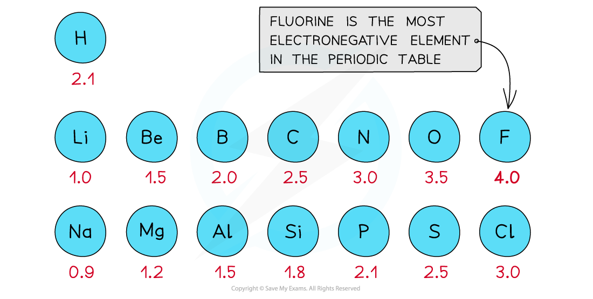
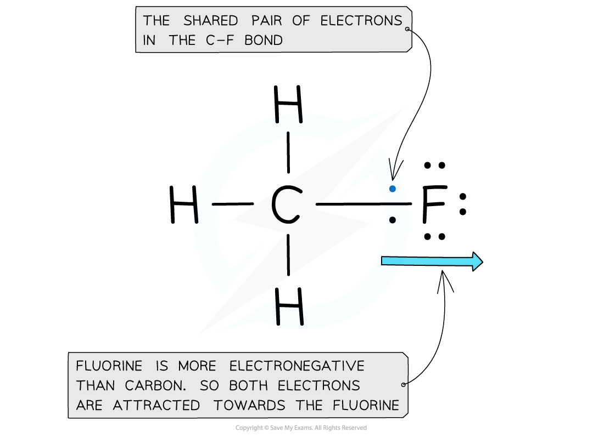
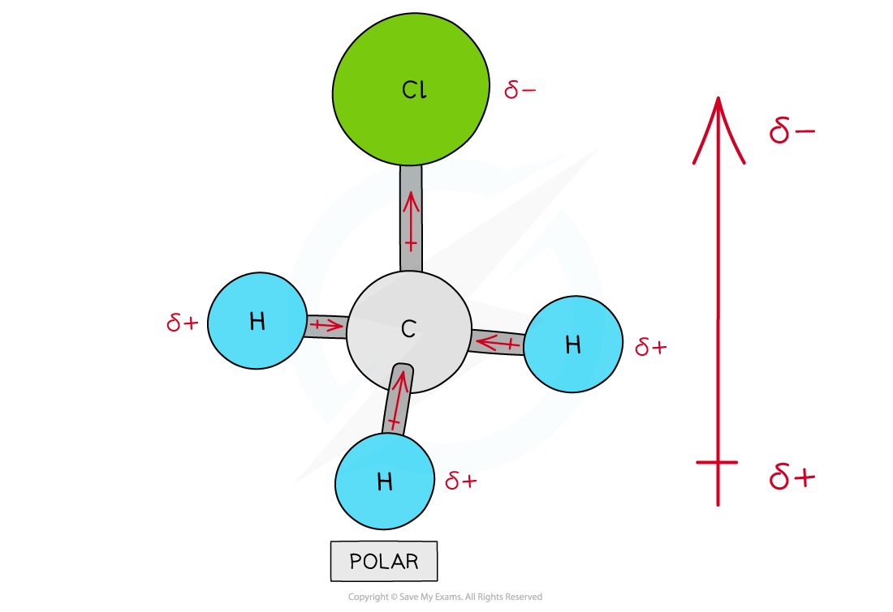
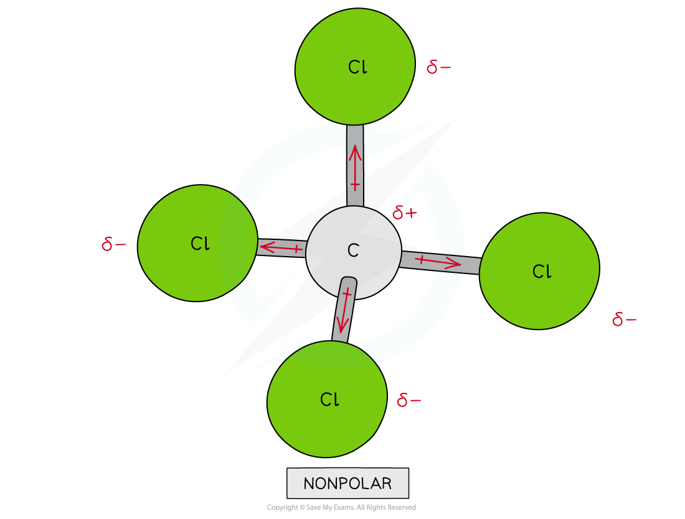

# Electronegativity

## Electronegativity & Bonding 

> **Spec point** — `spcpt_VNDpvzP9md39nMNw`

## Electronegativity & Bonding

- Electronegativity is the power of an atom to attract the pair of electrons in a covalent bond towards itself
- The electron distribution in a covalent bond between elements with different electronegativities will be unsymmetrical
- This phenomenon arises from the ability of the positive nucleus to attract the negatively charged electrons, in the outer shells, towards itself
- The **Pauling** **scale** is used to assign a value of electronegativity for each atom

***First three rows of the periodic table showing electronegativity values***

- Fluorine is the most electronegative atom on the Periodic Table, with a value of 4.0 on the Pauling Scale
- It is best at attracting electrons towards itself when covalently bonded to another atom

***Electron distribution in the C-F bond of fluoromethane***

#### Ionic and covalent bonding

- Elements with large differences in electronegativity tend to form ionic bonds
- Atoms of elements with similar electronegativity tend to form covalent bonds
- Intermediate differences in electronegativity between covalently bonded atoms lead to polarity in the bond

  - As a rule, an electronegativity difference of 2 or more on the Pauling scale between atoms leads to the formation of an ionic bond
  - A difference of less than 2 between atoms leads to covalent bond formation

## Polar Bonds & Polar Molecules 

> **Spec point** — `spcpt_5rzTYy8qQ2qhvpbP`

## Polar Bonds & Polar Molecules

- When two atoms in a covalent bond have the **same electronegativity **the covalent bond is **nonpolar**

***The two chlorine atoms have the same electronegativities so the bonding electrons are shared equally between the two atoms***

- The difference in electronegativities will dictate the type of bond that is formed
- When the electronegativities are very different (difference of more than 1.7) then ions will be formed and the bond will be ionic
- When two atoms in a covalent bond have a difference in electronegativities of 0.3 to 1.7 a covalent bond is formed and the bond will be polar

  - The electrons will be drawn towards the more electronegative atom
- As a result of this:

  - The negative charge centre and positive charge centre do not **coincide **with each other
  - This means that the **electron distribution **is **asymmetric**
  - The **less** **electronegative** atom gets a partial charge of δ+ (**delta** **positive**)
  - The **more** **electronegative** atom gets a partial charge of δ- (**delta** **negative**)
- The greater the difference in **electronegativity** the more polar the bond becomes

***Cl has a greater electronegativity than H causing the electrons to be more attracted towards the Cl atom which becomes delta negative and the H delta positive***

#### Dipole moment

- The **dipole moment **is a measure of how **polar **a bond is
- The **direction** of the dipole moment is shown by the following sign in which the **arrow **points to the **partially negatively charged end **of the dipole:

***The sign shows the direction of the dipole moment and the arrow points to the delta negative end of the dipole***

#### Assigning polarity to molecules

- To determine whether a molecule with more than two different atoms** **is polar, the following things have to be taken into consideration:

  - The polarity of each bond
  - How the bonds are arranged in the molecule
- Some molecules have polar bonds but are overall not polar because the polar bonds in the molecule are arranged in such way that the individual dipole moments **cancel each other out**

***There are four polar covalent bonds in CH******3******Cl which do not cancel each other out causing CH******3******Cl to be a polar molecule; the overall dipole is towards the electronegative chlorine atom***

***Though CCl******4****** has four polar covalent bonds, the individual dipole moments cancel each other out causing CCl******4****** to be a nonpolar molecule***
