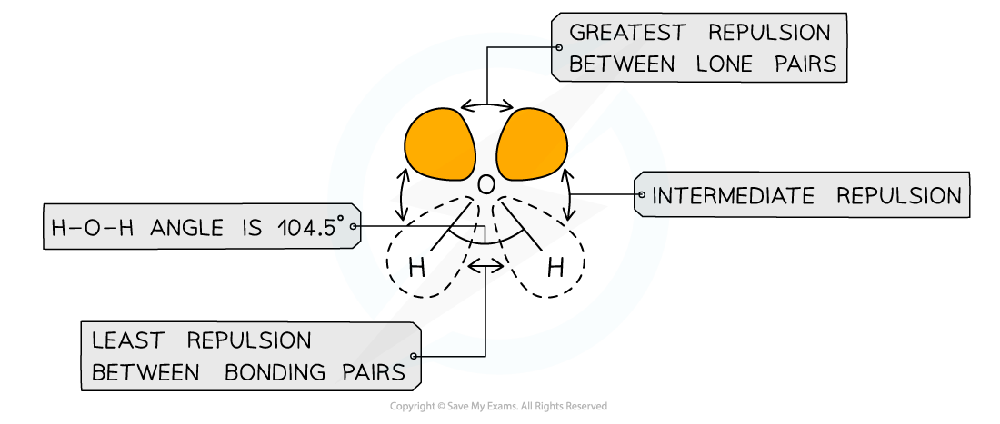
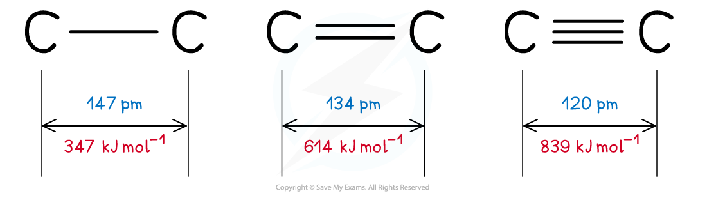
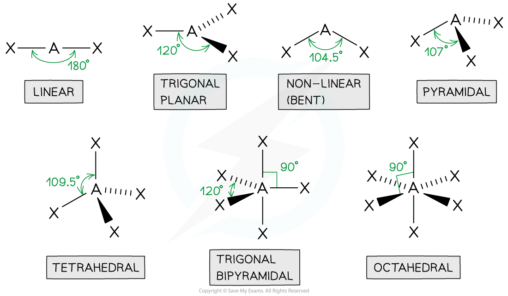

# VSEPR Theory

## Shapes & Angles

> **Spec point** — `spcpt_3hm2qgPFpK9NhN88`

## Shapes & Angles

- The **valence shell electron pair repulsion theory **(VSEPR) predicts the shape and bond angles of molecules
- Electrons are **negatively charged **and will repel other electrons when close to each other
- In a molecule, the **bonding pairs of electrons **will repel other electrons around the **central atom **forcing the molecule to adopt a shape in which these **repulsive forces **are minimised
- When determining the **shape** and **bond** angles of a molecule, the following VSEPR rules should be considered:

  - Valence shell electrons are those electrons that are found in the outer shell
  - Electron pairs repel each other as they have the same charge
  - Lone pair electrons repel each other more than bonded pairs
  - Repulsion between multiple and single bonds is treated the same as for repulsion between single bonds
  - Repulsion between pairs of double bonds are greater
  - The most stable shape is adopted to minimize the repulsion forces
- Different types of electron pairs have different repulsive forces

  - Lone pairs of electrons have a more concentrated electron charge cloud than bonding pairs of electrons
  - The cloud charges are wider and closer to the central atom’s nucleus
  - The order of repulsion is therefore: lone pair – lone pair > lone pair – bond pair > bond pair – bond pair

***Different types of electron pairs have different repulsive forces***

#### Bond length

- The **bond length **is **internuclear distance of two covalently bonded atoms**

  - It is the distance from the nucleus of one atom to another atom which forms the covalent bond
- The **greater **the forces of attraction between electrons and nuclei, the more the atoms are pulled closer to each other
- This **decreases **the **bond** **length** of a molecule and **increases **the **strength** of the covalent bond
- **Triple bonds **are the **shortest** and **strongest** covalent bonds due to the large electron density between the nuclei of the two atoms
- This increase the forces of attraction between the electrons and nuclei of the atoms
- As a result of this, the atoms are pulled closer together causing a shorter bond length
- The increased forces of attraction also means that the covalent bond is **stronger**

***Triple bonds are the shortest covalent bonds and therefore the strongest ones***

#### Bond Angle

- Molecules can adapt the following shapes and bond angles:

***Molecules of different shapes can adapt with their corresponding bond angles***
