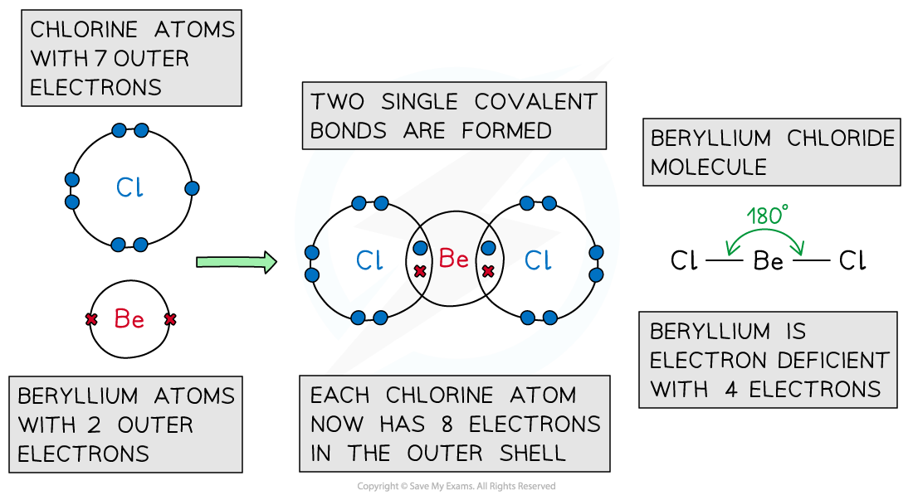
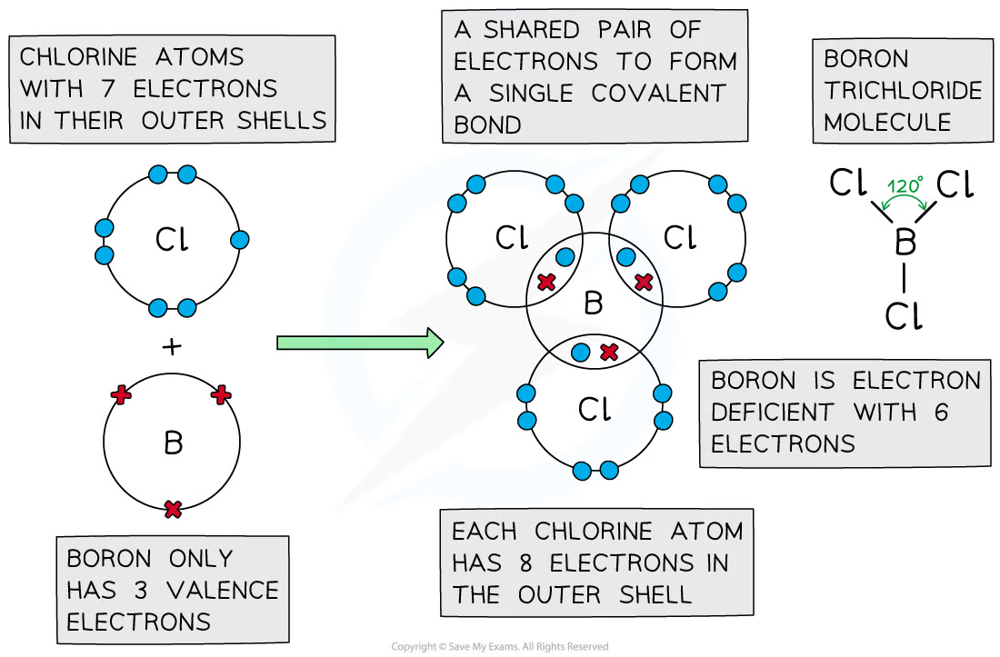
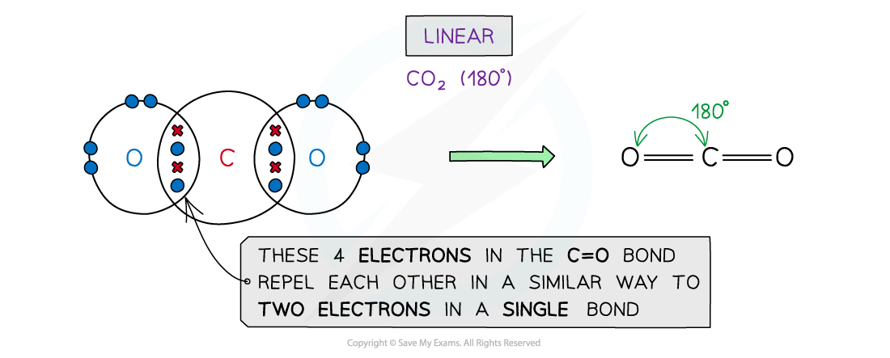
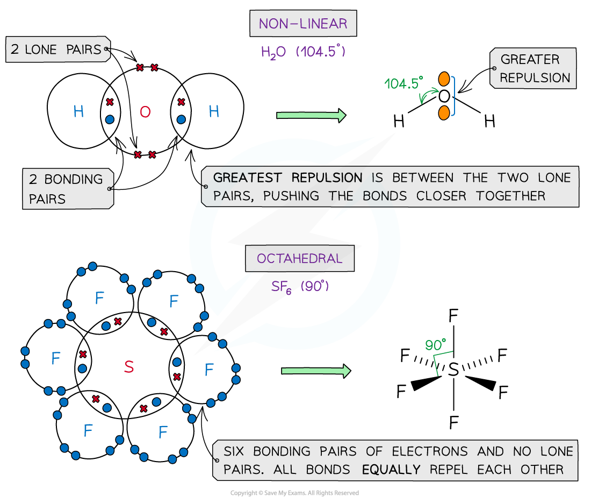
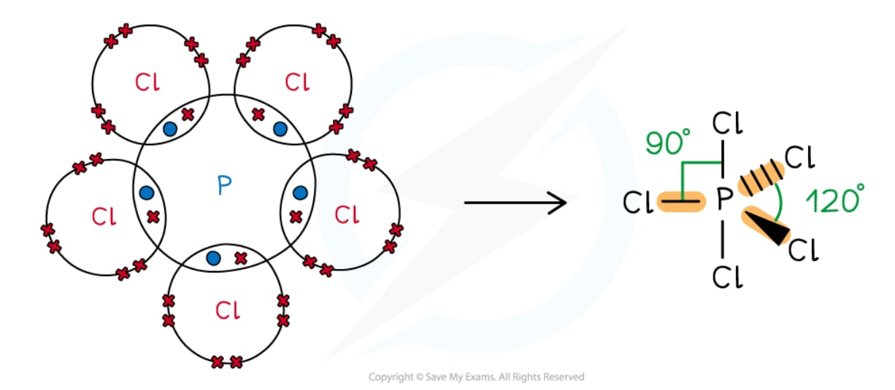

# Predicting Shapes & Angles

## Predicting Shapes & Angles

> **Spec point** — `spcpt_RSTkQx378JYgvC8r`

## Predicting Shapes & Angles

- You will need to know and explain the shapes of the following molecules:

  - BeCl2
  - BCl3
  - CH4
  - NH3
  - NH4+
  - H2O
  - CO2
  - PCl5 (g)
  - SF6
  - C2H4

- In order to write the correct shapes and structures of the molecules listed we need to consider the number of valence electrons

**BeCl****2**

- Beryllium is in group 2, so has 2 valence electrons; Cl is in group 17, so has 7 valence electrons
- Both electrons are used to form covalent bonds with Cl and there are no lone pairs
- Accommodating **less** than 8 electrons in the outer shell means than the central atom is **‘electron deficient’**
- This gives a** linear **shape with bond angles of 180°

**BCl****3**

- Boron is in group 13, so has 3 valence electrons; Cl is in group 17, so has 7 valence electrons
- All 3 electrons are used to form covalent bonds with Cl and there are no lone pairs
- Accommodating **less** than 8 electrons in the outer shell means than the central atom is **‘electron deficient’**
- This gives a **trigonal** **planar** shape with bond angles of 120°

**CH****4**** & NH****3**

- Carbon is in group 14, so has 4 valence electrons; H is in group 1, so has 1 valence electron
- All 4 electrons are used to form covalent bonds with H
- This gives a **tetrahedral** arrangement with a bond angle of 109.5°
- Nitrogen is in group 15, so has 5 valence electrons
- Only 3 electrons are used to form covalent bonds with H and 2 are unbonded as a lone pair
- This gives a **trigonal pyramid **arrangement with a bond angle of 107° 

**NH****4****+**

- Nitrogen is in group 15, so has 5 valence electrons; H is in group 1, so has 1 valence electron
- Only 3 electrons are used to form covalent bonds with H and 2 are used to form a dative covalent bond
- This gives a **tetrahedral** arrangement
- With a bond angle of 109.5° (similar to CH4)

***The NH******4******+****** ion ***

**Other examples**

**PCl****5**** (g)**

- Phosphorus is in group 15, so has 5 valence electrons; Cl is in group 17, so has 7 valence electrons

  - All 5 electrons are used to form covalent bonds with Cl and there are no lone pairs
  - This gives a **trigonal** (or **triangular**)** bipyramidal** shape
  - With bond angles of 120° and 90°

***Phosphorus pentachloride molecule ***

**C****2****H****4**

- Each carbon atom is in group 14, so has 4 valence electrons, each hydrogen atom is in group 1 so has 1 valence electron
- This gives a total of 12 electrons
- There are 4 C-H bonds which use 8 electrons
- This leaves 4 electrons which are involved in the C=C
- Therefore the overall shape is trigonal planar as there are three regions of electron density for each carbon atom

***Ethene molecule***
