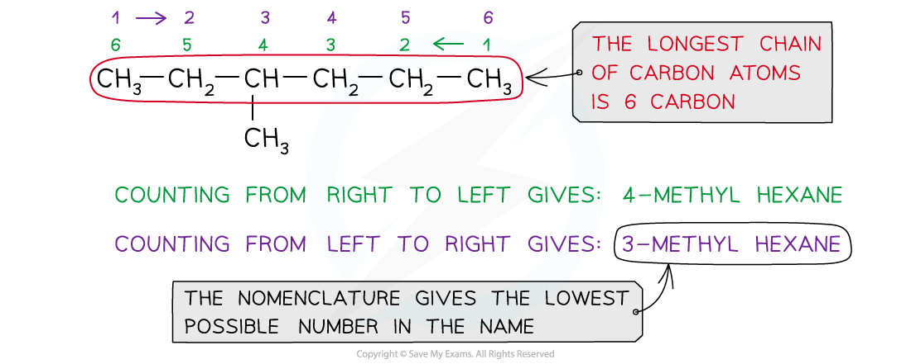
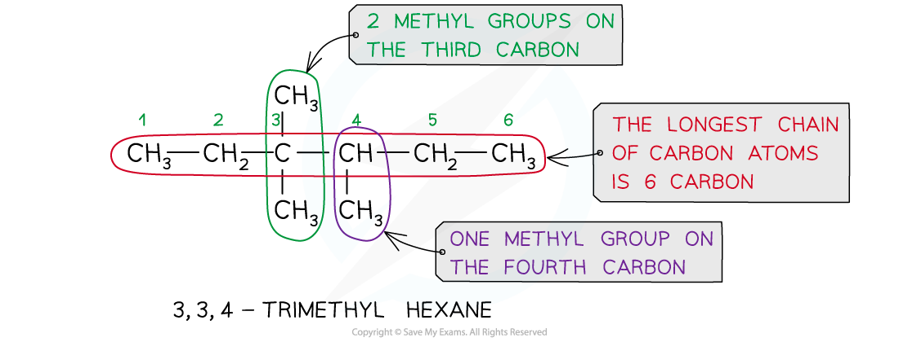
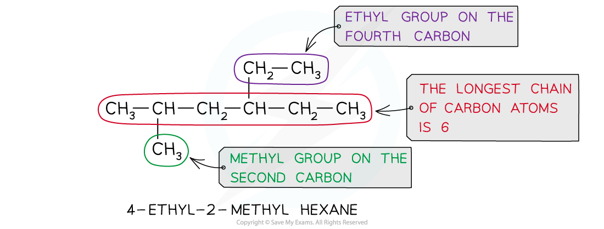
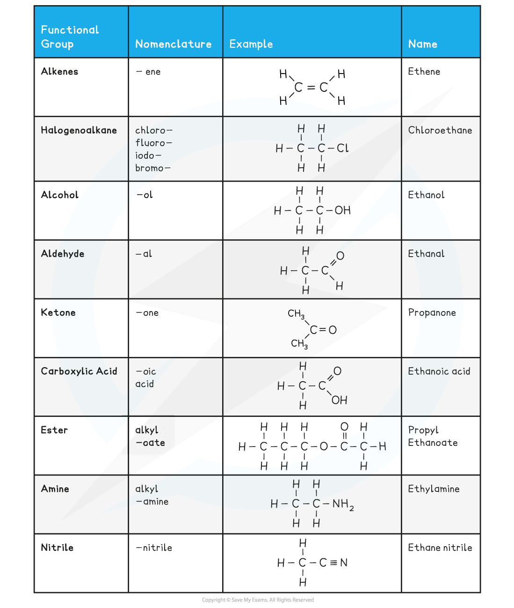
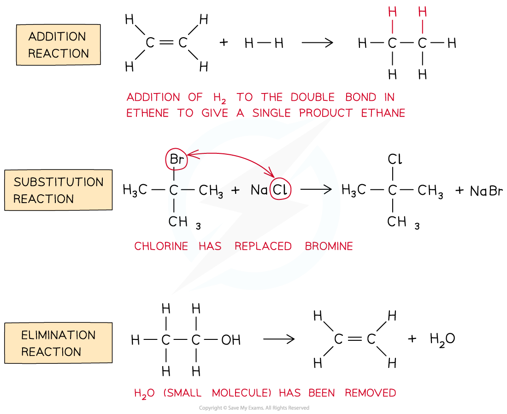
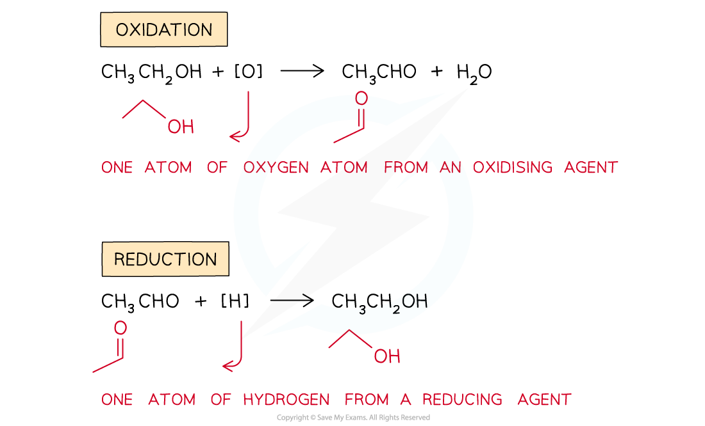

# Nomenclature & Classification

## IUPAC Nomenclature

> **Spec point** — `spcpt_6vtRGStJMRHpR2K5`

## IUPAC Nomenclature

- **Systematic nomenclature **can be used to name organic compounds and therefore make it easier to refer to them
- The **alkanes** provide the basis of the naming system and the **stem** of each name indicates how many carbon atoms are in the **longest chain **in one molecule of the compound

#### Nomenclature of Organic Compounds Table

| **Number of C atoms** | **Molecular formula of straight-chain alkane** | **Name of alkane** | **Stem used in naming** |
|---|---|---|---|
| 1 | CH4 | methane | meth- |
| 2 | C2H6 | ethane | eth- |
| 3 | C3H8 | propane | prop- |
| 4 | C4H10 | butane | but- |
| 5 | C5H12 | pentane | pent- |
| 6 | C6H14 | hexane | hex- |
| 7 | C7H16 | heptane | hept- |
| 8 | C8H18 | octane | oct- |
| 9 | C9H20 | nonane | non- |
| 10 | C10H22 | decane | dec- |

- If there are any side-chains or functional groups present, then the position of these groups is indicated by numbering the carbon atoms in the longest chain starting at the end that gives the lowest possible numbers in the name
- The hydrocarbon **side-chain **is shown in **brackets **in the structural formula

CH3CH**(CH****3****)**CH2CH3

- The side-chain is named by adding ‘-yl’ to the normal alkane **stem**
- This type of group is called an **alkyl **group

***Naming Side Chains***

- If there are more than one of the same alkyl side-chain or functional groups, **di-** (for two), **tri-** (for three) or **tetra-** (for four) is added in front of its name
- The adjacent **numbers **have a comma between them
- **Numbers **are separated from **words **by a hyphen

***Naming Multiple Side Chains***

- If there is more than one type of alkyl side-chain, they are listed in alphabetic order

***Naming Side Chains in Alphabetical Order***

#### Functional Groups & their Nomenclature Table

> **Worked Example**
> **Naming organic molecules **Name the following molecules using correct systematic nomenclature:
> 
> 
> 
> **Answer**
> 
> 

## Reaction Classification

> **Spec point** — `spcpt_Wzs3gQvG7gtsVRvN`

## Reaction Classification

- We can classify reactions into different types

  - An **addition **reaction is an organic reaction in which two (or more) molecules combine to give a **single** **product** with no other products
  - A **substitution **reaction is a reaction that involves **replacing** an atom or group of atoms by another
  - An **elimination **reaction is a reaction in which a small molecule (such as H2O or HCl) is **removed** from an organic molecule
  - A **hydrolysis **reaction is a reaction in which a compound is **broken** **down** by **water** (it can also refer to the breakdown of a substance by dilute acids or alkali)
  - A **condensation **reaction is a reaction in which two organic molecules join together and in the process **eliminate** small molecules (such as H2O or HCl)

***The different types of reactions in organic chemistry***

#### Oxidation & reduction

- An **oxidation **reaction is a reaction in which oxygen is added, electrons are removed or the oxidation number of a substance is increased

  - In organic chemistry it often refers to the addition of oxygen or removal of hydrogen atoms to a substance
  - In equations for organic redox reactions, the symbol [O] can be used to represent one atom of oxygen from an oxidising agent

- A **reduction **reaction is a reaction in which oxygen is removed, electrons are added or the oxidation number of a substance is decreased

  - In organic chemistry it often refers to the removal of oxygen or addition of hydrogen atoms to a substance
  - In equations for organic redox reactions, the symbol [H] can be used to represent one atom of hydrogen from a reducing agent

***In organic chemistry oxidation is often the gain of oxygen or loss of hydrogen atoms and reduction is the gain of hydrogen and loss of oxygen atoms***

#### Polymerisation

- In the AS level course all the polymerisation reactions covered are examples of addition polymerisation
- Addition polymerisation is the reaction in which many **monomers** containing at least one C-C double bond form long chains of **polymers** as the only product
