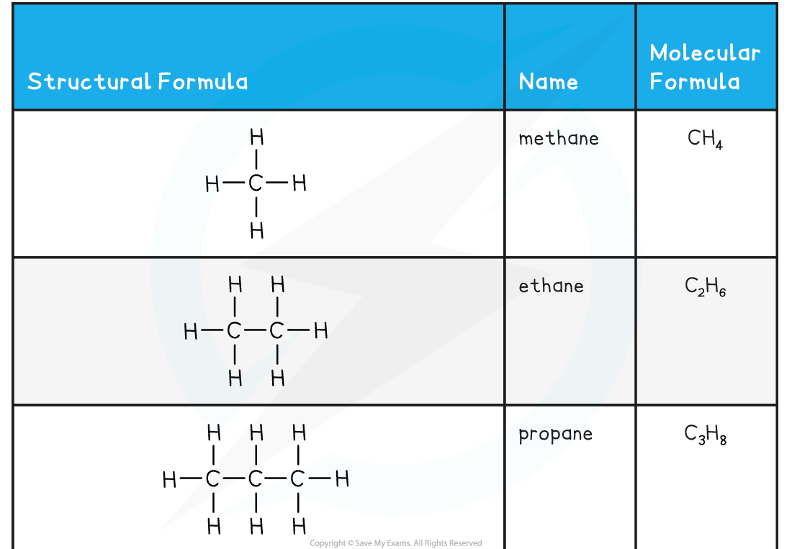
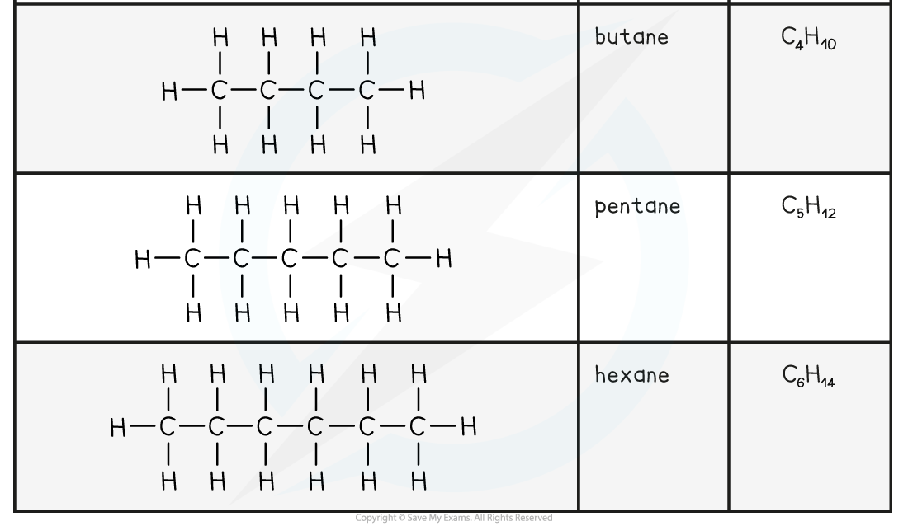
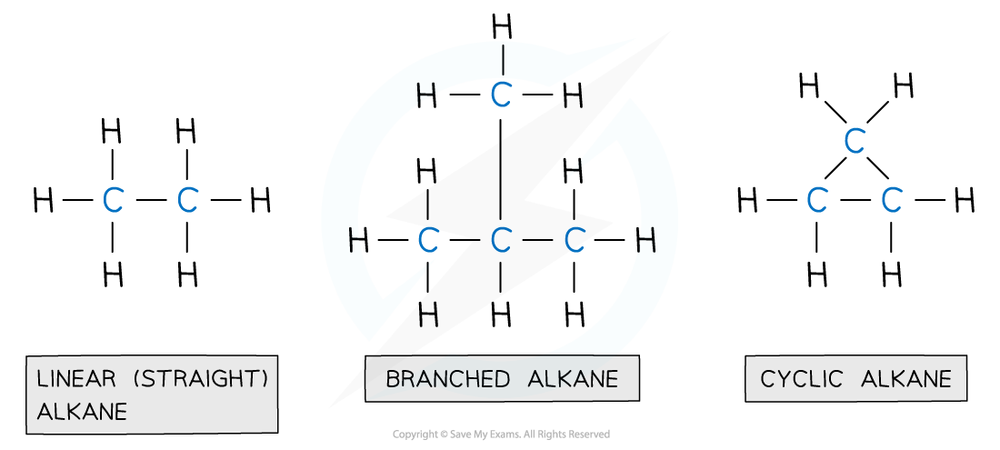
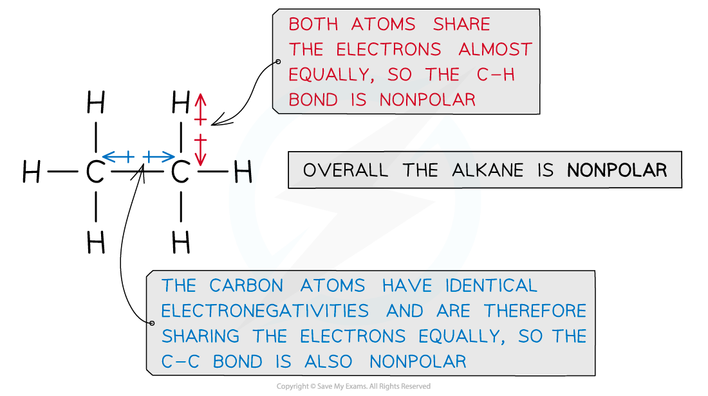
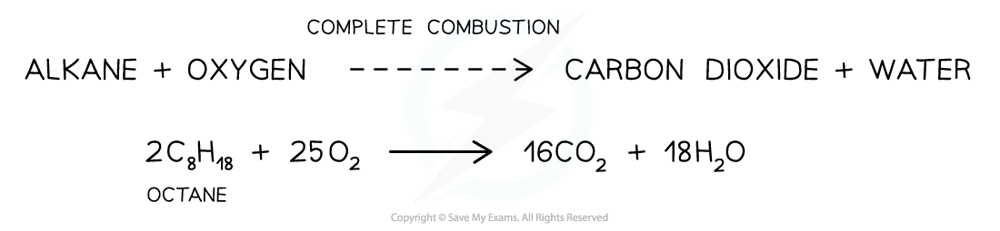
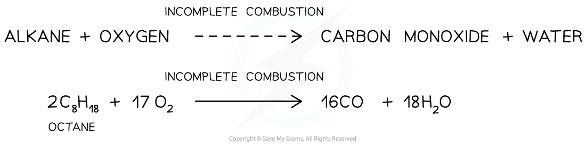
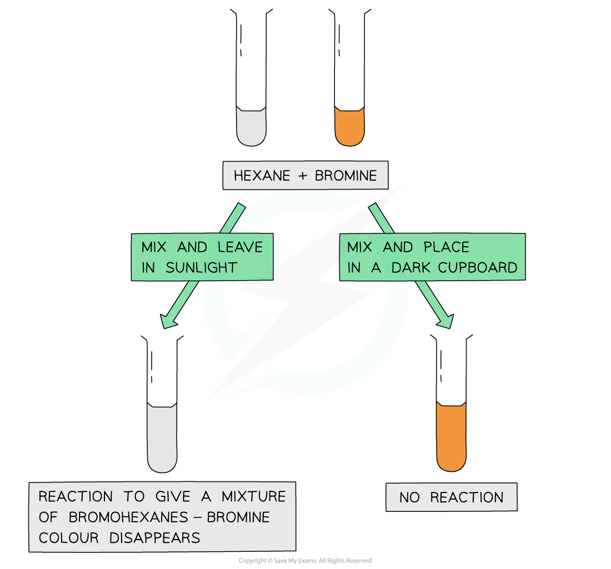

# Alkanes - Introduction

## Alkanes - Introduction

> **Spec point** — `spcpt_NyKBZPF6HPcGx3CZ`

## Alkanes - Introduction

- **Hydrocarbons** are compounds containing hydrogen and carbon only
- Some of the hydrocarbon families that you are expected to know include: **alkanes, alkenes **and** arenes**

  - Alkanes and alkenes can be described as **aliphatic**
  - Arenes can be described as **aromatic**
- Alkanes have the general molecular formula **C****n****H****2n+2**** **
- They contain only **single bonds** and are said to be **saturated**
- Alkanes are named using the nomenclature rule **alk + ane**

  - The **alk** portion of the name depends on the number of carbons
  
    - 1 carbon = meth
    - 2 carbons = eth
    - 3 carbons = prop
    - 4 carbons = but
    - 5 carbons = pent
    - After 5 carbons, the naming of alkanes matches the names of the polygons in Maths
  - The **ane** portion of the name suggests single bonds between the carbon atoms

#### The First Six Members of the Alkane Family

- Alkanes can be linear, branched or cyclic

  - The key points are that there are no functional groups and only single bonds between the carbon atoms
- Cycloalkanes have the general formula **C****n****H****2n**

  - This general formula is the same as the alkene general formula but cycloalkanes are still saturated
  - Cycloalkanes are named using the nomenclature rule **cyclo + alk + ane**
  
    - The **cyclo** portion of the name shows that there is a ring stucture
    - As with alkanes, the **alk** portion of the name depends on the number of carbons
    - The **ane** portion of the name suggests single bonds between the carbon atoms

***Alkanes are compounds made up of carbon and hydrogen atoms only and contain no functional group***

## Alkanes - Reactions 

> **Spec point** — `spcpt_BXzpKQJ3TQGfYrBw`

## Alkanes - Reactions

- The **unreactive** nature of alkanes can be explained by two factors

  - The **high bond enthalpies** of the C-C and C-H bonds
  - The very **low polarity** of the sigma (σ) bonds present

#### Bond enthalpy

- The C-C bond has a bond enthalpy of 316 kJ mol-1 and the C-H bond has a bond enthalpy of 411 kJ mol-1
- The C-H bond is stronger as the bond length is less than the C-C bond

  - This is because the hydrogen atom only consists of one shell, so the distance between the nuclei is shorter
  - Creating greater force of attraction to the nuclei and the pair of electron between them

#### Polarity

- The electronegativities of carbon and hydrogen are very similar, therefore the bonds will have very low polarity

***Ethane is an example of an alkane that lacks polarity due to almost similar electronegativities of the carbon and hydrogen atoms***

Alkanes are **combusted **(burnt) on a large scale for their use as fuels

#### Complete combustion

- When alkanes are burnt in **excess **(plenty of) oxygen, **complete combustion **will take place and all carbon and hydrogen will be oxidised to **carbon dioxide **and **water** respectively

  - For example, the complete combustion of octane to carbon dioxide and water

***The complete combustion of alkanes***

#### Incomplete combustion

- When alkanes are burnt in only a **limited supply **of oxygen, **incomplete combustion** will take place and not all the carbon is fully oxidised
- Some carbon is only **partially **oxidised to form **carbon monoxide**

  - For example, the incomplete combustion of octane to form carbon monoxide

***The incomplete combustion of alkanes***

- Incomplete combustion often takes place inside a **car engine **due to a limited amount of oxygen present
- With a reduced supply of oxygen, **carbon** will be produced in the form of soot: 

#### Free-radical substitution

- Alkanes can undergo **free-radical substitution **in which a hydrogen atom gets **substituted **by a halogen (chlorine / bromine)
- Since alkanes are very unreactive, **ultraviolet **light** (sunlight)** is needed for this substitution reaction to occur
- The free-radical substitution reaction consists of three steps:

  - In the **initiation step**, the halogen bond (Cl-Cl or Br-Br) is broken by UV energy to form two radicals
  - These radicals create further radicals in a chain reaction called the **propagation step**
  - The reaction is terminated when two radicals collide with each other in a **termination step**
- Alkanes can undergo **free-radical substitution **in which a hydrogen atom gets **substituted **by a halogen (chlorine/bromine)

  - **Ultraviolet **light** (sunlight)** is needed for this substitution reaction to occur

***The fact that the bromine colour has disappeared only when mixed with an alkane and placed in sunlight suggests that the ultraviolet light is essential for the free radical substitution reaction to take place***
