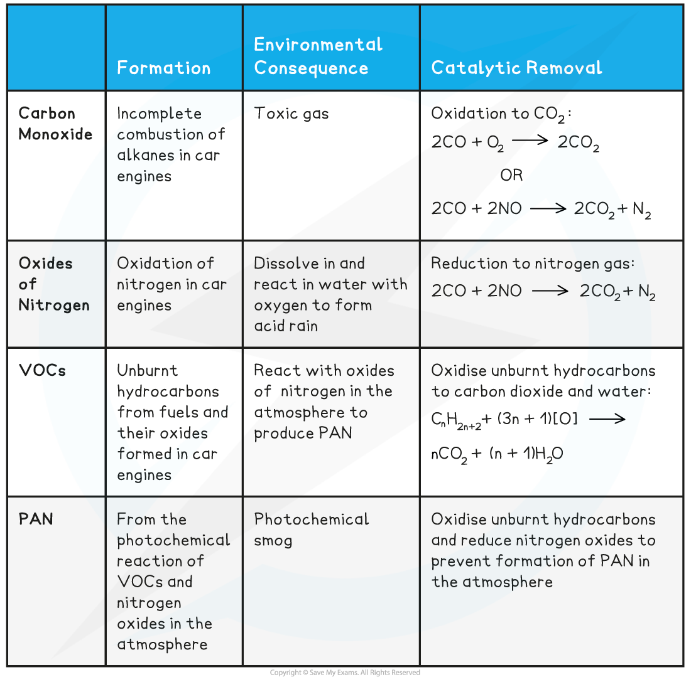

# Combustion of Alkanes

## Problems of Pollution

> **Spec point** — `spcpt_7gwQFxHJFwZJzM7v`

## Problems of Pollution - General

- When alkanes are burnt in **excess **(plenty of) oxygen, **complete combustion **will take place and all carbon and hydrogen will be oxidised to **carbon dioxide **and **water** respectively
- When alkanes are burnt in only a **limited supply **of oxygen, **incomplete combustion** will take place and not all the carbon is fully oxidised

  - Some carbon is only **partially **oxidised to form **carbon monoxide**
- Incomplete combustion often takes place inside a **car engine **due to a limited amount of oxygen present
- With a reduced supply of oxygen, **carbon** will be produced
- Solid carbon particles (or **particulates**) released from incomplete combustion clump together to form **soot** which gradually falls back to the ground

- Car **exhaust fumes **include toxic gases such as **carbon monoxide **(CO), **oxides of sulfur**, **oxides of nitrogen **(NO/NO2) and **volatile organic compounds **(VOCs)
- When released into the atmosphere, these pollutants have serious environmental consequences damaging nature and health

#### Carbon monoxide

- CO is a toxic and odourless gas which can cause dizziness, loss of consciousness and eventually death

  - The CO binds well to haemoglobin which therefore cannot bind oxygen and carbon dioxide
  - Oxygen is transported to organs
  - Carbon dioxide is removed as waste material from organs

***The high affinity of CO to haemoglobin prevents it from binding to O******2****** and CO******2***

#### Oxides of sulfur

- Some of the crude oil products from fractional distillation, cracking and reforming contain sulfur atoms
- When these molecules are combusted, the sulfur atoms form sulfur dioxide and sulfur trioxide

  - Both of these sulfur oxides are acidic

**S + O****2**** → SO****2**** **

**2SO****2**** + O****2**** → 2SO****3**** **

- When these acidic sulfur oxides dissolve into water in the atmosphere, they form sulfurous and sulfuric acid

**SO****2**** + H****2****O → H****2****SO****3**** **

**SO****3**** + H****2****O → H****2****SO****4**** **

- Both of these acids contribute to acid rain, which is responsible for various environmental issues:

  - Damage / death of aquatic life
  - Damage / death to crops and forests
  - Release of carbon dioxide from carbonate rocks and building materials
  - Corrosion of metallic structures

#### Oxides of nitrogen

- Normally, nitrogen is too unreactive to react with oxygen in air
- However, in a car engine, high temperatures and pressures are reached causing the oxidation of nitrogen to take place:

**N****2**** + O****2**** → 2NO**

**N****2**** + 2O****2**** → 2NO****2**

- The **oxides of nitrogen** are then released in the exhaust fumes into the atmosphere
- Car exhaust fumes also contain **unburnt** **hydrocarbons** from fuels and their **oxides** (VOCs)
- In air, the nitrogen oxides can react with these VOCs to form **peroxyacetyl** **nitrate** (PAN) which is the main pollutant found in **photochemical smog**

  - PAN is also harmful to the lungs, eyes and plant-life
- Nitrogen oxides can dissolve in water to form nitrous and nitric acid:

**2NO****2**** + H****2****O → HNO****2**** + HNO****3**

- Nitrogen oxides can also react with water and oxygen to form nitric acid:

4NO2 (g) + 2H2O (l) + O2 (g) → 4HNO3 (aq)

- Nitric and nitrous acids are a cause of **acid rain**, which can corrode buildings, endanger plant and aquatic life (as lakes and rivers become too **acidic**) as well as directly damaging human health

#### Pollutants, their Effect & Removal Table

