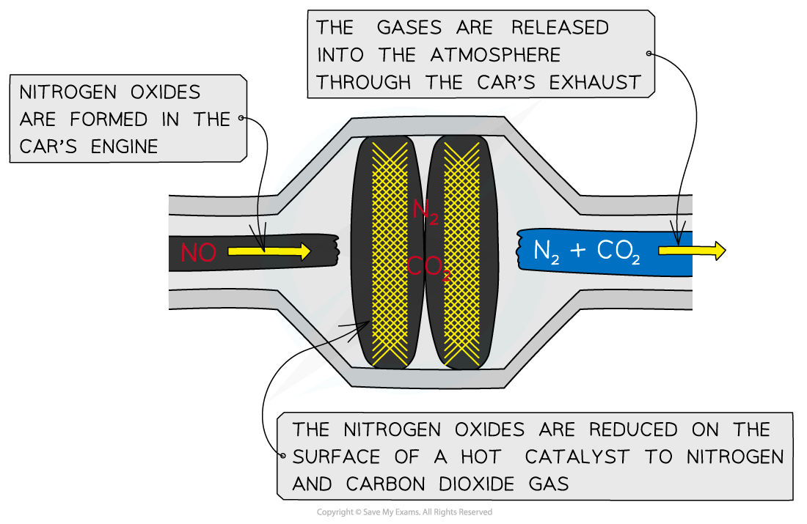

# Alternative Fuels

## Reducing Emissions

> **Spec point** — `spcpt_gJ6d7V7TxGqjWybn`

## Reducing Emissions

- To reduce the amount of pollutants released in car exhaust fumes, many cars are now fitted with **catalytic converters**
- Precious metals (such as platinum, rhodium and palladium) are coated on a honeycomb to provide a **large surface area**
- The reactions that take place in the catalytic converter include:

  - Oxidation of unburnt hydrocarbons:

**C****n****H****2n+2**** + (3n+1)[O] → nCO****2**** + (n+1)H****2****O**

- Oxidation of CO to CO2:

**2CO + O****2**** → 2CO****2**

or

**2CO + 2NO → 2CO****2**** + N****2**

#### Catalytic removal of NOx and CO

- Carbon monoxide and the nitrogen oxides released through cars’ exhaust fumes **pollute **the atmosphere
- The nitrogen oxides are **reduced** on the surface of the **hot catalyst** to form the unreactive and harmless nitrogen gas which is then released from the vehicle’s exhaust pipe into the atmosphere
- The chemical reaction for the reduction of nitrogen oxide to nitrogen gas by the catalyst is as follows:

**2CO (g) + 2NO (g) → 2CO****2 ****(g) + N****2 ****(g)**

***A catalytic converter helps reduce the pollutants from motor vehicles***

#### Alternative fuels

- There are a number of reasons for finding and developing alternative fuels:

  - Reducing pollution from the combustion of fossil fuels, including issues associated with global warming and climate change
  - The limited amount and depletion of **non-renewable fossil fuels **are two reasons for finding alternative fuels
- Biofuels are **renewable **fuels

  - Renewable meaning that they can be replaced over a short period of time
  - The bio part of biofuel meaning that it comes from living matter
- The three main biofuels are **biodiesel**, **bioethanol **and **biogas **

  - Biodiesel - made by refining renewable fats and oils
  - Bioethanol - made by fermentation
  - Biogas - made / released when organic waste breaks down

#### Benefits of biofuels

- Biofuels are often considered as **carbon neutral**
- Biodiesel and biogas can reduce the amount of waste going to landfill as the waste can be used to produce them
- Biofuel production could provide money for less developed countries as they have the space to grow the crops required

#### Drawbacks of biofuels

- The cost of converting engines and machinery to run on biofuels instead of petrol / diesel
- Many developed countries don't have the space to be able to produce enough plants to make the biofuels because the land is needed for food production

#### Greenhouse Gases

- When shortwave radiation from the sun strikes the Earth’s surface it is absorbed and re-emitted from the surface of the Earth as infrared radiation
- Much of the radiation, however, is trapped inside the Earth’s atmosphere by greenhouse gases which can absorb and store the energy
- **Carbon dioxide**,** methane **and** water vapour** are gases that have this effect
- Increasing levels of carbon dioxide, although present in only a small amount, is causing significant upset to the Earth’s natural conditions by trapping extra heat energy
- This process is called the enhanced greenhouse effect

## Carbon Neutrality

> **Spec point** — `spcpt_Y8QKvZzqPJnvC3tM`

## Carbon Neutrality

- Carbon neutral is defined as a net-zero effect on the amount of carbon dioxide in the atmosphere
- Hydrogen gas is an important carbon neutral fuel that produces only water when it combusts

2H2 (g) + O2 (g)  → 2H2O (l)

- Although it produces a large amount of energy, the low density of hydrogen means you need large amounts compared to fossil fuels to give the same amount of energy per gram

  - Along with its explosive nature, this results in storage problems when using hydrogen as a fuel
  - Producing hydrogen is not cheap, so although it qualifies as a carbon neutral fuel its widespread use remains limited
- Biofuels are commonly thought of as being plant-based

  - As a plant grows, it absorbs carbon dioxide from the atmosphere during photosynthesis
  - When the plant is then burnt as a fuel it releases the carbon that is stored as carbon dioxide
  - If the amount of carbon dioxide during growth is the same as the amount of carbon dioxide released during combustion, then this is considered to be carbon neutral

***As a plant grows, it absorbs carbon dioxide from the atmosphere during photosynthesis***

- There is an argument for fossil fuels being carbon neutral because they are releasing the carbon dioxide that they absorbed millions of years ago

  - However, they are not carbon neutral because they absorbed carbon dioxide millions of years ago when the levels of carbon dioxide in the atmosphere were higher than the present day
- Biofuels are considered to be carbon neutral, although this is not necessarily true

  - There is no consideration for the carbon dioxide used in their production, harvesting, manufacture and any transport involved

- Biofuel is a generic term applied to any fuel that is considered to have a biological (often plant-based) origin and is an indication of the way that the fuel was produced
- One of the most common biofuels is bioethanol, which is the same as ethanol
- It is produced by the fermentation of sugars using yeast enzymes
- There is a limit to the concentration of ethanol in solution that can be produced using this method, although more efficient and higher yield processes are being developed
- The separation of the ethanol from the solution is one of the reasons that bioethanol can be argued not to be carbon neutral
- The following four points are the major considerations for biofuels:

  1. Land - should the land used for biofuel production be used for food production instead?
  2. Yield - what volume of biofuel can be produced in the land provided? What percentage of the crop becomes useful fuel?
  3. Manufacture and transport - what are the energy costs involved in growing, harvesting, processing and transporting the biofuel from crop to finished product?
  4. Carbon neutrality - how close is the finished product (including manufacture and transport) to being carbon neutral?
