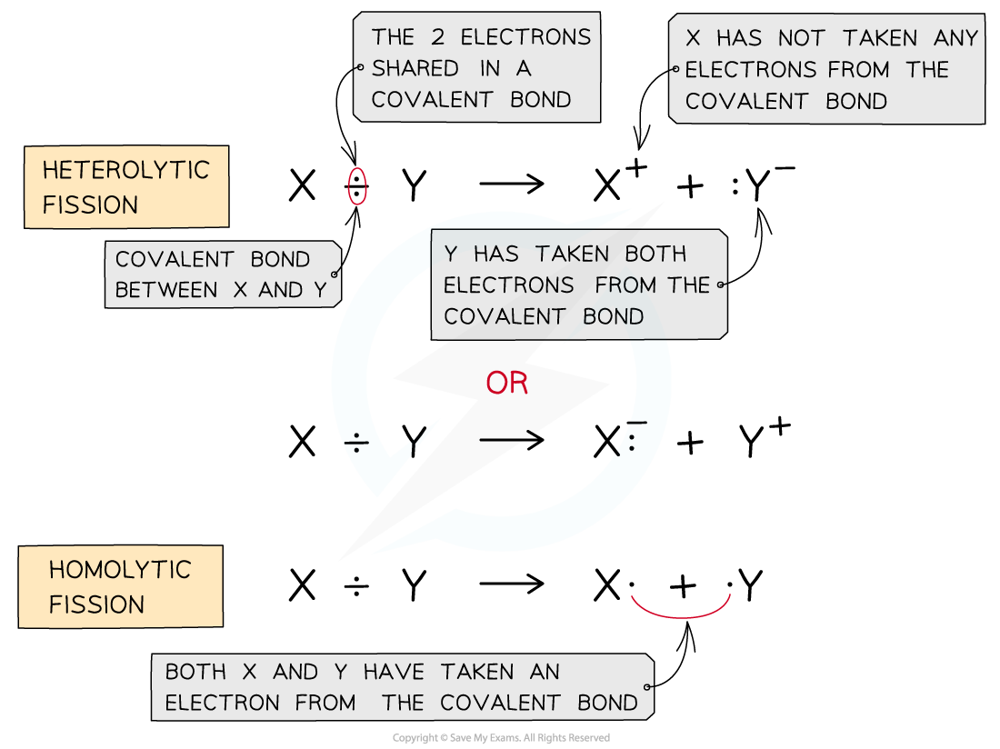
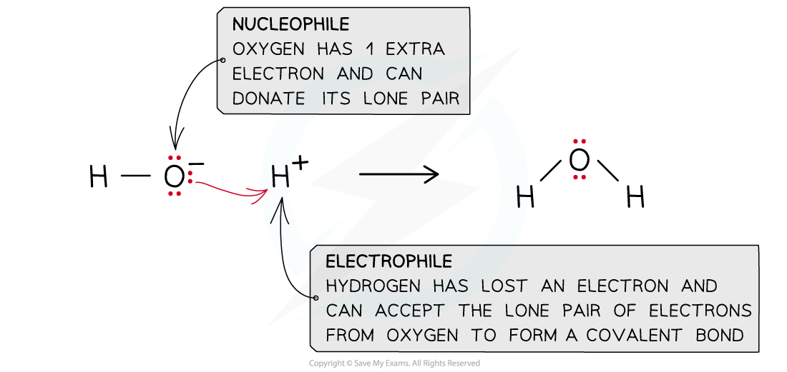

# Free Radicals & Fission

## Free Radicals & Fission

> **Spec point** — `spcpt_X8CzKK2zpcJS6yRy`

## Free Radicals & Fission

- In chemical reactions, there are two types of fission or bond breaking:

  1. **Heterolytic fission**
  2. **Homolytic fission**

***The diagram shows heterolytic fission in which the most electronegative atom takes both electrons in the covalent bond and homolytic fission in which each atom takes one electron from the covalent bond***

#### Heterolytic fission

- Heterolytic fission is breaking a covalent bond in such a way that the more electronegative atom takes both the electrons from the bond to form a negative ion and leaving behind a positive ion*** ***
- In heterolytic fission, a double-headed arrow is used to show the movement of a **pair of electrons**
- The resulting negative ion is an electron-rich species that can **donate** a pair of electrons

  - This makes the negative ion a **nucleophile**
- The resulting positive ion is an electron-deficient species that can **accept **a pair of electrons

  - This makes the positive ion an **electrophile**

***A nucleophile ‘loves’ a positive charge and an electrophile ‘loves’ a negative charge***

#### Homolytic fission

- Homolytic fission is breaking a covalent bond in such a way that each atom takes an electron from the bond to form two free radicals

  - A free radical is a species that contains an unpaired electron
- In homolytic fission, single-headed (or fishhook) arrows are used to show the movement of a **single electron**

***The homolytic fission of a chlorine-chlorine bond results in the formation of two chlorine-free radicals***

- Each atom involved in the original bond receives one of the two bonding electrons

  - This makes each atom into a free radical
