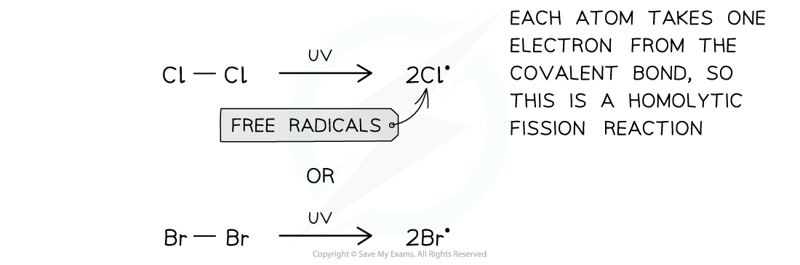
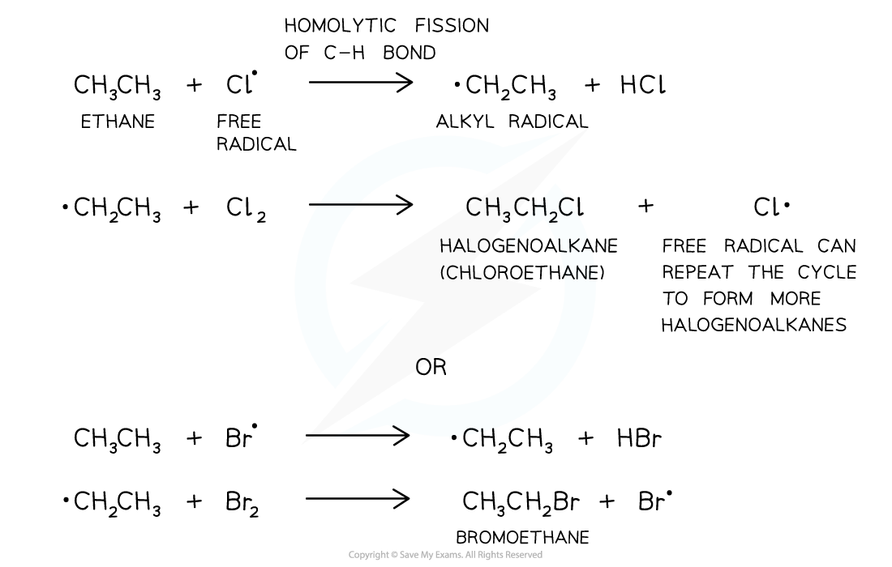
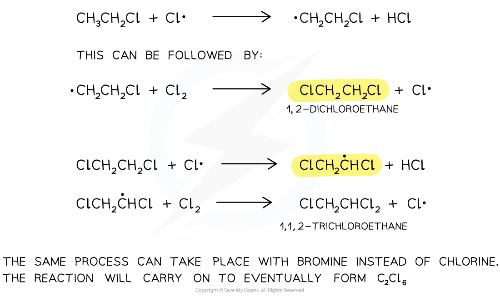
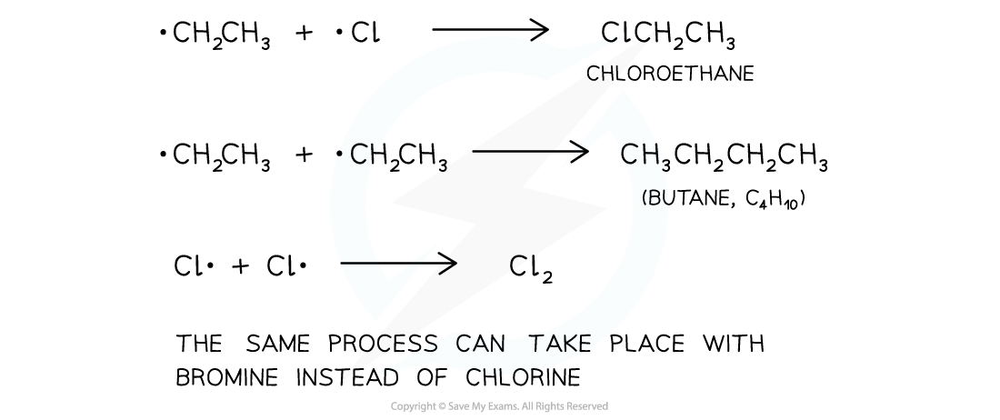

# The Free Radical Substitution Mechanism

## Free Radical Substitution - Mechanism

> **Spec point** — `spcpt_dcqSsRbKy9gKfhck`

## Free Radical Substitution - Mechanism

- The free-radical substitution reaction consists of three steps:

#### Initiation step

- In the **initiation** **step,** the Cl-Cl or Br-Br is broken by energy from the UV light
- This produces two radicals in a **homolytic** **fission** reaction

***The first step of the free-radical substitution reaction is the initiation step, in which two free radicals are formed by sunlight***

#### Propagation step

- The **propagation** **step** refers to the **progression **(growing) of the substitution reaction in a **chain reaction**

  - **Free radicals **are very reactive and will attack the unreactive alkanes
  - A C-H bond breaks **homolytically **(each atom gets an electron from the covalent bond)
  - An **alkyl** free radical is produced
  - This can attack another chlorine/bromine molecule to form the **halogenoalkane** and **regenerate** the chlorine/bromine free radical
  - This free radical can then **repeat **the cycle

***The second step of the free-radical substitution reaction is the propagation step in which the reaction grows in a chain reaction***

- This reaction is not very suitable for preparing specific halogenoalkanes as a **mixture **of substitution products are formed

  - If there is enough chlorine/bromine present, all the hydrogens in the alkane will eventually get substituted (eg. ethane will become C2Cl6/C2Br6)

***The free-radical substitution reaction gives a variety of products and not a pure halogenoalkane***

#### Termination step

- The **termination step **is when the chain reaction **terminates **(stops) due to two free radicals reacting together and forming a single unreactive molecule

  - Multiple products are possible

***The final step in the substitution reaction to form a single unreactive molecule***

#### Limitations of the free radical mechanism

- In the termination step, there are a number of possibilities
- Remember that termination involves any free radical bonding with another free radical
- If we have two •CH3 radicals, they can bond to form ethane, CH3CH3

  - •CH3 + •CH3 → CH3CH3
  - If we are trying to form a chloroalkane, then ethane is an impurity

#### Further substitution

- Excess chlorine present when reacted with methane in the presence of UV light will promote further substitution and could produce CH2Cl2, CHCl3, CCl4
- Further substitution can occur as follows

  - CH3Cl + •Cl → HCl + •CH2Cl
  - •CH2Cl + Cl2 → CH2Cl2 + •Cl
- These reactions could occur

  - CH3Cl + Cl2 → CH2Cl2 + HCl
  - CH2Cl2 + Cl2 → CHCl3 + HCl
  - CHCl3 + Cl2 → CCl4 + HCl

#### Substitution of different carbon atoms

- If we have an alkane with a middle carbon such as propane, substitution can occur here
- Propagation steps for the substitution of propane with excess bromine in the presence of UV light on the middle carbon are as follows:

  - CH3CH2CH3 + •Br → CH3•CHCH3 + HBr
  - CH3•CHCH3 + Br2 → CH3CH(Br)CH3 + •Br
- If the question asks for the halogen to be substituted onto a middle carbon, you must show the radical dot in the correct place, so on the electron-deficient carbon
