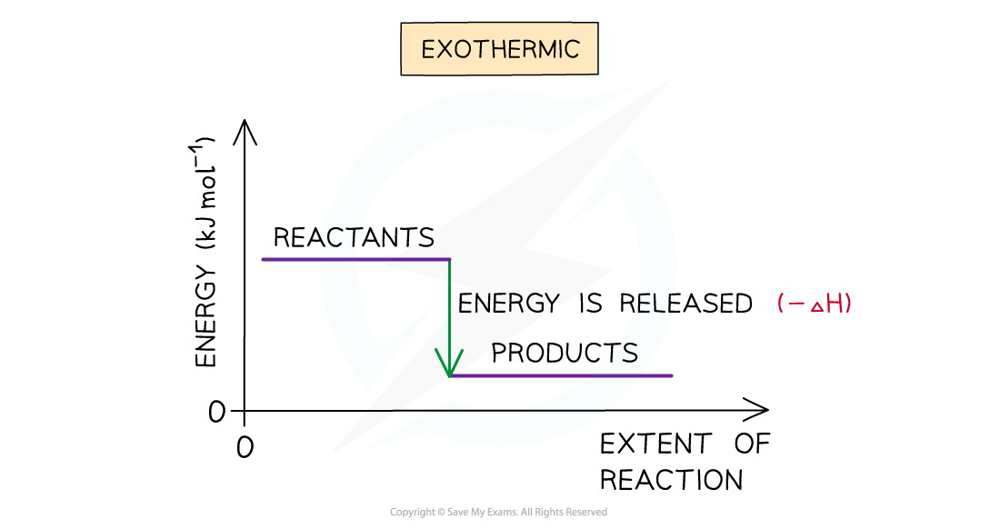
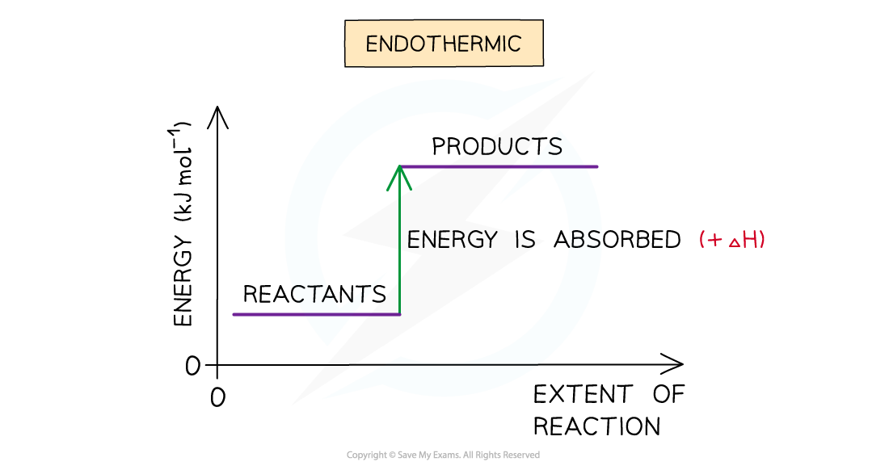
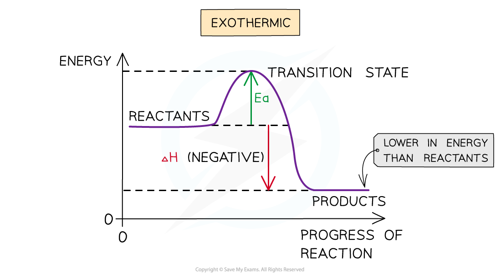
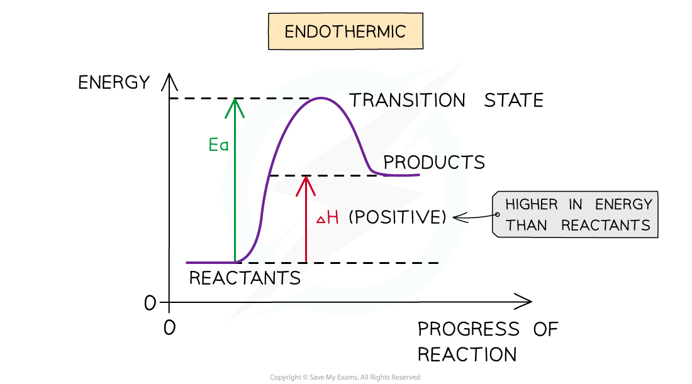

# Enthalpy Level Diagrams

## Enthalpy Level Diagrams

> **Spec point** — `spcpt_hq2TPhQ2Hn8XPMyr`

## Enthalpy Level Diagrams

- The total chemical energy inside a substance is called the **enthalpy** (or heat content)
- When chemical reactions take place, changes in chemical energy take place and therefore the enthalpy changes
- An **enthalpy change** is represented by the symbol Δ*H *(Δ= change; *H* = enthalpy)
- An enthalpy change can be positive or negative

> **Exam Hint**
> Activation energy is not shown in enthalpy level diagrams
> 
> Activation is shown in reaction profile diagrams

#### Exothermic reactions

- A reaction is exothermic when the products have less energy than the reactants
- Heat energy is **given off **by the reaction **to the** **surroundings**

  - The **temperature** of the **environment increases** - this can be measured with a thermometer
  - The **energy **of the **system decreases**
- There is an enthalpy decrease during the reaction so Δ*H *is negative
- Exothermic reactions are **thermodynamically **possible (because the enthalpy of the reactants is **higher** than that of the products)
- However, if the rate is too slow, the reaction may not occur

  - In this case the reaction is **kinetically **controlled

***The enthalpy change during an exothermic reaction***

#### Endothermic reactions

- A reaction is endothermic when the products have more energy than the reactants
- Heat energy is **absorbed** **by **the reaction **from **the **surroundings**

  - The **temperature** of the **environment decreases** - this can be measured with a thermometer
  - The **energy **of the **system increases**
- There is an enthalpy increase during the reaction so Δ*H *is positive

***The enthalpy change during an endothermic reaction***

> **Exam Hint**
> It is important to specify the physical states of each species in an equation when dealing with enthalpy changes as any changes in state can cause very large changes of enthalpy. For example:
> 
> **NaCl (s) → Na****+**** (aq) + Cl****-**** (aq)   Δ*****H***** = +4 kJ mol****-1**
> 
> **NaCl (g) → Na****+**** (g) + Cl****-**** (g)   Δ*****H***** = +500 kJ mol****-1**
> 
> Also, remember that the **system** is the substances** that are reacting** (i.e. the reaction itself) and the **surroundings is everything else** (e.g. the flask the reaction is taking place in).

#### Reaction profile diagrams

- Reaction profile diagrams are similar to enthalpy level diagrams

  - The difference between the energy level of the reactants and the energy level of the products is still the overall enthalpy change of the reaction, Δ*H*
- The main differences are that they include information about:

  - The activation energy, *E*a, of the reaction
  
    - **Activation energy** can be defined as ‘*the minimum amount of energy needed for reactant molecules to have a successful collision and start the reaction’*
    - This is the difference between the energy level of the reactants and the peak of the curve
  - Possible transition states
  
    - The peak of the curve indicates a transition state
    - The **transition state** is a stage during the reaction at which chemical bonds are partially broken and formed
    - The transition state is very unstable – a molecule in the transition state cannot be isolated and is higher in energy than the reactants and products

#### Exothermic reaction profiles

- In an exothermic reaction, the reactants are higher in energy than the products
- The reactants are therefore closer in energy to the transition state
- This means that exothermic reactions have a lower activation energy compared to endothermic reactions

***The reaction profile diagram for a general exothermic reaction***

#### Endothermic reaction profiles

- In an endothermic reaction, the reactants are lower in energy than the products
- The reactants are therefore further away in energy from the transition state
- This means that endothermic reactions have a higher activation energy compared to exothermic reactions

***The reaction profile diagram for a general endothermic reaction***
