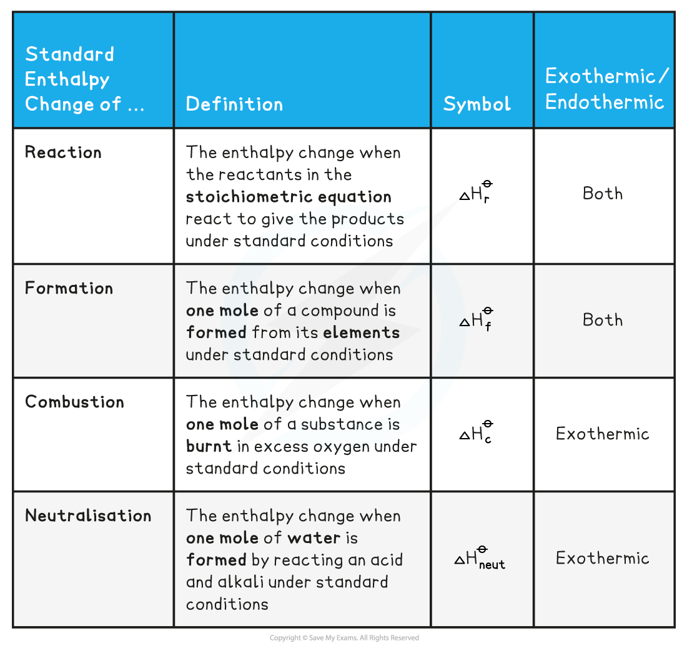

# Enthalpy Change - Definitions

## Enthalpy Change - Definitions

> **Spec point** — `spcpt_ByV2yPRHdjRSXCXQ`

## Enthalpy Change - Definitions

- To be able to compare the changes in enthalpy between reactions, all thermodynamic measurements are carried out under standard conditions
- These standard conditions are:

  - A **pressure** of 100 kPa (you may see some older exam questions that use a figure of 101 kPa; the exact figure is 101 325 Pa, but it has been simplified in the current syllabus for problem-solving purposes)
  - A **temperature** of 298 K (25 oC)
  - Each substance involved in the reaction is in its **standard physical state** (solid, liquid or gas)
- To show that a reaction has been carried out under standard conditions, the symbol ‘Ꝋ’ is used

  - Δ*H*Ꝋ = the standard enthalpy change
- There are a number of standard definitions relating to enthalpy changes that you are expected to know

#### Enthalpy Definitions Table

- A further definition that is expected knowledge, although less used at AS level, is:

  - **Standard enthalpy of atomisation** - the enthalpy change when **one mole** of **gaseous atoms** is formed from an element in its standard state, under standard conditions

> **Exam Hint**
> You will see various enthalpy change symbols used with subtle changes, e.g.
> 
> Δ*H*cꝊ or Δc*H*Ꝋ for enthalpy of combustion
> 
> Whichever symbol you use must have the following basic points:
> 
> - Δ to represent change
> - *H* to represent enthlalpy
> - Ꝋ to respresent standard conditions
> - A symbol to represent the type of enthalpy change occurring, e.g.
> 
>   - c for combustion
>   - f for formation
>   - neut for neutralisation
>   - r for reaction

> **Worked Example**
> **Calculating the enthalpy change of reaction**
> 
> One mole water is formed from hydrogen and oxygen, releasing 286 kJ of energy
> 
> H2 (g) + ½O2 (g) **→ **H2O (I)      Δ*H**r*Ꝋ = -286 kJ mol-1
> 
> Calculate Δ*H**r*Ꝋ for the reaction below:
> 
> 2H2 (g) + O2 (g) **→ **2H2O (I)
> 
> **Answer**
> 
> - Since two moles of water molecules are formed in the question above, the energy released is simply:
> 
> - Δ*H**r*Ꝋ = 2 mol x (-286 kJ mol-1) = -572 kJ mol-1

> **Worked Example**
> **Calculating the enthalpy change**
> 
> Calculate ΔHfꝊ for the reaction below, given that ΔHfꝊ [Fe2O3(s)] = -824.2 kJ mol-1
> 
> 4Fe(s) + 3 O2(g) → 2 Fe2O3(s)
> 
> **Answer**
> 
> - Since two moles of Fe2O3 (s) are formed the total change in enthalpy for the reaction above is:
> 
>   - Δ*H**f*Ꝋ =  2 x ( -824.2 kJ mol-1) = - 1648 kJ

> **Worked Example**
> **Calculating enthalpy changes**
> 
> Identify each of the following as Δ*H**r*Ꝋ, Δ*H**f*Ꝋ, ΔHcꝊ or ΔHneutꝊ
> 
> 1. MgCO3 (s) **→ **MgO (s) + CO2 (g)
> 2. C (graphite) + O2 (g) **→ **CO2 (g)
> 3. HCl (aq) + NaOH (aq) **→ **NaCl (aq) + H2O (I)
> 
> **Answer**
> 
> **Answer 1: **Δ*H**r*Ꝋ
> 
> **Answer 2: **Δ*H**f*Ꝋ as one mole of CO2 is formed from its elements in standard state *and* Δ*H**c*Ꝋ as one mole of carbon is burnt in oxygen
> 
> **Answer 3: **Δ*H**neut*Ꝋ as one mole of water is formed from the reaction between an acid and an alkali

> **Exam Hint**
> The Δ*H**f*Ꝋ of an **element** in its standard state is zero.
> 
> For example, Δ*H**f **Ꝋ *of O2(g) is 0 kJ mol-1
