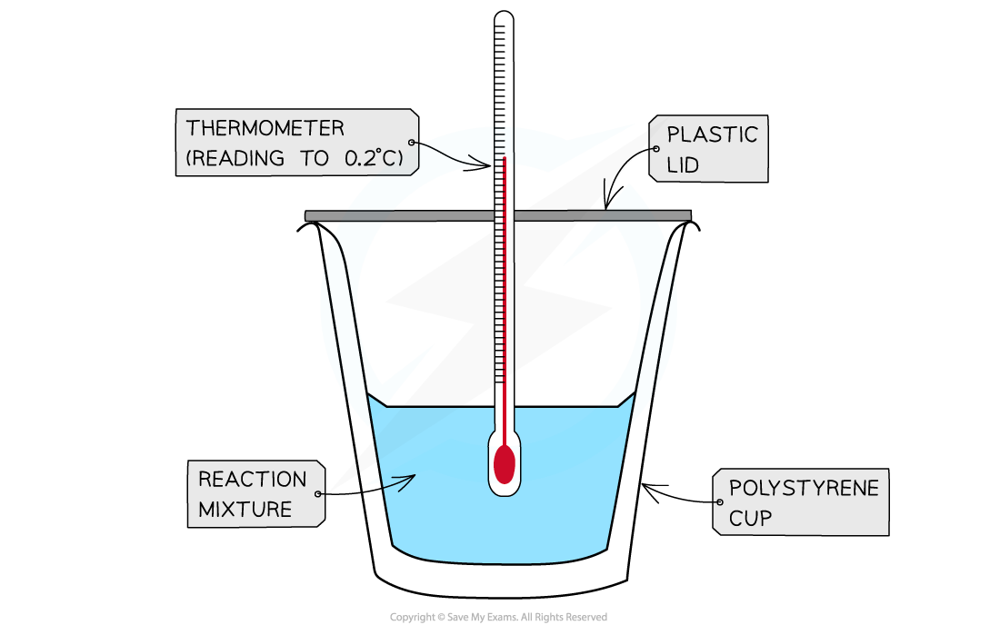
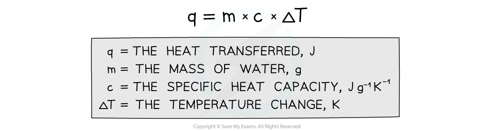
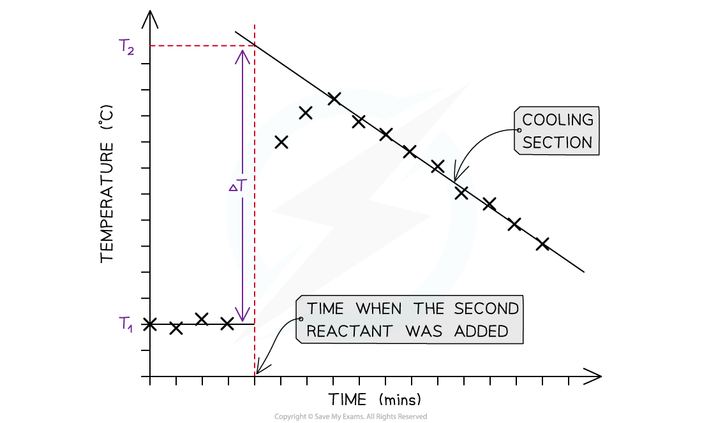
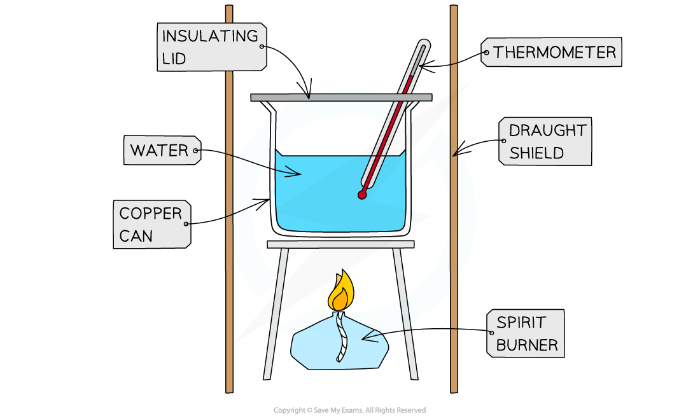
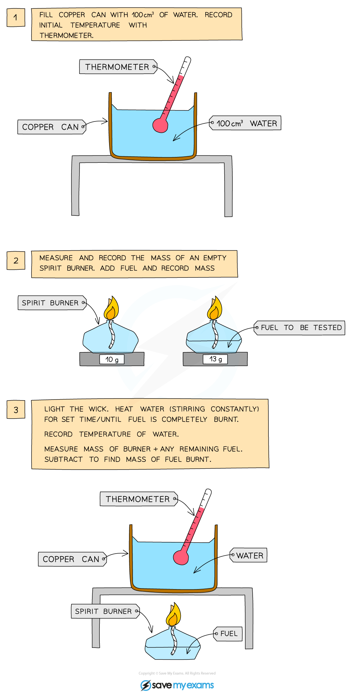

# Using Calorimetry

## Using Calorimetry

> **Spec point** — `spcpt_DDgFnxsJJY2p34cm`

## Using Calorimetry

- **Calorimetry** is the measurement enthalpy changes in chemical reactions
- There are two types of calorimetry experiments you need to know:

  - **Enthalpy** changes of **reactions in solution**, e.g. displacement and neutralisation
  - **Enthalpy** changes of **combustion**
- In both cases, you should be able to give an outline of the experiment and be able to process experimental data using calculations or graphical methods

#### Enthalpy changes for reactions in solution

- The principle of these calorimetry experiments is to carry out the reaction with an excess of one reagent and measure the temperature change over the course of a few minutes
- The apparatus needed to carry out an enthalpy of reaction in solution calorimetry experiment is shown below

  - A **calorimeter** can be made up of a **polystyrene drinking cup**, a **vacuum flask** or **metal can**

***A polystyrene cup can act as a calorimeter to find enthalpy changes in a chemical reaction***

The energy needed to raise the temperature of 1 g of a substance by 1 K is called the **specific heat capacity **(*c*) of the liquid The **specific heat capacity** of water is 4.18 J g-1 K-1 The energy transferred as heat can be calculated by:

***Equation for calculating energy transferred in a calorimeter***

#### Sample method for a displacement reaction

1. Using a measuring cylinder place 25 cm3 of the 1.0 mol dm-3 copper(II) sulphate solution into the polystyrene cup
2. Weigh about 6 g of zinc powder - as this is an excess there is no need to be very accurate
3. Draw a table to record the initial temperature and then the temperature and time every half minute up to 9.5 minutes
4. Put a thermometer or temperature probe in the cup, stir, and record the temperature every half minute for 2.5 minutes
5. At precisely 3 minutes, add the zinc powder to the cup (DO NOT RECORD THE TEMPERATURE AT 3 MINUTES)
6. Continue stirring and record the temperature for an additional 6 minutes

- For the purposes of the calculations, some assumptions are made about the experiment:

  - That the specific heat capacity of the solution is the same as pure water, i.e. **4.18 J g****-1 ****K****-1**
  - That the density of the solution is the same as pure water, i.e. **1 g cm****-3**
  - The specific heat capacity of the container is ignored
  - The reaction is complete
  - There are negligible heat losses

> **Exam Hint**
> As well as any assumptions made for the experiment, you can be expected to comment on:
> 
> - Sources of error, e.g. incorrect masses or volumes of chemicals, heat loss to the surroundings, etc.
> - Uncertainty, e.g. measurements for mass, volume and temperature
> 
>   - Be aware that you will have to double the uncertainty reading for temperature as the calculation requires an initial and final temperature to determine the temperature change

#### Temperature correction graphs

- For reactions which are not instantaneous there may be a delay before the maximum temperature is reached
- During that delay the substances themselves may be losing heat to the surroundings, so that the true maximum temperature is never actually reached
- To overcome this problem we can use graphical analysis to determine the maximum enthalpy change

***A temperature correction graph for a metal displacement reaction between zinc and copper sulfate solution. The zinc is added after 4 minutes***

**The steps to make a temperature correction graph are:**

1. Take a temperature reading before adding the reactants for a few minutes to get a steady value
2. Add the second reactant and continue recording the temperature and time
3. Plot the graph and **extrapolate **the cooling part of the graph until you intersect the time at which the second reactant was added

#### Analysis

- Use both extrapolated lines to calculate Δ*T* as shown on the graph
- Use the equation *q * = *mc*Δ*T* to calculate the energy transferred

  - *q* = energy transferred
  - *m* = mass - this will be the mass of the 25 cm3 solution which will be 25 g (assuming a density of 1 g cm-3)
  - *c* = specific heat capacity - this will be assumed to be 4.18 J g-1 K-1, which is the specific heat capacity of water
  - Δ*T* = the temperature change from the graph
- Convert your value for energy transferred from J into kJ
- Then use the equation Δ*H* = $\frac{q}{n}$ to calculate the enthalpy change for the reaction

  - *q* = energy transferred
  - *n *= number of moles - this would be the number of moles of the **limiting reagent**, which means that you will have an extra calculation to do to determine whether this is the zinc or the copper sulfate
- Remember that in the example above, the temperature of the reaction mixture increased which means that the reaction is exothermic and should, therefore, have a negative value

> **Worked Example**
> **Enthalpy of neutralisation calculation**
> 
> The initial temperature of 25.0 cm3 of sodium hydroxide and 50.0 cm3 of sulfuric acid was measured every 30 seconds for 3 minutes. The two liquids were then mixed and the temperature of the resulting solution was taken every 30 seconds for 5 minutes. A temperature correction graph of the results was plotted and the temperature change was determined to be 6.5 oC.
> 
> Calculate the energy transferred during this reaction.
> 
> **Answer**
> 
> - *q* = *m* x *c* x Δ*T*
> 
>   - *m* (of resulting solution) = 25.0 + 50.0 = 75.0 g
>   - *c* (of water) = 4.18 J g-1 oC-1
>   - *Δ*T (of water) = 6.5 oC
> 
>   - *q* = 75.0 x 4.18 x 6.5 = 2038 J

> **Exam Hint**
> It is more likely that you would be asked to calculate the enthalpy change for this neutralisation reaction
> 
> 1. Calculate the number of moles of NaOH and H2SO4 to determine which reactant is the **limiting reagent**
> 2. Calculate the enthalpy change by dividing the energy transferred by the number of moles of the limiting reagent
> 
> Another twist to this calculation could be for the NaOH and H2SO4 to have different initial temperatures
> 
> - In this case, you work out the energy transferred for the NaOH and for the H2SO4 separately and then add them together
> - After that you follow steps 1 and 2 above to calculate the enthalpy change

#### Enthalpy of combustion

- The principle here is to use the heat released by a combustion reaction to increase the heat content of water
- A typical simple calorimeter is used to measure the temperature changes to the water

***A simple combustion calorimeter***

- To complete this experiment, the following steps will need to be completed:

- It is important that you record the starting temperature, and the final temperature in order to complete the calculations
- You must also record the starting mass of the spirit burner and the final mass of the spirit burner, so that you can work out the mass of the fuel burned during the reaction

  - This will then be used to calculate the moles, which will be used to convert Q to an enthalpy change in your calculations

#### Key points to consider

- Not all the heat produced by the combustion reaction is transferred to the water

  - Some heat is lost to the surroundings
  - Some heat is absorbed by the calorimeter
- To minimise the heat losses the copper calorimeter should not be placed too far above the flame and a lid placed over the calorimeter
- Shielding can be used to reduce draughts
- In this experiment the main sources of error are

  - **Heat losses**
  - **Incomplete combustion**

> **Worked Example**
> **Enthalpy of combustion**
> 
> In a calorimetry experiment 2.50 g of methane is burnt in excess oxygen.
> 
> 30% of the energy released during the combustion is absorbed by 500 g of water, the temperature of which rises from 25 °C to 68 °C.
> 
> The specific heat capacity of water is 4.18 J g-1 K−1
> 
> What is the total energy released per gram of methane burnt?
> 
> **Answer**
> 
> **   Step 1:**
> 
> - *q* = *m* x *c* x Δ*T*
> 
>   - *m* (of water) = 500 g
>   - *c* (of water) = 4.18 J g-1 oC-1
>   - Δ*T* (of water) = 68 oC - 25 oC = 43 oC
> 
> **Step 2: **
> 
> - *q *= 500 x 4.18 x 43 = 89 870 J
> 
> **Step 3: **
> 
> - This is only 30% of the total energy released by methane
> 
>   - Total energy x 0.3 = 89 870 J
>   - Total energy = 299 567 J
> 
> **Step 4:  **
> 
> - This is released by 2.50 g of methane
> 
>   - Energy released by 1.00 g of methane = 299 567 ÷ 2.50 = 120 000 J g-1 (to 3 s.f.) or 120 kJ g-1

## Calculating Enthalpy Changes

> **Spec point** — `spcpt_DTgNWBTvnnGTdWRK`

## Calculating Enthalpy Changes

- Aqueous solutions of acid, alkalis and salts are assumed to be largely water so you can just use the m and c values of water when calculating the energy transferred.
- To calculate any changes in enthalpy per mole of a reactant or product the following relationship can be used:

Δ*H* = $\frac{q}{n}\mathrm{or}\frac{m\timesc\timesΔT}{n}$

- When there is a rise in temperature, the value for Δ*H* becomes negative suggesting that the reaction is exothermic

  - This means that your value should be negative for an exothermic reaction, e.g. combustion
- When the temperature falls, the value for Δ*H* becomes positive suggesting that the reaction is endothermic

  - This means that your value should be positive for an endothermic reaction, e.g. ammonium salts dissolving in water

> **Worked Example**
> 1.50 g of an organic liquid (*M*r = 58.0) underwent complete combustion. The heat formed raised the temperature of 100 g of water from 20 oC to 75 oC.
> 
> Calculate the enthalpy of combustion for the organic liquid
> 
> **Answer**
> 
> **Step 1: **Calculate the energy released by the organic liquid
> 
> - *Q *= *mc*Δ*T*
> 
>   - *Q *= 100 x 4.18 x (75 - 20)
>   - *Q *= 22990 J
>   - *Q *= 22.99 kJ
> 
> **Step 2:** Calculate the number of moles of the organic liquid
> 
> - Number of moles = $=\frac{mass}{molarmass}=\frac{1.50}{58.0}=$0.0259 moles (to 3s.f.)
> 
> **Step 3:** Calculate the enthalpy change of combustion
> 
> - Δc*H*θ $=\frac{Q}{n}=\frac{22.99}{0.0259}=$-887 kJ mol-1 (to 3s.f.)
> 
>   - Remember, combustion is an exothermic process and will, therefore, be a negative enthalpy change value
