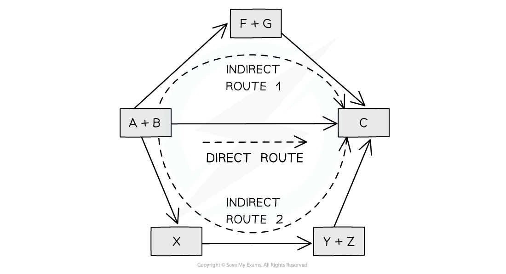

# Using Hess Cycles

## Hess Cycles - Construction 

> **Spec point** — `spcpt_xB8fWTmhkVQkc9Jg`

## Hess Cycles - Construction

- In 1840, the Russian chemist Germain Hess formulated a law which went on to be known as **Hess’s Law**
- This went on to form the basis of one of the laws of thermodynamics. The first law of thermodynamics relates to the **Law of Conservation of Energy**
- It is sometimes expressed in the following form:

***Energy cannot be created or destroyed, it can only change form***

- This means that in a **closed system**, the total amount of energy present is always constant
- Hess’s law can be used to calculate the standard enthalpy change of a reaction from known standard enthalpy changes
- Hess’s Law** **states that:

**"The total enthalpy change in a chemical reaction is independent of the route by which the chemical reaction takes place as long as the initial and final conditions are the same."**

- This means that whether the reaction takes place in one or two steps, the total enthalpy change of the reaction will still be the same

***According to Hess’ Law, the enthalpy change of the direct route, going from reactants (A+B) to product (C), is equal to the enthalpy change of the indirect routes***

- Hess’ Law is used to calculate enthalpy changes which can’t be found experimentally using **calorimetry**, e.g.:

**3C (s) + 4H****2 ****(g) → C****3****H****8****(g)**

- Δf*H* (propane) can’t be found experimentally as hydrogen and carbon don’t react under standard conditions

#### Calculating ΔHr from ΔHf using Hess’s Law energy cycles

- You can see the relationships on the following diagram: 

***The enthalpy change from elements to products (direct route) is equal to the enthalpy change of elements forming reactants and then products (indirect route)***

- The products can be formed:

  - Directly from the elements = **ΔH****2**** **
  **OR**
  Indirectly from the elements = **ΔH****1**** + ΔH****r**

- **Equation**

**ΔH****2**** = ΔH****1**** + ΔH****r**

- Therefore for energy to be conserved,

**ΔH****r ****= ΔH****2**** – ΔH****1**

> **Exam Hint**
> You do not need to learn Hess's Law word for word as it is not a syllabus requirement, but you do need to understand the principle as it provides the foundation for all the problem solving in Chemical Energetics

## Hess Cycles - Calculations

> **Spec point** — `spcpt_hyHwcVZ7JPPWFkD4`

## Hess Cycles - Calculations

### Calculating ΔHr  from ΔHf using Hess’s Law energy cycles

- Knowing the enthalpy change of formation, Δ*H*f, allows us to determine the overall enthalpy change of a reaction, Δ*H*r
- To do this, we follow these steps:

  1. Write the equation for the reaction
  2. Write the elements with the correct** number of moles** and **state symbols** underneath
  3. Draw **upwards pointing arrows** to each compound
  4. Write the appropriate **values** on the arrows and** multiply** by the number of moles
  5. In a cycle, go from the reactants to the products, changing the sign of the value if the arrow points in the opposite direction

> **Worked Example**
> **Calculating the enthalpy change of reaction**
> 
> Use the information in the table to calculate the enthalpy change for this reaction:
> 
> NH4NO3 (s)  +  ½C (s)  →  N2 (g)  +  2H2O (g)  +  ½CO2 (g)
> 
> | **Substance** | C (s) | N2 (g) | H2O(g) | CO2 (g) | NH4NO3 (s) |
> |---|---|---|---|---|---|
> | **∆*****H*****f*****ө***** / kJ mol****–1** | 0 | 0 | –242 | –394 | –365 |
> 
> **Final answer:** **Answer:**
> 
> **Step 1: **Write the balanced equation
> 
> 
> 
> **Step 2: **Write the elements with the correct** number of moles** and **state symbols** underneath
> 
> 
> 
> **Step 3: **Draw **upwards pointing arrows** to each compound
> 
> 
> 
> **Step 4: **Write the appropriate **values** on the arrows and** multiply** by the number of moles
> 
> 
> 
> **Step 5: **In a cycle, go from the reactants to the products, changing the sign of the value if the arrow points in the opposite direction
> 
> 
> 
> Δ*H*r*ө* = +365 - 484 - 197 = **-316 kJ mol****-1**
> 
> - The sign on -365 needs reversing as the cycle goes in the opposite direction to the arrow pointing upwards
> - There is no need to draw arrows from the elements to carbon and nitrogen as Δ*H*f*ө* is 0 for elements

> **Exam Hint**
> Keep your enthalpy values inside their own brackets so that you don't accidentally lose a minus sign

### Calculating ΔHf from ΔHc using Hess’s Law energy cycles

- It can be difficult to find the enthalpy change of formation of compounds experimentally
- However, many enthalpy changes of combustion **can** be measured experimentally so these can be used to find the enthalpy of formation
- To do this, we follow these steps:

  1. Write the equation for the formation of the compound
  2. Write the combustion products **below** the equation
  3. Draw **downward pointing arrows** from each substance to its combustion products
  4. Write **values** on the arrows and multiply by the number of moles
  5. In a cycle, go from the reactants to the products, changing the sign of the value if the arrow points in the opposite direction

> **Worked Example**
> **Calculating the enthalpy change of formation**
> 
> Using the data provided, calculate the standard enthalpy change of formation, Δ*H*f, of propanone.
> 
> 3C (s)  +     3H2 (g)   +      ½ O2 (g)       **→**        CH3COCH3 (l)
> 
> | **Substance** | C (s) | H2 (g) | CH3COCH3 (l) |
> |---|---|---|---|
> | **∆*****H*****C*****ө***** / kJ mol****–1** | -394 | -286 | -1821 |
> 
> **Final answer:** **Answer:**
> 
> - **Step 1: **Write the balanced equation
> 
> 
> 
> - **Step 2:**Write the combustion products **below** the equation
> 
> 
> 
> - **Step 3:** Draw **downward pointing arrows** from each substance to its combustion product
> 
> 
> 
> - **Step 4: **Write the appropriate **values** on the arrows and multiply by the number of moles
> 
> 
> 
> - **Step 5:** In a cycle, go from the reactants to the products, changing the sign of the value if the arrow points in the opposite direction
> 
> 
> 
> Δ*H*f*ө* = -1182 - 858 + 1821 = **-219 kJ mol****-1**
> 
> - The sign on -1821 needs reversing as the cycle goes in the opposite direction to the arrow pointing to the combustion products

> **Exam Hint**
> Don't forget to make sure the number of atoms for each element is balanced when drawing your cycle.
