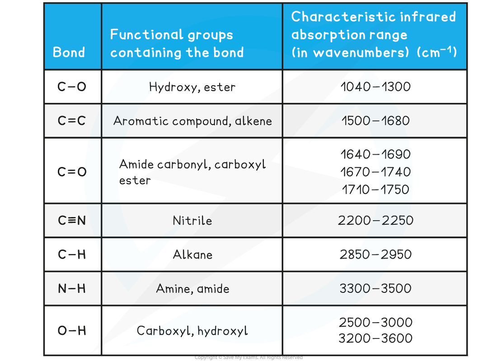

# Using Infrared Spectrometry

## Infrared Spectrometry - Interpretation

> **Spec point** — `spcpt_T9jRgC66zhQ5DPCf`

## Infrared Spectrometry - Interpretation

- **Infrared (IR) spectroscopy **is a technique used to identify compounds based on changes in **vibrations** of atoms when they **absorb** IR of certain **frequencies**
- A **spectrophotometer **irradiates the sample with electromagnetic waves in the infrared region and then detects the **intensity** of the wavelength of IR radiation which goes through the sample
- All organic molecules absorb IR radiation and depending on which energies of radiation are absorbed, bonds between atoms will vibrate by **stretching**, **bending **and **twisting**
- The molecules will only vibrate at a specific frequency
- The **resonance frequency **is the specific frequency at which the molecules will vibrate to stimulate larger vibrations
- Depending on the rest of the molecule, each vibration will absorb specific wavelengths of IR radiation which are also shown as the **reciprocal **of the wavelength

  - This unit is called the **wavenumber **(cm-1)
- Particular absorbance have characteristic **widths **(broad or sharp) and **intensities **(strong or weak)

  - For example, hydrogen bonds cause the O-H bonds in alcohols and carboxylic acids to be **broad** whereas the C-O bond in carbonyl (C=O) groups have a strong, sharp absorbance peak
- The energies absorbed by different functional groups are given as a range and an unknown compound can be identified by comparing its IR spectrum to the IR spectrum of a known compound

#### Absorption Range of Bonds Table

- Due to some absorption bands overlapping each other, other analytical techniques such as mass spectroscopy should be used alongside IR spectroscopy to identify an unknown compound

> **Worked Example**
> **Analysing IR Spectra**
> 
> Look at the two infrared spectra below and determine which one corresponds to propanone and which one to propan-2-ol
> 
> 
> 
> **Answer**
> 
> - IR spectrum **A** is **propanone **and spectrum **B** is **propan-2-ol**.
> 
>   - In IR spectrum **A **the presence of a strong, sharp absorption around 1710 cm-1 corresponds to the characteristic C=O, carbonyl, group in a ketone.
>   - In spectrum **B** the presence of a strong, broad absorption around 3200-3500 cm-1 suggests that there is an alcohol group present, which corresponds to the -OH group in propan-2-ol.
