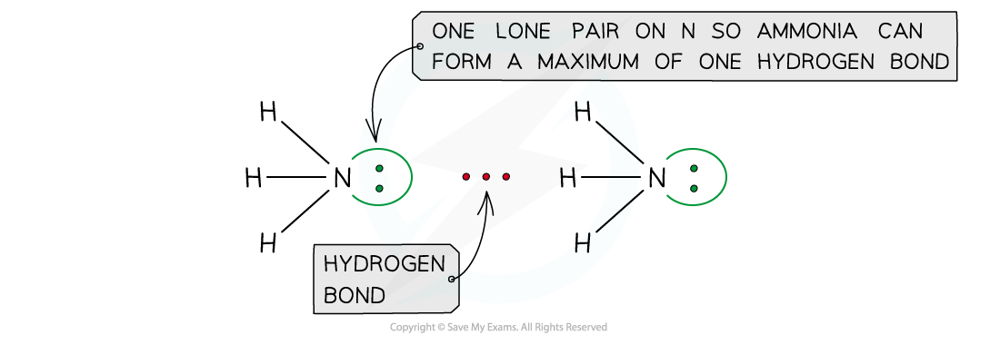
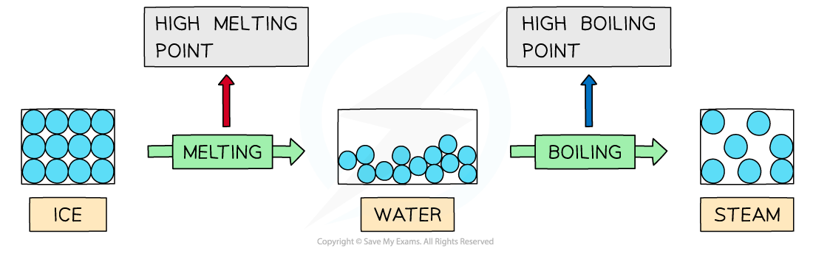
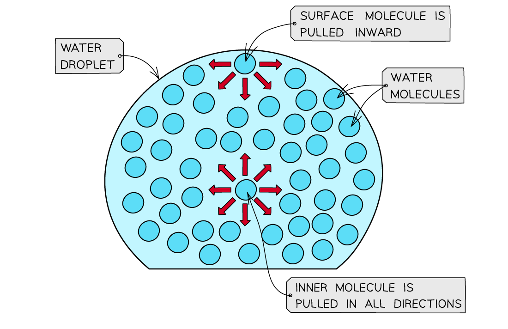
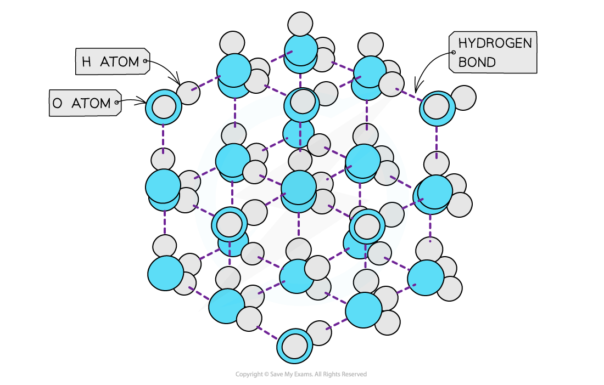

# Hydrogen Bonding

## Molecular Interactions

> **Spec point** — `spcpt_NRXw8RfYNTgR5zPX`

## Molecular Interactions

Examples of compounds that can form hydrogen bonds are:

- Alcohols (contains an O-H bond)
- Ammonia (contains an N-H bond)
- Amines (contains an N-H bond)
- Carboxylic acids (contains an O-H bond)
- Hydrogen fluoride (contains an H-F bond)
- Proteins (contains an N-H bond)

***Ammonia can form a maximum of one hydrogen bond per molecule***

## Anomalous Properties - Water

> **Spec point** — `spcpt_DKZt39n6ZkQpjWvB`

## Anomalous Properties of Water

#### Properties of water

- Hydrogen bonding in water, causes it to have **anomalous properties **such as high melting and boiling points, high surface tension and a higher density in the liquid than the solid

#### High melting & boiling points

- Water has high **melting **and **boiling points** due to the the **strong intermolecular forces **of hydrogen bonding between the molecules in both ice (solid H2O) and water (liquid H2O)
- A lot of energy is therefore required to separate the water molecules and melt or boil them

***Hydrogen bonds are strong intermolecular forces which are harder to break causing water to have a higher melting and boiling point than would be expected for a molecule of such a small size***

- The graph below compares the **enthalpy of vaporisation **(energy required to boil a substance) of different hydrides
- The enthalpy changes **increase **going from H2S to H2Te due to the increased number of electrons in the Group 16 elements
- This causes an increase in the **instantaneous dipole - induced dipole forces (dispersion forces) **as the molecules become larger
- Based on this, H2O should have a much lower enthalpy change (around 17 kJ mol**-1**)
- However, the enthalpy change of vaporisation is almost 3 times **larger** which is caused by the **hydrogen bonds **present in water but not in the other hydrides

***The high enthalpy change of evaporation of water suggests that instantaneous dipole-induced dipole forces are not the only forces present in the molecule – there are also strong hydrogen bonds, which cause the high boiling point***

#### High surface tension

- Water has a **high surface tension**
- **Surface** **tension** is the ability of a **liquid surface **to resist any **external forces **(i.e. to stay unaffected by forces acting on the surface)
- The water molecules at the **surface **of liquid are bonded to other water molecules through **hydrogen bonds**
- These molecules **pull downwards** the **surface molecules **causing the surface of them to become compressed and more tightly together at the surface
- This increases water’s **surface** **tension**

***The surface molecules are pulled downwards due to the hydrogen bonds with other molecules, whereas the inner water molecules are pulled in all directions***

#### Density

- **Solids **are **denser **than their **liquids **as the particles in solids are more **closely packed **together than in their liquid state
- The water molecules are packed into an open lattice
- This way of packing the molecules and the relatively long **bond lengths **of the hydrogen bonds means that the water molecules are slightly further apart than in the liquid form
- Therefore, ice has a lower density than liquid water by about 9%

***The ‘more open’ structure of molecules in ice causes it to have a lower density than liquid water***

> **Exam Hint**
> The H-O-H bond angle in water is 104.5° but in ice, this increases to closer to the undistorted tetrahedral bond angle of 109.5°. This is because the lone pairs of electrons on the oxygen atom are drawn towards the δ+ on the hydrogen atom on a neighbouring water molecule, away from the oxygen atom. This reduces the repulsion of the bonded electron pairs around the oxygen, increasing the bond angle.
