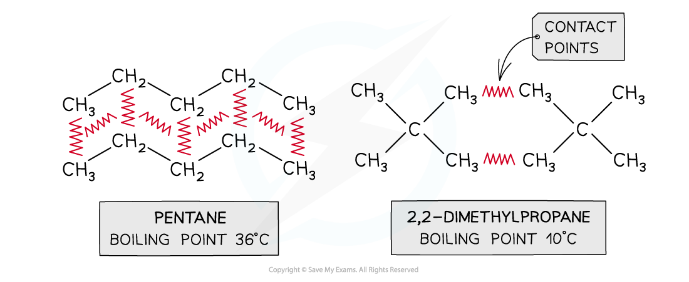
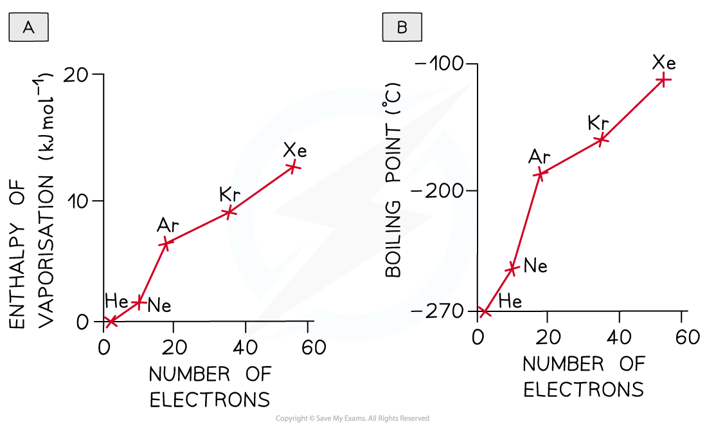
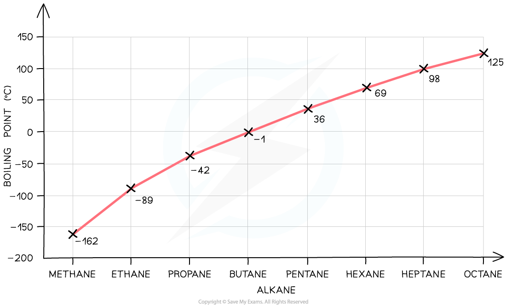
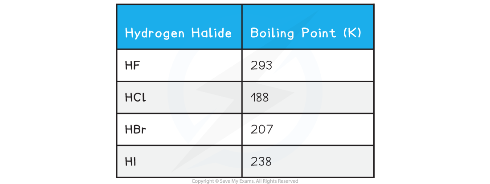

# Physical Properties

## Physical Properties & Intermolecular Forces

> **Spec point** — `spcpt_5ssGMTjjDQvqsgHC`

## Physical Properties & Intermolecular Forces

#### Branching

- The larger the surface area of a molecule, the more contact it will have with adjacent molecules
- The surface area of a molecule is **reduced by branching**
- The greater its ability to induce a dipole in an adjacent molecule, the greater the** London (dispersion) forces** and the higher the melting and boiling points
- This point can be illustrated by comparing different isomers containing the same number of electrons:

***Boiling points of molecules with the same numbers of electrons but different surface areas***

#### Number of electrons

- The greater the number of electrons (or the greater the molecular mass) in a molecule, the greater the likelihood of a distortion and thus the greater the frequency and magnitude of the temporary dipoles
- The dispersion forces between the molecules are stronger and the enthalpy of vaporisation, melting and boiling points are larger
- The greater boiling points of the noble gases illustrate this factor:

***As the number of electrons increases more energy is needed to overcome the forces of attraction between the noble gases atoms***

***Graph showing the increase in boiling point as the number of electrons increases***

#### Alcohols

- Hydrogen bonding occurs between molecules where you have a hydrogen atom attached to one of the very electronegative elements - fluorine, **oxygen** or nitrogen
- In an alcohol, there are **O-H bonds** present in the structure
- Therefore hydrogen bonds set up between the slightly positive hydrogen atoms (δ+ H) and lone pairs on oxygens in other molecules
- The hydrogen atoms are slightly positive because the bonding electrons are pulled away from them towards the very electronegative oxygen atoms
- In **alkanes**, the only intermolecular forces are **temporary induced dipole-dipole forces**
- Hydrogen bonds are much stronger than these and therefore it takes more energy to separate alcohol molecules than it does to separate alkane molecules
- Therefore, the boiling point of alkanes is lower than the boiling point of the respective alcohols
- For example, the boiling point of propane is -42 oC and the boiling point of propanol is 97 oC

#### Hydrogen Halides

- The boiling points of the hydrogen halides are as follows

- The boiling points of the rest of the hydrogen halides **increase** as the molecules become larger
- The extra electrons allow greater temporary dipoles and so increase the amount of London dispersion forces between the molecules
- Hydrogen fluoride also has hydrogen bonding between the HF molecules
- The bond is very polar so that the hydrogen has a significant amount of positive charge and the fluorine a significant amount of negative charge. In addition, the fluorine has small intense lone pairs
- Hydrogen bonds can form between the hydrogen on one molecule and a lone pair on the fluorine in its neighbour
