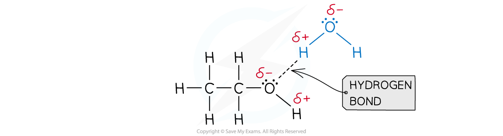

# Solvent Choice

## Solvent Choice

> **Spec point** — `spcpt_vdjkNRv8BRczgTn2`

## Solvent Choice

- The general principle is that 'like dissolves like' so non-polar substances mostly dissolve in non-polar solvents, like hydrocarbons, and they form dispersion forces between the solvent and the solute
- Polar covalent substances generally dissolve in polar solvents as a result of dipole-dipole interactions or the formation of hydrogen bonds between the solute and the solvent
- A good example of this is seen in organic molecules such as alcohols and water:

***Hydrogen bonds form between ethanol and water***

- As covalent molecules become larger, their solubility can decrease as the polar part of the molecule is only a smaller part of the overall structure

  - This effect is seen in alcohols, for example, where ethanol, C2H5OH, is readily soluble but hexanol, C6H13OH, is not
- Polar covalent substances are unable to dissolve well in non-polar solvents as their dipole-dipole attractions are unable to interact well with the solvent
- Giant covalent substances generally don't dissolve in any solvents as the energy needed to overcome the strong covalent bonds in the lattice structures is too great

#### Haloalkanes

- Even though haloalkanes contain a polar bond, they are only partially soluble in water as they can not form hydrogen bonds
- This is because there are no H-F, H-O or H-N bonds within the molecule

***Due to the large difference in electronegativity between the carbon and halogen atoms, the C-X bond is polar***

#### Ionic compounds

- Many ionic compounds will dissolve in **polar** solvents, e.g. water
- Solubility is dependent on two main factors:

  1. Breaking down the ionic lattice
  2. The polar molecules attract and surround the ions
- Polar molecules, such as water, can break down or disrupt the ionic lattice and surround each ion in solution
- The δ+ end of the polar molecule can surround the negative anion
- The δ- end of the polar molecule can surround the positive cation
- The solubility of an ionic compound depends on the relative strength of the electrostatic forces of attraction within the ionic lattice and the attractions between the ions and the polar molecule
- In general, the greater the ionic charge, the less soluble an ionic compound is

  - For example, 356.9 g of sodium chloride, NaCl, will dissolve in one dm3 of water while only 74.4 g of calcium chloride will dissolve in one dm3 of water
  - This is a general rule, though and there are many exceptions
