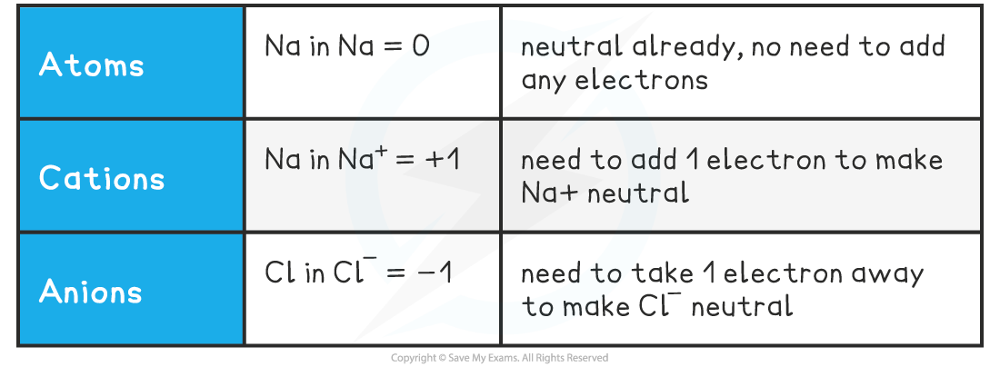
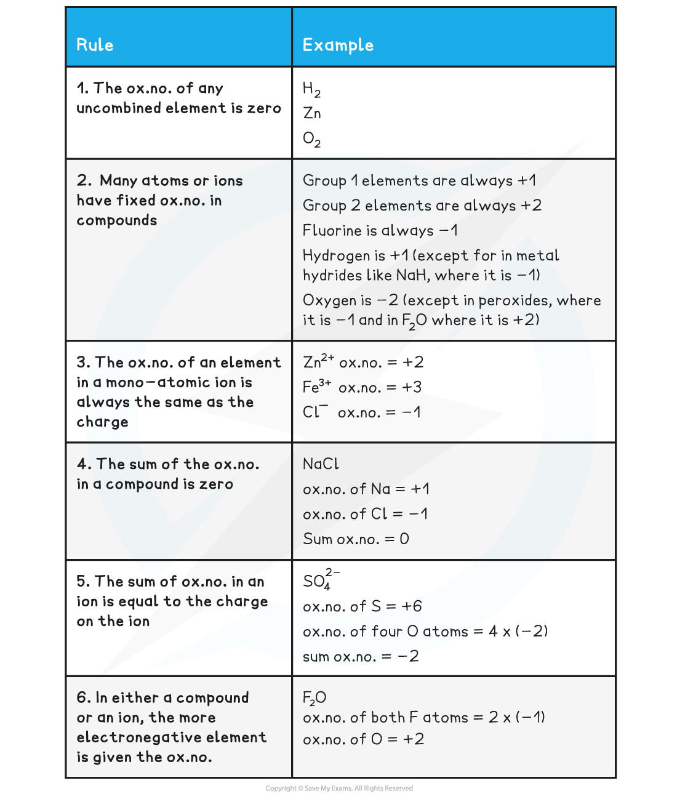
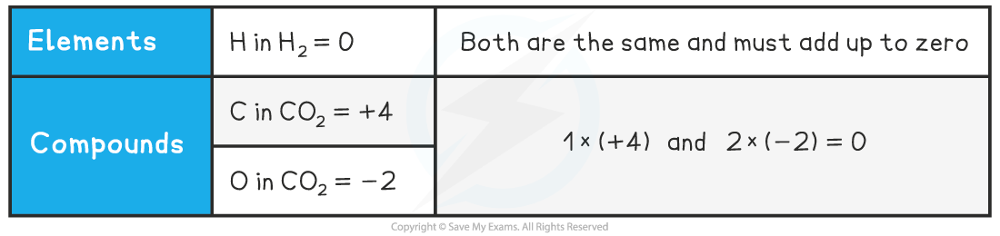

# Oxidation Numbers - Introduction

## Oxidation Numbers - Introduction 

> **Spec point** — `spcpt_S4hPJqpjXhqZtXh7`

## Oxidation Numbers - Introduction

- There are three definitions of **oxidation** and **reduction**  used in different branches of chemistry
- **Oxidation** and **reduction** can be used to describe any of the following processes

#### Definitions and Examples of Oxidation & Reduction

***Use the acronym "Oil Rig" to help you remember the definitions of oxidation and reduction***

#### Oxidation Number

- The** **oxidation number of an atom is the charge that would exist on an individual atom if the bonding were completely ionic
- It is like the electronic ‘status’ of an element
- Oxidation numbers are used to

  - Tell if oxidation or reduction has taken place
  - Work out what has been oxidised and/or reduced
  - Construct half equations and balance redox equations

#### Oxidation Numbers of Simple Ions

> **Worked Example**
> What are the oxidation numbers of the elements in the following species?
> 
> a) C                b)  Fe3+                       c)  Fe2+
> 
> d) O2-             e)  He                          f)  Al3+
> 
> **Answers:**
> 
> a) 0     b) +3    c) +2
> 
> d) -2    e) 0      f) +3
> 
> - So, in simple ions, the oxidation numbers of the atom is the charge on the ion:
> 
>   - Na+, K+, H+ all have an oxidation number of +1
>   - Mg2+, Ca2+, Pb2+ all have an oxidation number of +2
>   - Cl–, Br–, I– all have an oxidation number of -1
>   - O2-, S2- all have an oxidation number of -2

#### Oxidation Number Rules

- A few simple rules help guide you through the process of determining the oxidation number of any element
- Remember, you are determining the oxidation number of a *single* atom
- The oxidation number (ox.no.) refers to a *single* atom in a compound

#### Oxidation Number Rules Table

#### Roman Numerals

- **Transition metals** are characterised by having **variable oxidation numbers**.
- **Oxidation numbers** can be used in the names of compounds to indicate which **oxidation number** a particular element in the compound is in
- Where the element has a **variable oxidation number**, the number is written afterwards in **Roman numerals**.
- This is called the **STOCK NOTATION** (after the German inorganic chemist Alfred Stock), but is not as widely used for non-metals, so SO2 is often referred to as sulfur dioxide rather than sulfur(IV) oxide
- For example, iron can be both +2 and +3 so **Roman numerals** are used to distinguish between them

  - **Fe****2+** in FeO can be written as** iron(II) oxide**
  - **Fe****3+** in Fe2O3 can be written as **iron(III) oxide**
- More complicated examples include other atoms / ions as part of the formula

  - Potassium manganate(VII) implies that the manganese is in a +7 oxidation
  - Potassium manganate(VII) contains the potassium ion K+ and the manganate ion MnO4–
  
    - Since the oxygen in the manganate ion is in the -2 oxidation state, there is a total of -8 from the oxygen
    - The manganate ion has an overall -1 charge, which means that the manganese ion must be in the +7 oxidation state

## Oxidation Numbers - Calculations

> **Spec point** — `spcpt_5K7TCnPWhZ6dkdWv`

## Oxidation Numbers - Calculations

#### Molecules or Compounds

- In molecules or compounds, the sum of the oxidation numbers on the atoms is zero

#### Oxidation Number in Molecules or Compounds Table

- Because CO2 is a neutral molecule, the sum of the oxidation states must be zero
- For this, one element must have a positive oxidation number and the other must be negative

#### How do you determine which is the positive one?

- The more electronegative species will have the negative value
- Electronegativity increases across a period and decreases down a group
- O is further to the right than C in the periodic table so it has the negative value

#### How do you determine the value of an element's oxidation number?

- From its position in the periodic table and / or the other element(s) present in the formula

#### Hydrogen in metal hydrides, H-

- An example of a metal hydride is sodium hydrogen, NaH which is a neutral compound
- The hydrogen atom is present as a **hydride ion**

  - This has the symbol H- and therefore the oxidation state -1
- We can also think of this as a sum

  - Since **group 1** metals always have an oxidation state of **+1** in their compounds, it follows that the hydrogen must have an oxidation state of -1 (+1 -1 = 0)

#### Oxygen in peroxides, O-

- Peroxides include hydrogen peroxide, H2O2, which again is a neutral compound
- The sum of the oxidation states of the hydrogen and oxygen must be **0**
- Since each hydrogen has an oxidation state of +1, each **oxygen must have an oxidation state of -1** to accommodate the neutral charge of the compound

#### Ions

- The oxidation number of elements within an ion can be calculated using the rules shown in the **Oxidation Number Rules Table** (above)

> **Worked Example**
> Deduce the oxidation number of the highlighted element in:
> 
> 1. The nitrite ion: <u>**N**</u>O2–
> 2. The nitrate ion: <u>**N**</u>O3–
> 3. The thiosulfate ion: <u>**S**</u>2O32–
> 4. The tetrathionate ion: <u>**S**</u>4O62–
> 
> **Answers**
> 
> - In all of the answers, the O is more electronegative than the other element, so the oxidation number of O will be –2
> 
> **Answer 1:**
> 
> - The nitrite ion contains two oxygen atoms
> 
>   - 2 x –2 = –4
> 
>   - The overall ion has an oxidation state of –1, which means that the oxidation numbers of the elements in the ion must add up to –1
>   - Therefore, the oxidation number of N is +3
>   
>     - N + (2 x –2) = –1 N = +3
> 
> **Answer 2:**
> 
> - The nitrate ion contains three oxygen atoms
> 
>   - 3 x –2 = –6
> 
>   - The overall ion has an oxidation state of –1, which means that the oxidation numbers of the elements in the ion must add up to –1
>   - Therefore, the oxidation number of N is +5
>   
>     - N + (3 x –2) = –1 N = +5
> 
> **Answer 3:**
> 
> - The thiosulfate ion contains three oxygen atoms
> 
>   - 3 x –2 = –6
> 
>   - The overall ion has an oxidation state of –2, which means that the oxidation numbers of the elements in the ion must add up to –2
>   - The oxidation number of both S atoms is +4
>   
>     - 2S + (3 x –2) = –2 2S = +4
>   - Therefore, the oxidation number of S is +2
>   
>     - 2S = +4
>     - S = +2
> 
> **Answer 4:**
> 
> - The tetrathionate ion contains six oxygen atoms
> 
>   - 6 x –2 = –12
> 
>   - The overall ion has an oxidation state of –2, which means that the oxidation numbers of the elements in the ion must add up to –2
>   - The oxidation number of all four S atoms is +10
>   
>     - 4S + (6 x –2) = –2 4S = +10
>   - Therefore, the oxidation number of S is +2.5
>   
>     - 4S = +10
>     - S = 2.5
>   - This specific question is a rare example showing a fractional oxidation number for the element in question / sulfur
>   
>     - This is because the sulfur atoms are in two different environments 
>     - The fractional oxidation number shows the average oxidation number of the sulfur environments
