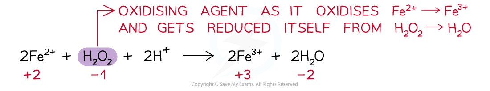
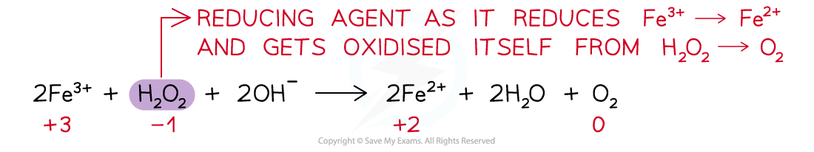

# Oxidation & Reduction

## Electron Transfer & Oxidation Numbers

> **Spec point** — `spcpt_rQH5JNH33scmMHg6`

## Electron Transfer & Oxidation Numbers

- Oxidation and reduction in a reaction can be demonstrated in terms of electron transfer

  - For example:

**2NH****3**** + 3Br****2**** → N****2**** + 6HBr**

- The oxidation number of N in NH3 has changed from -3 to 0

  - As the oxidation number has increased, nitrogen has been oxidised
- The oxidation number of Br has changed from 0 to -1

  - As the oxidation number has decreased, bromine has been reduced
- Overall, nitrogen has reduced bromine by donating electrons

## Reducing & Oxidising Agents

> **Spec point** — `spcpt_gh8pwMKm9wgtqK9w`

## Reducing & Oxidising Agents

#### Oxidising agent

- **An oxidising agent** is a substance that **oxidises** another atom or ion by causing it to lose electrons
- An oxidising agent itself gets **reduced – gains electrons**
- Therefore, the **ox. no. **of the oxidising agent **decreases**

***Example of an oxidising agent in a chemical reaction***

#### Reducing agent

- **A reducing agent **is a substance that **reduces** another atom or ion by causing it to gain electrons
- A reducing agent itself gets **oxidised – loses / donates electrons**
- Therefore, the **ox.** **no. **of the reducing agent **increases**

***Example of a reducing agent in a chemical reaction***

- For a reaction to be recognised as a redox reaction, there must be both an oxidising and reducing agent
- Some substances can act both as oxidising and reducing agents
- Their nature is dependent upon what they are reacting with and the reaction conditions

> **Worked Example**
> Four reactions are shown.
> 
> In which reaction is the species in bold acting as an oxidising agent?
> 
> 1. Cr2O72- + 8H+ + **3SO****3****2-** → 2Cr3+ + 4H2O + 3SO42-
> 2. Mg + **Fe****2+** → Mg2+ + Fe
> 3. Cl2 + **2Br****-** → 2Cl- + Br2
> 4. Fe2O3 + **3CO** → 2Fe + 3CO2
> 
> **Answer:**
> 
> - The correct option is 2
> 
>   - Oxidising agents are substances that oxidise other species, gain electrons and are themselves reduced.
>   - Write down the oxidation numbers of each species in the reaction
> 
> 
> 
> - In equation 2, Fe2+ oxidises Mg(0) to Mg2+(+2) and is itself reduced from Fe2+(+2) to Fe(0)
