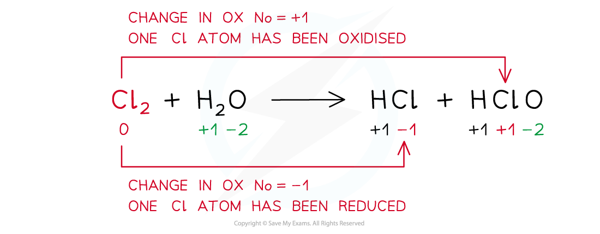

# Disproportionation Reactions

## Disproportionation

> **Spec point** — `spcpt_sQhfXSTSDxZFPgdB`

## Disproportionation

#### Disproportionation reactions

- A **disproportionation** **reaction** is a reaction in which the same species is simultaneously oxidised and reduced

***Example of a disproportion reaction in which the same species (chlorine in this case) has been both oxidised and reduced***

> **Worked Example**
> **Balancing disproportionation reactions**
> 
> Balance the disproportionation reaction which takes place when chlorine is added to hot concentrated aqueous sodium hydroxideThe products are Cl- and ClO3- ions and water
> 
> **Answer**
> 
> **Step 1: **Write the unbalanced equation and identify the atoms that change in oxidation number:
> 
> 
> 
> **Step 2: **Deduce the oxidation number changes:
> 
> 
> 
> **Step 3: **Balance the oxidation number changes:
> 
> 
> 
> **Step 4: **Balance the charges
> 
> 
> 
> **Step 5: **Balance the atoms
> 
> 
