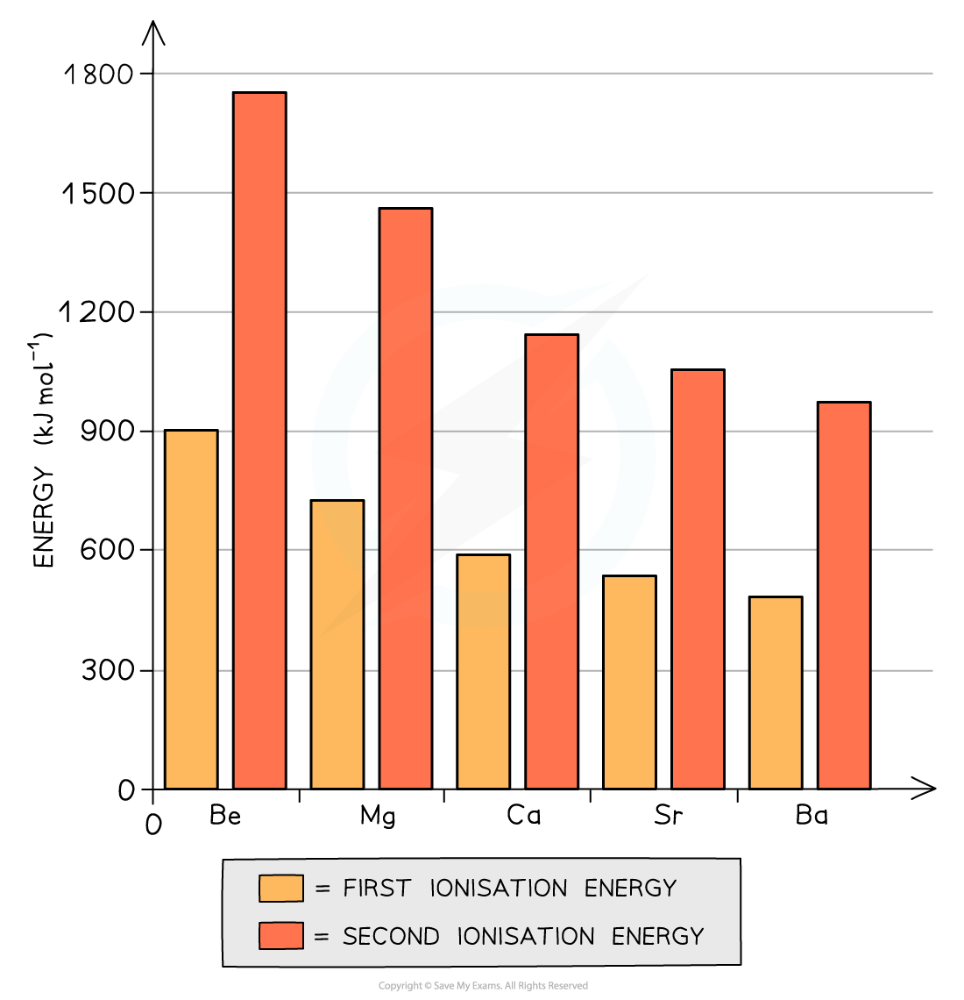

# Ionisation Energy - Groups 1 & 2

## Ionisation Energy Trends

> **Spec point** — `spcpt_zMdMBR6765gSFqsW`

## Ionisation Energy Trends

- All elements in Groups 1 (also called **alkali metals)** have one electron in their **outermost principal quantum shell**
- All elements in Groups 2 (also called **alkali earth metals)** have two electrons in their **outermost principal quantum shell**
- All Group 1 and Group 2 metals can form **ionic** **compounds** in which they donate these **outermost electrons **(so they act as **reducing agents) **to become an ion with either a +1 or +2 charge (so they themselves become **oxidised)**
- Going down the group, the metals become more **reactive**

  - This can be explained by looking at the Group 2 ionisation energies:

***The graph shows that both the first and second ionization energies decrease going down the group***

- The same trend is observed with Group 1 alkali metals
- The **first ionisation energy **is the energy needed to remove the first outer electron of an atom
- The **second ionisation energy** is the energy needed to remove the second outer electron of an atom
- The graph above shows that going down the group, it becomes easier to remove the outer two electrons of the metals
- Though the **nuclear charge **increases going down the group (because there are more protons), factors such as an **increased shielding effect **and a **larger distance **between the outermost electrons and nucleus outweigh the attraction of the higher nuclear charge
